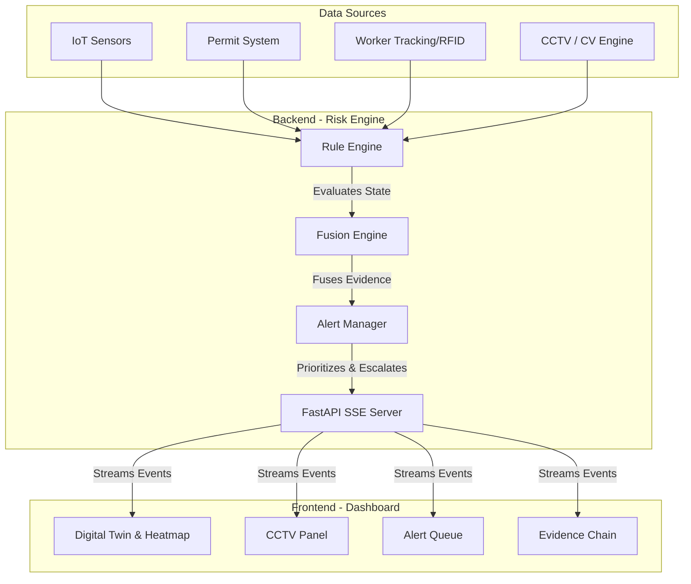
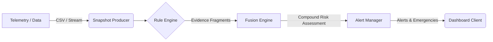
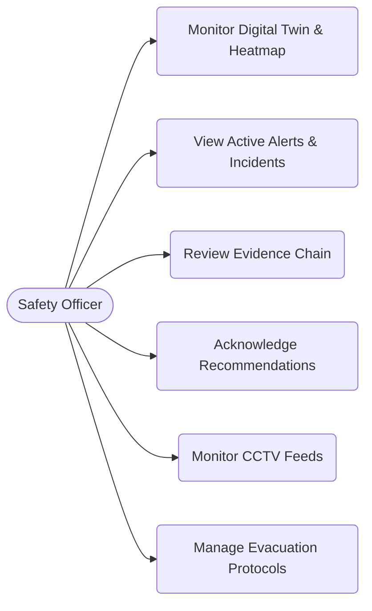

# IndusIntel-AI: Industrial Safety Intelligence Platform

IndusIntel-AI is a real-time, digital twin and industrial safety intelligence platform designed to monitor hazardous environments. By fusing telemetry from IoT sensors, active work permits, and worker tracking data, the system proactively identifies emerging compound risks before they become critical safety incidents.

## 🌟 Best Features

- **Live Sensor Monitoring**: Real-time telemetry from IoT sensors with configurable threshold tracking for hazardous gases, temperature, and pressure.
- **Active Permit & Workers Monitoring**: Live tracking of "Hot Work", "Confined Space", and "Working at Height" permits alongside worker locations and medical statuses.
- **Evidence Chain**: Append-only, chronological audit trail of incidents, transparently correlating multiple signals into a single compound risk picture.
- **Actionable Recommendations**: Automated SOP (Standard Operating Procedure) generation for safety officers based on the severity and context of active incidents.
- **Geospatial Heat Map (Digital Twin)**: Interactive 2D schematic of the physical plant (e.g., Furnace Bay, Valve Gallery) dynamically mapping hazard severities.
- **Evacuation Protocol**: Dynamic pathfinding to safe exits that intelligently avoids routing workers through hazardous adjacent zones.
- **CCTV Monitoring**: Live looping camera feeds that automatically reorganize to focus on the zone experiencing a critical incident.
- **Worker Recognition & PPE Detection (CV Engine)**: Computer vision pipelines to detect PPE compliance (helmet, vest, gloves, mask, shoes) and unauthorized entry.

## 🏗 System Architecture

The platform operates on a decoupled client-server architecture, enabling high throughput and responsive UI updates.



## 🔄 Data Flow Diagram



## 👥 Use Case Diagram



## 🧠 Risk Engine Logic & Risk Score Calculation

The heart of IndusIntel-AI is its **Compound Risk Fusion** engine. Rather than relying on simple threshold alerts (which often lead to alarm fatigue), the engine contextualizes multiple data streams (e.g., elevated gas readings + active hot work permit in the same zone).

### Evidence Generation
Each rule (sensor, permit, trend, worker) independently evaluates the plant state and produces **Evidence Fragments**. Each fragment acts as an immutable unit of risk evidence with a `severity_contribution` ranging from 0.0 to 1.0.

### Risk Score Calculation (Noisy-OR Fusion)
Instead of naive summation, the Fusion Engine uses a **Noisy-OR** probability model to combine severity scores across multiple independent rules. This ensures the score scales sensibly with the number and strength of independent signals, without exceeding 1.0.

1. **Intra-Dimension Fusion**: Evidence is grouped by risk dimension (e.g., Worker, Equipment, Process). The combined score for a dimension is calculated as:  
   `Score = 1.0 - Π (1.0 - severity_i)`
2. **Overall Compound Score**: A weighted Noisy-OR combines dimension scores into an overall severity (0.0 to 1.0).
3. **Severity Bands**:
   - `CRITICAL`: ≥ 0.75
   - `HIGH`: ≥ 0.50
   - `MEDIUM`: ≥ 0.25
   - `LOW`: < 0.25

### Escalation and Alerting
The **Alert Manager** applies cooldowns to prevent noise and statefully escalates unacknowledged `HIGH` alerts to `CRITICAL` after a sustained period. A CRITICAL compound risk immediately triggers the **Evacuation Protocol**.

## 🚀 Getting Started

1. **Run the Backend (Risk Engine)**
   ```bash
   cd risk_engine
   python3 -m uvicorn api:app --reload
   ```

2. **Run the Frontend (Dashboard)**
   ```bash
   cd dashboard
   npm install
   npm run dev
   ```

3. **View the Dashboard**
   Open your browser to `http://localhost:5173` (or the port provided by Vite). The mock risk engine will immediately begin streaming telemetry and incidents.
