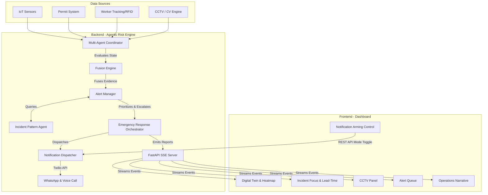
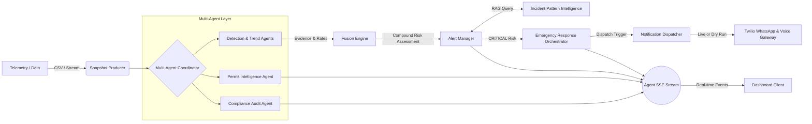
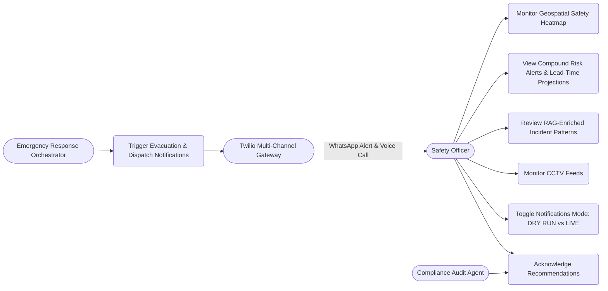

# IndusIntel-AI: Agentic AI-Powered Industrial Safety Intelligence

IndusIntel-AI is an **Agentic AI-powered Industrial Safety Intelligence platform** that brings together data from IoT sensors, SCADA systems, permit-to-work logs, CCTV feeds, and shift records into a single predictive layer. Operating as a Multi-Agent System (MAS), it detects compound risk conditions—like the co-occurrence of maintenance activity and hazardous gas accumulation—that no single sensor would flag alone, triggering preemptive interventions before they escalate.

## 🌟 Best Features (Agentic Capabilities)

- **Compound Risk Detection Engine**: A Multi-agent system that correlates gas sensor readings, work permit activity, equipment maintenance status, and shift changeover patterns to identify dangerous combinations (e.g., confined space entry during abnormal process conditions) hours before they become critical.
- **Predictive Rate-of-Change & Lead-Time Projections**: Temporal trend agents (`GasRisingTrendRule`, `RapidEscalationRule`) analyze per-sensor rolling windows to derive exact rate-of-change metrics (`rate = Δvalue / Δt`). Surfacing dynamic lead-time projections (e.g., *"At current rate, reading may reach critical threshold in 1 simulated minute"*) directly in the Incident Focus and Narrative panels.
- **Geospatial Safety Heatmap**: A real-time geospatial layer over the plant layout that visualises risk zones dynamically as conditions change—integrating worker location data, hazardous area classifications, and active permit overlaps to give safety officers situational awareness across the entire facility.
- **Incident Pattern Intelligence (RAG)**: A RAG-powered agent that cross-references near-miss reports, historical incident data, and OISD/Factory Act regulatory guidance to identify recurring patterns that manual investigations miss—and surfaces them as actionable prevention priorities.
- **Digital Permit Intelligence Agent**: An AI that analyses active permits against real-time plant conditions and flags dangerous simultaneous operations (SIMOPS)—for example, hot work permits issued in proximity to areas with elevated gas readings.
- **Emergency Response Orchestrator**: An autonomous agent that, on confirmed trigger, immediately initiates evacuation protocols, aggregates active critical compound alerts across zones, preserves evidence, generates incident reports, and dispatches multi-channel alerts (Twilio WhatsApp with rich Markdown evidence formatting, plus automated TwiML Voice calls with text-to-speech).
- **Control Plane & Safety Arming Mode**: A UI status bar control (`Notifications: DRY RUN` / `Notifications: LIVE`) and REST endpoint (`/api/notifications/mode`) allowing safety officers to arm/disarm live Twilio dispatches at runtime without touching `.env` or restarting services.
- **Quality & Compliance Audit Agent**: An AI layer that continuously monitors safety procedures, inspection records, and statutory compliance documentation against regulatory standards (OISD, DGMS), autonomously generating corrective action workflows for missing gas tests or isolations.
- **Computer Vision & CCTV Analytics**: Custom-trained YOLOv26 deep learning pipeline (`cv_engine/`) running object detection on camera feeds to autonomously classify PPE compliance (helmet, vest, mask, gloves, shoes) and detect restricted zone boundary violations.

## 🏗 System Architecture

The platform operates on a decoupled client-server architecture, enabling high throughput and responsive UI updates.



## 🤖 Multi-Agent Layer

IndusIntel-AI operates as a true **Multi-Agent System**. Individual autonomous agents inspect distinct slices of plant state and report findings into a central coordinator, directly fulfilling the challenge statement's requirements:

1. **Rule-Based Detection Agents (~13 autonomous agents)**
   - **Challenge Statement Mapping:** *Compound Risk Detection Engine*
   - Each subclass in `sensor_rules.py`, `permit_rules.py`, `worker_rules.py`, `cv_rules.py`, and `trend_rules.py` acts as an independent agent. They run concurrently without knowledge of one another, emitting evidence fragments that the `FusionEngine` combines via noisy-OR.
2. **Predictive Trend & Rate-of-Change Agent**
   - **Challenge Statement Mapping:** *Predictive Lead-Time & Trend Engine*
   - `GasRisingTrendRule` maintains stateful rolling windows of sensor history to derive escalation velocity (`rate_per_second`) and compute exact simulated minutes to critical threshold.
3. **Digital Permit Intelligence Agent**
   - **Challenge Statement Mapping:** *Digital Permit Intelligence Agent*
   - Correlates SIMOPS and detects conflicts (e.g., hot work near gas). This agent orchestrates the permit-specific detection rules into a cohesive summary.
4. **Quality & Compliance Audit Agent**
   - **Challenge Statement Mapping:** *Quality & Compliance Audit Agent*
   - Continuously monitors active permits. If procedural flags (like gas tests or LOTO isolations) are missing, it autonomously surfaces corrective action workflows with RAG-backed OISD regulatory citations.
5. **Incident Pattern Intelligence (RAG)**
   - **Challenge Statement Mapping:** *Incident Pattern Intelligence (RAG)*
   - A retrieval agent (`rag.py`) that searches historical near-misses and OISD safety regulations, appending regulatory precedents directly to dashboard alerts.
6. **Emergency Response Orchestrator & Notification Dispatcher**
   - **Challenge Statement Mapping:** *Emergency Response Orchestrator*
   - Triggers when CRITICAL compound risks escalate. It packages preserved sensor evidence, references evacuation protocols, and dispatches multi-channel Twilio alerts (rich Markdown WhatsApp messages and clear text-to-speech TwiML Voice calls).

## 🔄 Data Flow Diagram



## 👥 Use Case Diagram



## 🧠 Risk Engine Logic & Risk Score Calculation

The heart of IndusIntel-AI is its **Compound Risk Fusion** engine. Rather than relying on simple threshold alerts (which often lead to alarm fatigue), the engine contextualizes multiple data streams (e.g., elevated gas readings + active hot work permit in the same zone).

### Evidence Generation
Each autonomous detection agent (sensor, permit, trend, worker) independently evaluates the plant state and produces **Evidence Fragments**. Each fragment acts as an immutable unit of risk evidence with a `severity_contribution` ranging from 0.0 to 1.0.

### Risk Score Calculation (Noisy-OR Fusion)
Instead of naive summation, the Fusion Engine uses a **Noisy-OR** probability model to combine severity scores across multiple independent agents. This ensures the score scales sensibly with the number and strength of independent signals, without exceeding 1.0.

1. **Intra-Dimension Fusion**: Evidence is grouped by risk dimension (e.g., Worker, Equipment, Process). The combined score for a dimension is calculated as:  
   `Score = 1.0 - Π (1.0 - severity_i)`
2. **Overall Compound Score**: A weighted Noisy-OR combines dimension scores into an overall severity (0.0 to 1.0).
3. **Severity Bands**:
   - `CRITICAL`: ≥ 0.75
   - `HIGH`: ≥ 0.50
   - `MEDIUM`: ≥ 0.25
   - `LOW`: < 0.25

### Escalation, Multi-Zone Aggregation & Notification Dispatch
- **Alert Manager**: Applies cooldowns to prevent alarm fatigue and statefully escalates unacknowledged `HIGH` alerts to `CRITICAL` after a sustained period.
- **Multi-Zone Aggregation**: When an emergency triggers, `AlertManager` aggregates ALL currently critical compound risk zones across the plant, preserving zone-specific projections and evidence chains.
- **Emergency Response Orchestrator & Twilio Dispatcher**:
  - Automatically formats spoken voice TwiML (`<Say voice="alice">`) and rich Markdown WhatsApp alerts detailing zone status, evidence findings, projections, and recommended actions.
  - Enforces per-channel cooldown clocks while maintaining last-known dispatch statuses (`LIVE SENT`, `dry run — not sent`) continuously on the dashboard UI.

## 🚀 Getting Started

1. **Configure Environment Variables (Optional for Live Twilio Notifications)**
   Copy `risk_engine/.env.example` to `.env` in the root directory:
   ```bash
   cp risk_engine/.env.example .env
   ```
   *Edit `.env` if you wish to configure live Twilio credentials (`TWILIO_ACCOUNT_SID`, `TWILIO_AUTH_TOKEN`, `TWILIO_PHONE_NUMBER`, `TWILIO_WHATSAPP_NUMBER`, `NOTIFY_TARGET_PHONE_NUMBER`). Defaults to safe `dry_run` mode.*

2. **Run the Backend (Risk Engine)**
   ```bash
   # Make sure you are in the root directory (ET)
   python -m uvicorn risk_engine.api:app --reload
   ```

3. **Run the Frontend (Dashboard)**
   ```bash
   cd dashboard
   npm install
   npm run dev
   ```

4. **View the Dashboard**
   Open your browser to `http://localhost:5173`. The mock risk engine will immediately begin streaming telemetry, permits, workers, and predictive incidents.
   - Use the **`Notifications: DRY RUN` / `Notifications: LIVE`** toggle in the top bar to arm live Twilio alerts for your demo!
