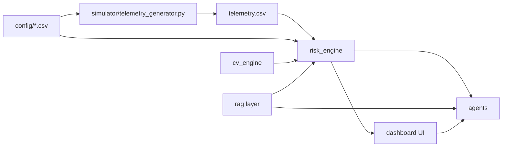
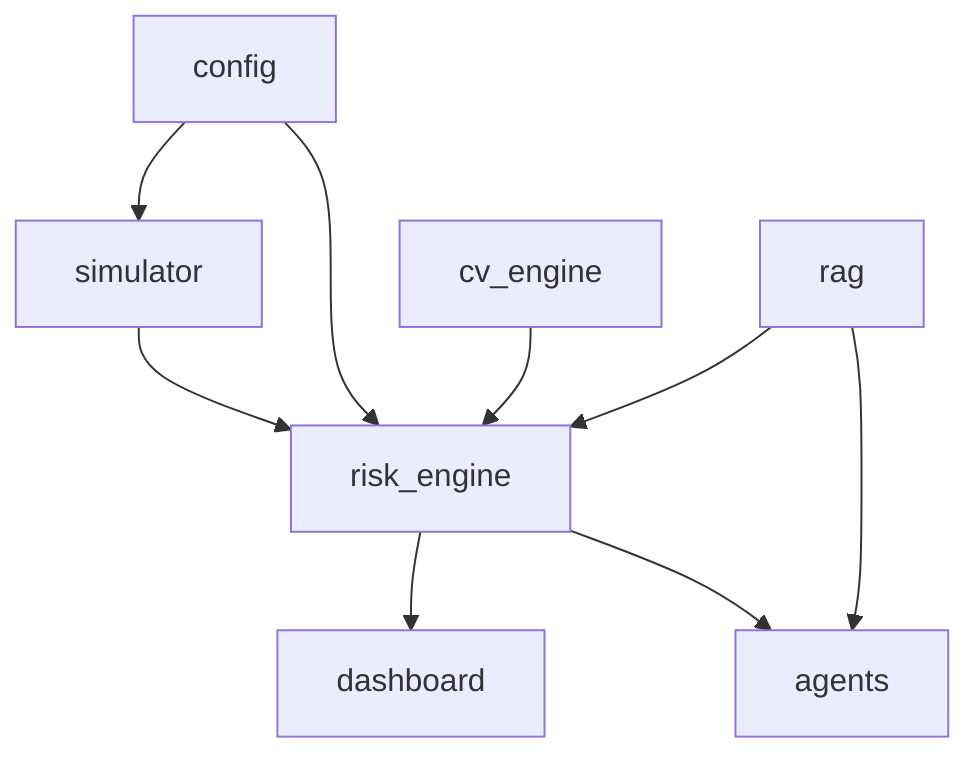
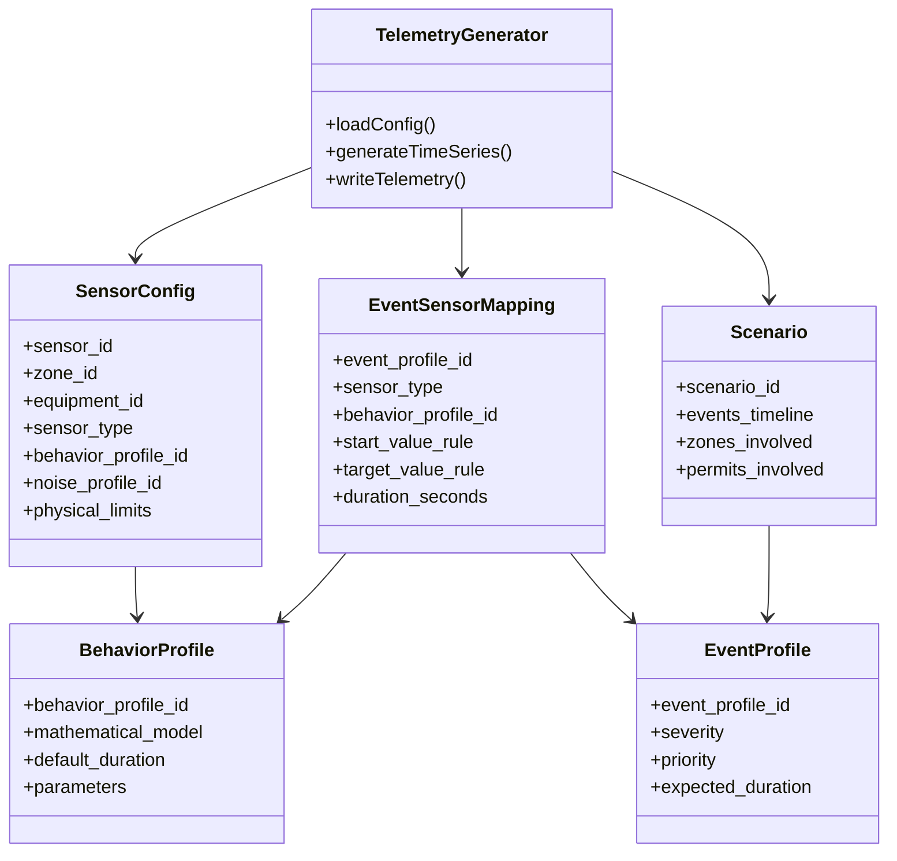
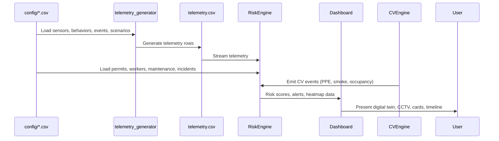

# 02 – Architecture

## High-Level Overview

The repository implements an end‑to‑end **Industrial Safety Intelligence Layer** with:

- A **simulation engine** generating realistic telemetry for a reference coke‑oven plant.
- A **Risk Engine** performing compound‑risk detection.
- A **Digital Twin dashboard** visualizing zones, workers, permits, sensors, and CV events.
- A **CV engine** providing safety‑relevant events from camera streams.
- A **RAG layer** grounding explanations in incident and regulatory corpora.
- A **future agent layer** orchestrating notifications, compliance, and reporting.

## Directory Structure (Proposed)

```text
config/
  zones.csv
  equipment.csv
  sensors.csv
  behavior_profiles.csv
  event_profiles.csv
  event_sensor_mapping.csv
  scenario.csv
  permits.csv
  workers.csv
  maintenance.csv
  shifts.csv
  incidents.csv
  alarms.csv
  notifications.csv

simulator/
  telemetry_generator.py
  models/
    scenarios.py
    events.py
    behaviors.py
    sensors.py

risk_engine/
  rules/
  compound_risk.py
  scoring.py
  fusion/
    sensors_fusion.py
    permits_fusion.py
    maintenance_fusion.py
    workers_fusion.py
    cv_fusion.py

dashboard/
  api/
    telemetry_api.py
    risk_api.py
    config_api.py
  ui/
    components/
    pages/

cv_engine/
  pipelines/
    ppe_detection.py
    smoke_fire_detection.py
    zone_occupancy.py
  adapters/
    camera_input.py
    event_output.py

rag/
  corpus/
  retriever.py
  formatter.py

agents/
  whatsapp_agent.py
  call_agent.py
  daily_report_agent.py
  compliance_agent.py
  maintenance_agent.py
  permit_agent.py

docs/
  00_PROJECT_CONTEXT.md
  01_PLANT_BIBLE.md
  02_ARCHITECTURE.md
  ...

tests/
  ...
```

## Package Responsibilities

- **config/**: Pure data – permanent source of truth for plant structure, events, behaviours, scenarios, and operational context.

- **simulator/**:

  - Reads config CSVs.
  - Generates `telemetry.csv` with one row per sensor per timestamp (no thresholds or config baked in).
  - Models scenarios, events, behaviours, noise, and quality assignment.

- **risk_engine/**:

  - Reads `telemetry.csv` and relevant config tables.
  - Computes risk scores per zone/equipment/worker.
  - Performs multi‑modal fusion (sensors, permits, maintenance, workers, CV).
  - Generates alerts, incident states, and escalation recommendations.

- **dashboard/**:

  - Exposes APIs for telemetry, risk, and configuration.
  - Renders digital twin, heatmaps, CCTV feeds, risk and sensor cards, permit/worker panels, timelines and alert feeds.

- **cv_engine/**:

  - Processes camera frames or streams.
  - Detects PPE compliance, smoke/fire, zone occupancy, restricted area violations.
  - Emits events into the same event bus used by the risk engine.

- **rag/**:

  - Manages incident/near‑miss/regulatory corpus.
  - Provides retrieval and answer formatting for explanations, reports, and recommendations.

- **agents/**:

  - Orchestrate communications (WhatsApp/SMS/calls), daily reports, compliance checks, maintenance suggestions, permit audits.
  - Consume risk engine outputs and RAG content.

## Data Flow and Execution Flow

### End-to-End Flow



### Simulation Pipeline

- Inputs: `zones.csv`, `equipment.csv`, `sensors.csv`, `behavior_profiles.csv`, `event_profiles.csv`, `event_sensor_mapping.csv`, `scenario.csv`.
- Output: `telemetry.csv`.

Responsibility: Generate realistic, physically plausible time‑series for sensors, labelled with `simulation_state` and `event_id`, using purely configuration‑driven logic.

### Risk Engine Pipeline

- Inputs: `telemetry.csv`, config CSVs, CV events.
- Output: Risk scores, alerts, incident state machine, escalation paths.

Responsibility: Fuse modalities, detect compound risk, compute risk scores and severity per zone/equipment/worker, and emit structured alerts.

### Dashboard Pipeline

- Inputs: APIs from risk_engine and simulator.
- Output: UI components for human consumption.

Responsibility: Present digital twin, heatmaps, charts, cards, timelines, and feeds in a coherent, operator‑friendly layout.

### CV Pipeline

- Inputs: Camera streams, config (zones, cameras, PPE rules).
- Output: CV event objects (PPE violation, smoke, fire, occupancy, restricted entry) into the risk engine.

### RAG Pipeline

- Inputs: Corpus (regulations, incidents, near‑misses), queries from risk engine/agents.
- Output: Context‑grounded explanations, summaries, and report sections.

### Agent Pipeline

- Inputs: Risk engine outputs, RAG responses, configuration.
- Output: Messages, calls, reports, compliance checks, maintenance suggestions.

## Mermaid Package Diagram



## Example Class Diagram (Simulator Core – Conceptual)



## Sequence Diagram – Telemetry to Risk to Dashboard



This architecture document should be kept in sync with actual code structure as the repository evolves; all packages and modules should trace back to these responsibilities.
