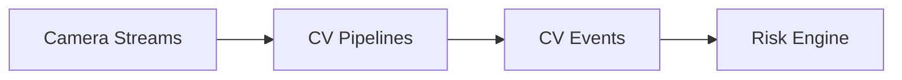

# 07 – CV Engine

## Purpose

The CV Engine turns raw camera images into **safety events**:

- PPE detection (helmets, respirators, FR clothing).
- Smoke and fire detection.
- Worker tracking and zone occupancy.
- Restricted area detection and unauthorized entry.

These events feed directly into the Risk Engine.

## Inputs

- Camera streams from:

  - `CAM-Z2-TOP-01`, `CAM-Z6-QCH-01`, `CAM-Z4-BASE-01`, `CAM-Z5-TAR-01`.
- Zone definitions and camera→zone mapping (`zones.csv`).
- PPE rules per zone (`ppe_required`).

## PPE Detection

Tasks:

- Detect workers and classify PPE items:
  - Helmet, FR overalls, gloves, face shield, respirator/SCBA.
- Compare detected PPE with `ppe_required` for zone:

  - If missing PPE: emit `PPE_VIOLATION` event tied to worker ID (via RFID/CV association) and zone.

Events:

- `cv_ppe_violation`: used by Risk Engine worker fusion.

## Smoke and Fire Detection

Tasks:

- Detect smoke plumes and fire hotspots:

  - Use brightness, colour, movement patterns, and IR cues where available.

Events:

- `cv_smoke_detected` → used with `Z2_SMOKE_01` sensor readings.
- `cv_fire_detected` → used with `Z2_COKEHOTSPOT_01` and other thermal sensors.

## Worker Tracking and Zone Occupancy

Tasks:

- Track workers via:

  - Visual tracking (bounding boxes).
  - RFID tags.
- Map worker positions to zones and occupancy counts.

Events:

- `cv_worker_enter_zone`, `cv_worker_exit_zone`.
- `cv_zone_occupancy` metrics.

Used by Risk Engine to:

- Detect unauthorized entries.
- Compute crowding metrics in hazardous zones.

## Restricted Area Detection

Tasks:

- Define restricted zones (e.g., basement gallery, tar area) with stricter rules.
- When worker enters restricted zone without permit or authorization, emit `UNAUTHORIZED_ENTRY` event.

Events:

- `cv_unauthorized_entry`: fused with permit and worker data.

## Integration with Risk Engine

Event flow:

Each CV event:

- Includes `event_type`, `zone_id`, `worker_id` (if available), `timestamp`, `severity`.
- Mapped to corresponding event profiles (e.g., `EV_PPE_VIOLATION`, `EV_SMOKE_DETECTION`, `EV_FIRE_DETECTION`, `EV_UNAUTHORIZED_ENTRY`).

The CV Engine is fully modular; models and thresholds can be improved independently as long as they emit well‑structured events.
