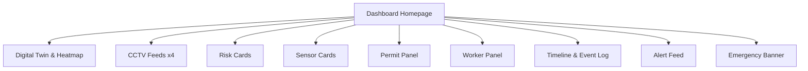

# 06 – Dashboard

## Purpose

The dashboard is the main human interface to the Industrial Intelligence Layer. It presents:

- A digital twin map.
- CCTV feeds.
- Heatmaps and timelines.
- Risk and sensor cards.
- Permit and worker panels.
- Alert and incident feeds.
- Emergency banners.

## Main UI Components

### Homepage Layout

- **Top bar**: Plant name, current scenario, time, global risk indicator.
- **Left column**:

  - Digital twin map with geospatial heatmap.
  - Zone labels and hazard icons.

- **Right column**:

  - 4 CCTV feeds (camera tiles).
  - Risk cards and alerts.

- **Bottom area**:

  - Timeline and event log.
  - Incident feed and emergency banner.

### CCTV Feeds

- Four simultaneous camera tiles:

  - Battery top (`CAM-Z2-TOP-01`).
  - Quench area (`CAM-Z6-QCH-01`).
  - Basement gallery (`CAM-Z4-BASE-01`).
  - Tar extractor (`CAM-Z5-TAR-01`).

Each tile:

- Shows current CV overlays (PPE, zones, smoke).
- Indicates CV events feeding the Risk Engine.

### Digital Twin & Geospatial Heatmap

- 2D plant map using `zones.csv` layout coordinates.

Features:

- Zones coloured by current risk score (green/yellow/orange/red).
- Icons for equipment, sensors, workers, and permits.
- Evacuation routes and muster points drawn from `zones.csv`.
- Clickable zones to show details (risk, sensors, permits, workers).

Data sources:

- `zones.csv`, `equipment.csv`, `workers.csv`, `permits.csv`, `telemetry.csv`, Risk Engine scores.

### Risk Cards

Card types:

- Zone risk cards (one per zone).
- Equipment risk cards (select equipment).
- Scenario risk cards.

Each card shows:

- Risk score and severity.
- Contributing sensors and events.
- Active permits and workers.
- Links to explanations via RAG.

### Sensor Cards

Per sensor:

- Value trend.
- Quality state (OK/WARN/CRIT).
- Threshold lines.
- Event annotations (gas leak phases, maintenance).

### Permit Panel

Shows:

- Active permits with type, zone, equipment, workers, start/end times.
- Isolation and gas test status.
- Risk flags when permits interact with anomalies.

### Worker Panel

Shows:

- Worker list with location, role, PPE level, permit assignments.
- Flags for PPE violations or unauthorized entries.

### Timeline and Event Log

- Global timeline showing scenario phases (normal, minor leak, major leak, shutdown).
- Event log of sensor and CV events, alerts, notifications.

### Alert Feed and Emergency Banner

Alert feed:

- Sorted by severity and time.
- Shows key details and recommended response.

Emergency banner:

- Large banner when critical risk is active.
- Summary of situation and next steps.

## Data Flow into Widgets

- Digital twin and heatmap: Risk Engine zone scores + config layouts.
- CCTV tiles: CV engine streams + overlay metadata.
- Risk cards: Risk Engine outputs (scores, explanations).
- Sensor cards: Telemetry API + thresholds.
- Permit panel: `permits.csv` and permit API.
- Worker panel: `workers.csv` and worker tracking API.
- Timeline and log: scenario engine + risk engine events.
- Alerts and banner: risk engine alert API.

## Mermaid Wireframe (Logical)

The dashboard should be kept in sync with the data model and Risk Engine APIs, ensuring each widget has a clear, documented data source.
