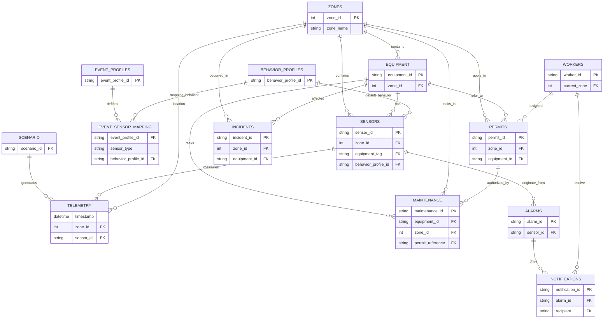

# 03 – Data Model

This document describes the CSV‑based data model forming the backbone of the simulator and Risk Engine. Each table has a clearly defined purpose, keys, relationships, and consumption patterns.

## Overview – Tables

Core config tables:

- `zones.csv`
- `equipment.csv`
- `sensors.csv`
- `behavior_profiles.csv`
- `event_profiles.csv`
- `event_sensor_mapping.csv`
- `scenario.csv`

Operational context tables:

- `permits.csv`
- `workers.csv`
- `maintenance.csv`
- `shifts.csv`
- `incidents.csv`
- `alarms.csv`
- `notifications.csv`

Generated table:

- `telemetry.csv`

## zones.csv

**Purpose:** Define spatial zones and hazard context for the digital twin.

- PK: `zone_id`
- Columns: `zone_id`, `zone_name`, `parent_area`, `camera_id`, `layout_x`, `layout_y`, `layout_width`, `layout_height`, `hazard_classification`, `ppe_required`, `permit_required`, `evacuation_route`, `description`.[output/zones.csv]
- Relationships:
  - FK from `equipment.zone_id`.
  - FK from `telemetry.zone_id`.
  - Referenced by `scenario.zones_involved`.

## equipment.csv

**Purpose:** Define equipment assets and group sensors.

- PK: `equipment_id`
- FK: `zone_id → zones.zone_id`.
- Columns: `equipment_id`, `equipment_name`, `zone_id`, `status`, `manufacturer`, `model`, `criticality`, `maintenance_interval_days`, `associated_sensors`.[output/equipment.csv]
- Relationships:
  - Strong link to `sensors.equipment_tag`.
  - Used by permits, maintenance, incidents.

## sensors.csv

**Purpose:** Describe sensor configuration, physical limits, and behaviour metadata.

- PK: `sensor_id`
- FKs:
  - `zone_id → zones.zone_id`.
  - `equipment_tag → equipment.equipment_id`.
  - `behavior_profile_id → behavior_profiles.behavior_profile_id`.[code_file:320][code_file:316]
- Key columns:
  - Physical: ranges (`normal_*`, `warning_*`, `critical_*`, `absolute_physical_*`), `unit`.
  - Operational: `sampling_interval_seconds`, `expected_noise_percent`, `SCADA_tag`, `alarm_priority`.
  - Behaviour: `behavior_profile_id`, `noise_profile_id`, `physical_response_type`, `inertia_class`, `max_physical_rate_of_change`, `min_physical_rate_of_change`, `failure_modes`, `default_quality_mapping_profile_id`, `operational_phase_tags`.

Used by:

- Simulator: to determine baseline and event behaviour, noise, inertia.
- Risk Engine: for thresholding, physical plausibility checks, and weighting.

## behavior_profiles.csv

**Purpose:** Reusable behaviour models for sensors.

- PK: `behavior_profile_id`
- Columns: `behavior_profile_id`, `behavior_name`, `description`, `mathematical_model`, `default_duration`, `supports_noise`, `supports_recovery`, `maximum_rate_of_change`, `minimum_rate_of_change`, `recommended_sensor_types`, `required_parameters`, `example_graph_shape`, `industrial_examples`.[code_file:316]
- Relationships:
  - Referenced by `sensors.behavior_profile_id`.
  - Referenced by `event_sensor_mapping.behavior_profile_id`.

## event_profiles.csv

**Purpose:** Event metadata (no sensor logic).

- PK: `event_profile_id`
- Columns: `event_profile_id`, `event_name`, `description`, `severity`, `priority`, `expected_duration_seconds`, `compound_risk_possible`, `recommended_response`, `dashboard_color`, `heatmap_color`, `ai_reasoning_summary`.[code_file:317]
- Relationships:
  - Referenced by `event_sensor_mapping.event_profile_id`.
  - Referenced by `scenario.events_timeline`.

## event_sensor_mapping.csv

**Purpose:** Define how events affect sensor types.

- PK: composite (`event_profile_id`, `sensor_type`) or separate row id.
- Columns: `event_profile_id`, `sensor_type`, `behavior_profile_id`, `start_value_rule`, `target_value_rule`, `duration_seconds`, `priority`, `supports_noise`, `recovery_profile_id`, `required_parameters`.[code_file:318]
- Relationships:
  - FK: `event_profile_id → event_profiles.event_profile_id`.
  - FK: `behavior_profile_id → behavior_profiles.behavior_profile_id`.

Used by simulator:

- For each active event, mapping rows tell the generator how to adjust sensors of specific types.

## scenario.csv

**Purpose:** Define plant‑level scenarios with event timelines.

- PK: `scenario_id`
- Columns: `scenario_id`, `name`, `description`, `start_time`, `end_time`, `zones_involved`, `permits_involved`, `events_timeline`, `expected_ai_actions`.[code_file:319]
- Relationships:
  - `events_timeline` references event IDs from `event_profiles`.
  - `zones_involved` references `zones.zone_id`.
  - `permits_involved` references `permits.permit_id`.

## telemetry.csv

**Purpose:** Time‑series telemetry output from the simulator.

- PK: composite (`timestamp`, `sensor_id`) in practice.
- Columns: `timestamp`, `zone_id`, `sensor_id`, `value`, `quality`, `simulation_state`, `event_id`.[file:289]
- Relationships:
  - `zone_id → zones.zone_id`.
  - `sensor_id → sensors.sensor_id`.
  - `event_id → event_profiles.event_profile_id` or scenario‑specific IDs.

Consumed by:

- Risk Engine: primary data stream.
- Dashboard: charts, trends, heatmaps.

## Operational Context Tables

### permits.csv

- Purpose: Permit‑to‑work records (confined space, hot work, maintenance).
- PK: `permit_id`.
- FKs: `zone_id → zones`, `equipment_id → equipment`, `workers_assigned → workers`.
- Used by Risk Engine to fuse permits with sensors and maintenance.

### workers.csv

- Purpose: worker identities, roles, PPE level, RFID tags, current zones.
- PK: `worker_id`.
- FKs: `shift_id → shifts`.
- Used by Risk Engine and CV for worker fusion and zone occupancy.

### maintenance.csv

- Purpose: maintenance tasks, priorities, links to permits and equipment.
- PK: `maintenance_id`.
- FKs: `equipment_id → equipment`, `zone_id → zones`, `permit_reference → permits`.

### shifts.csv

- Purpose: shift definitions and handover notes.
- PK: `shift_id`.

### incidents.csv

- Purpose: historical incidents for RAG and pattern intelligence.
- PK: `incident_id`.
- FKs: `zone_id → zones`, `equipment_id → equipment`.

### alarms.csv

- Purpose: alarm instances raised by sensors.
- PK: `alarm_id`.
- FKs: `sensor_id → sensors.sensor_id`.

### notifications.csv

- Purpose: messages triggered by alarms.
- PK: `notification_id`.
- FKs: `alarm_id → alarms.alarm_id`, `recipient → workers.worker_id`.

## ER Diagram (Conceptual)

This data model is the permanent foundation. All new features should extend it carefully rather than bypassing it.
