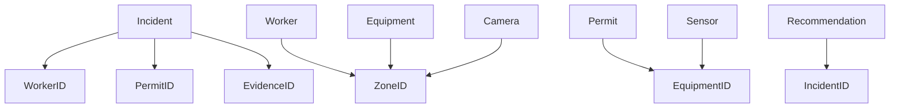
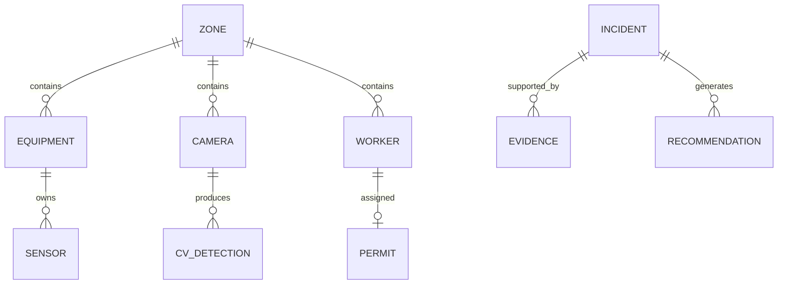
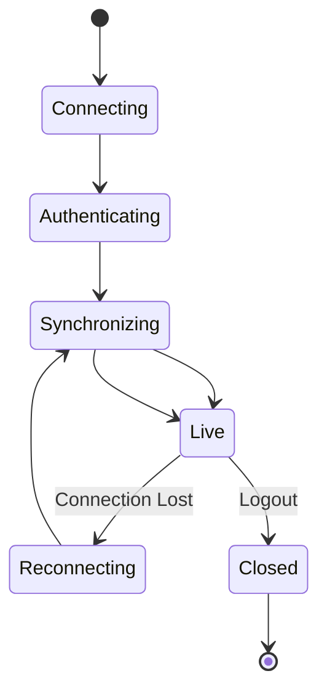
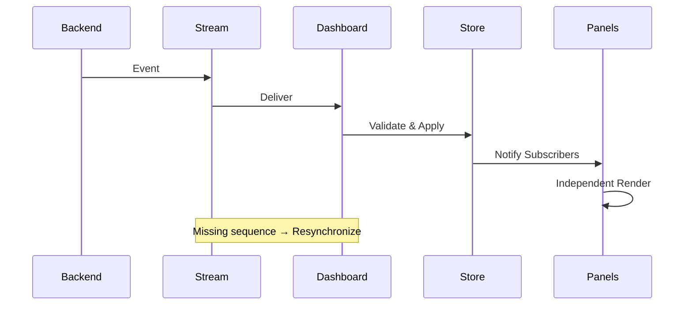
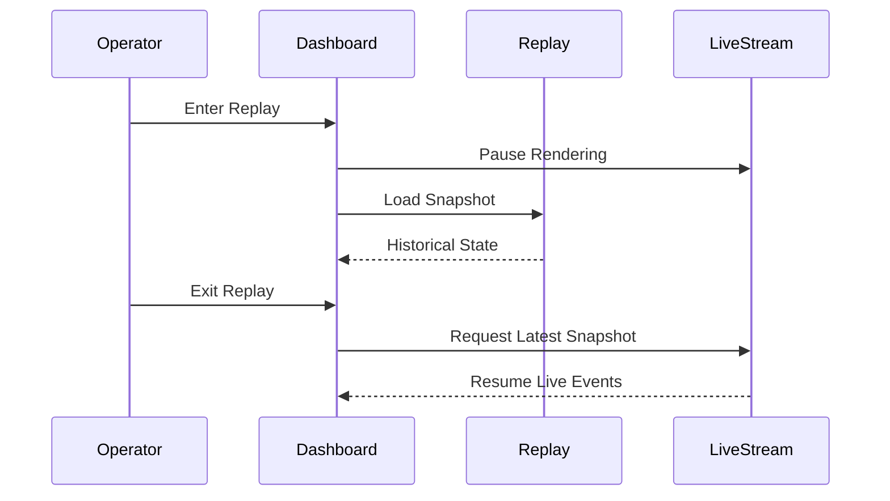
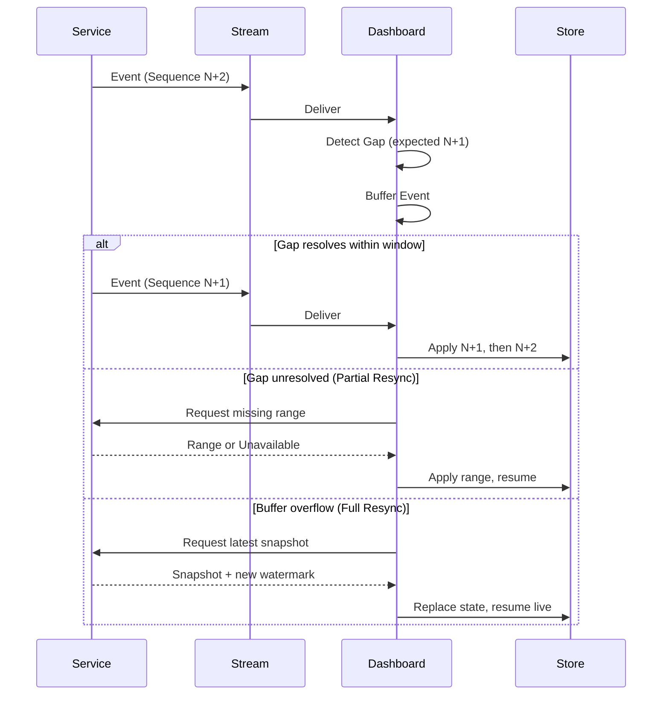
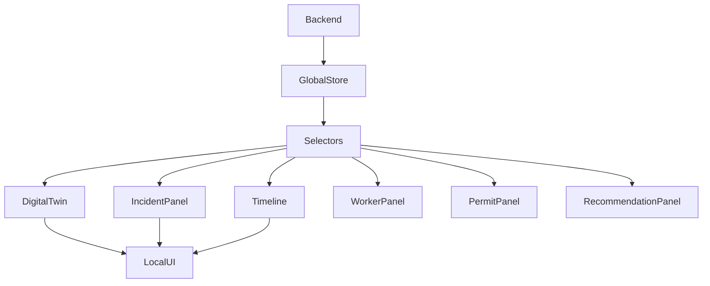
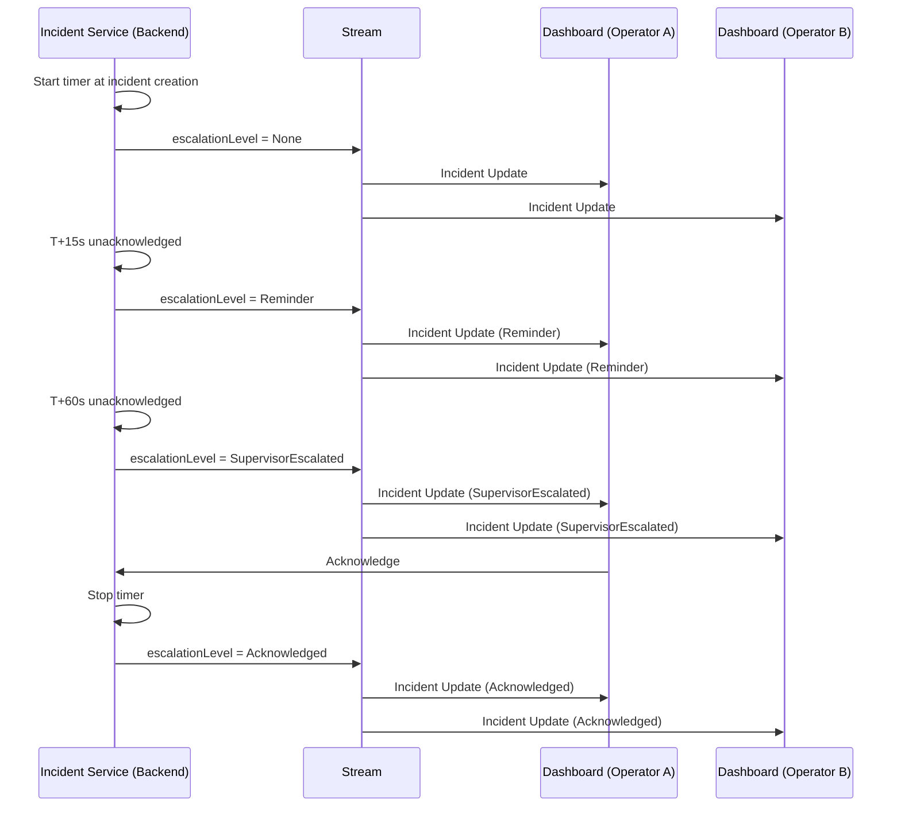
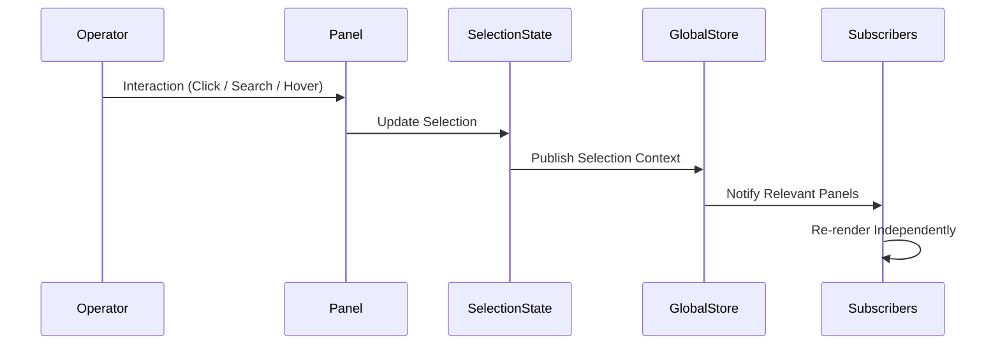

# 08_FRONTEND_ENGINEERING_SPEC.md

---

# 1. Frontend Data Model

## 1.1 State Ownership Rules

| Rule | Decision |
|-------|----------|
| Single Source of Truth | Every domain object exists only once in global state. |
| State Ownership | Every state slice has exactly one owner. |
| Mutations | Only the owning service/store may update a slice. |
| Cross-feature Communication | Through shared state only. |
| Duplication | Forbidden except for memoized derived state. |
| Persistence | UI preferences only. Domain state is reconstructed from backend. |

---

## 1.2 Application State Overview

```text
Application State
│
├── Domain State
│   ├── Telemetry
│   ├── Incident
│   ├── Worker
│   ├── Permit
│   ├── Camera
│   ├── Digital Twin
│   ├── Zone
│   ├── Equipment
│   ├── System Health
│   ├── Future CV
│   └── Future RAG
│
├── UI State
│   ├── Selection
│   ├── Navigation
│   └── Timeline
│
└── Derived State
    ├── Zone Summary
    ├── Incident Ranking
    ├── Visible Workers
    ├── Visible Recommendations
    └── Active Alerts
```

---

## 1.3 State Slice Specification

| State Slice | Purpose | Owner | Lifetime | Mutable | Normalization | Relationships | Update Frequency | Memory Strategy |
|-------------|---------|-------|----------|---------|---------------|---------------|-----------------|----------------|
| Telemetry | Live sensor values | Telemetry Service | Session | Mutable | Entity Map | Equipment, Zone | Every 500 ms | Sliding window buffer |
| Incident | Active incident lifecycle | Incident Service | Session | Mutable | Entity Store | Evidence, Worker, Permit, Recommendation | Event-driven | Active + archived summary |
| Worker | Workforce context | Worker Service | Session | Mutable | Entity Store | Permit, Zone, Incident | Every 500 ms | Current snapshot |
| Permit | Permit status | Permit Service | Session | Mutable | Entity Store | Worker, Equipment, Incident | Event-driven | Active permits only |
| Camera | Camera metadata | Camera Service | Session | Mutable | Entity Store | Zone, CV | Event-driven | Metadata only |
| Timeline | Replay state | Timeline Controller | Session | Mutable | Timeline Buffer | Incident, Telemetry | User-driven | Snapshot index |
| Selection | Current UI selection | UI Controller | Session | Mutable | Flat Object | References all entities | On interaction | Single active context |
| Navigation | Active route/layout | Navigation Controller | Session | Mutable | Flat Object | UI only | On interaction | Minimal |
| System Health | Infrastructure health | Health Service | Session | Mutable | Flat Map | Backend services | Every 5–10 s | Latest snapshot |
| Future CV | CV detections | CV Service | Session | Mutable | Entity Store | Camera, Worker, Incident | Event-driven | Rolling buffer |
| Future RAG | Knowledge references | RAG Service | Session | Immutable | Entity Store | Incident, Recommendation | On demand | LRU cache |

---

## 1.4 Normalization Strategy by State

| State | Structure | Why |
|--------|-----------|-----|
| Telemetry | Entity Map | Fast updates by sensor ID |
| Incident | Entity Store | Frequent lookup and cross-reference |
| Worker | Entity Store | Shared across multiple panels |
| Permit | Entity Store | Prevent duplicate permit data |
| Camera | Entity Store | Independent camera updates |
| Timeline | Ordered List | Time-sequential navigation |
| Selection | Flat Object | Single UI context |
| Navigation | Flat Object | Minimal UI state |
| System Health | Flat Map | Independent service statuses |
| CV | Entity Store | High-frequency event updates |
| RAG | Entity Store | Reusable references |

---

## 1.5 Lifetime Policy

| State | Startup | Live | Replay | Shutdown |
|--------|---------|------|--------|----------|
| Telemetry | Load | Live updates | Frozen | Dispose |
| Incident | Load | Live updates | Snapshot | Dispose |
| Worker | Load | Live updates | Snapshot | Dispose |
| Permit | Load | Live updates | Snapshot | Dispose |
| Camera | Load | Live updates | Frozen | Dispose |
| Timeline | Empty | Update | Active | Dispose |
| Selection | Empty | Active | Active | Save UI only |
| Navigation | Restore | Active | Active | Save |
| System Health | Load | Live | Frozen | Dispose |

---

## 1.6 Memory Rules

| Rule | Decision |
|------|----------|
| Duplicate domain entities | Not allowed |
| Historical telemetry | Managed by replay buffer only |
| Replay snapshots | Immutable |
| Derived state | Recomputed, never persisted |
| UI state | Small and ephemeral |
| Large datasets | Loaded incrementally |
| Camera frames | Never stored in application state |

---

## 1.7 Spatial Model State

§3.8 freezes ownership of Digital Twin, Zone, and Equipment concerns but does not declare them as frontend state slices. This subsection closes that gap by defining each exactly like every other row in §1.3, without altering any ownership decision made in §3.8.

| State Slice | Purpose | Owner | Lifetime | Mutable | Normalization | Relationships | Update Frequency | Memory Strategy |
|-------------|---------|-------|----------|---------|---------------|---------------|-----------------|----------------|
| Digital Twin | Plant topology graph and base overlays (heatmaps, sensor overlays) | Digital Twin Service | Session | Mutable | Entity Store | Zone, Equipment, Camera | On change (poll + event) | Session cache (§3.6) |
| Zone | Zone identity, geometry, and topology membership | Digital Twin Service | Session | Mutable | Entity Store | Equipment, Camera, Worker, Incident | On change (poll + event) | Session cache (§3.6) |
| Equipment | Equipment identity and static metadata (name, type, spec, install data) | Digital Twin Service | Session | Mutable | Entity Store | Zone, Telemetry (via Sensor), Permit | On change (poll + event) | Session cache, metadata only (§3.6) |

### Clarifications

- **Zone here is identity/geometry only.** Aggregated zone *operational* status remains the existing `Zone Summary` derived selector (§1.2 Derived State, §2.9) — unchanged, computed from this Zone slice plus Telemetry and Incident.
- **Equipment here is static metadata only.** Live Equipment *operational* state (running/stopped/fault, live values) continues to live in the existing Telemetry state slice (§1.3) — unchanged. The two are merged only at render time, never persisted as one entity, per §3.8.
- These three slices carry no write path; they are read-only from the Dashboard's perspective (§3.3).

---

# 2. Entity Normalization Strategy

## 2.1 Objective

The Dashboard uses normalized state to ensure:

- Single source of truth
- Constant-time entity lookup
- Minimal duplication
- Independent updates
- Efficient rendering
- Predictable memory usage

---

## 2.2 Primary Entity IDs

| Entity | Primary Identifier |
|---------|--------------------|
| Sensor | Sensor ID |
| Equipment | Equipment ID |
| Zone | Zone ID |
| Worker | Worker ID |
| Permit | Permit ID |
| Incident | Incident ID |
| Camera | Camera ID |
| Recommendation | Recommendation ID |
| Evidence | Evidence ID |
| Timeline Event | Event ID |
| CV Detection | Detection ID |
| Knowledge Record | Reference ID |

**Terminology note:** "Sensor" refers to the physical sensor metadata entity (device identity, keyed by Sensor ID), owned as part of Equipment metadata (§1.7, §3.8). It is distinct from **Telemetry Reading**, the streamed value entity produced by a Sensor (§1.3 Telemetry state slice; Appendix A). Every other use of "Sensor" in this document refers to this metadata entity, not to a telemetry value.

---

## 2.3 Foreign-Key Relationships

| Source | References |
|---------|------------|
| Sensor | Equipment, Zone |
| Equipment | Zone |
| Worker | Zone, Permit |
| Permit | Worker, Equipment |
| Incident | Zone, Worker, Permit, Evidence |
| Recommendation | Incident |
| Evidence | Incident, Sensor, Worker, Permit |
| Camera | Zone |
| CV Detection | Camera, Worker, Incident |

---

## 2.4 Entity Ownership

| Entity | Owning Service |
|---------|----------------|
| Telemetry | Telemetry Service |
| Incident | Incident Service |
| Worker | Worker Service |
| Permit | Permit Service |
| Camera | Camera Service |
| Recommendation | Recommendation Service |
| Evidence | Evidence Service |
| Timeline | Timeline Service |
| System Health | Health Service |

Only the owning service may mutate an entity.

---

## 2.5 Reference Rules

- Store IDs instead of nested objects.
- Cross-feature relationships use references only.
- Child entities never own parent entities.
- Circular references are prohibited.
- Entity ownership is unique.

---

## 2.6 Normalized Store



---

## 2.7 Entity Relationship Overview



---

## 2.8 Lazy Loading Policy

| Entity | Policy |
|---------|--------|
| Historical Timeline | On demand |
| Historical Incidents | On demand |
| Knowledge References | On demand |
| Camera Metadata | Initial load |
| Live Telemetry | Streaming |
| Active Incidents | Streaming |
| Active Workers | Streaming |
| Active Permits | Streaming |

---

## 2.9 Derived Selectors

Derived selectors are read-only computed views.

| Selector | Depends On |
|-----------|------------|
| Highest Risk Zone | Incident + Telemetry |
| Active Worker Count | Worker |
| Active Permit Count | Permit |
| Visible Incidents | Incident + Selection |
| Zone Summary | Zone + Telemetry |
| Visible Recommendations | Recommendation + Incident |
| Dashboard Status | System Health + Incident |

Derived selectors are:
- Never persisted
- Never mutated directly
- Recomputed only when dependencies change

---

## 2.10 Memory Management Rules

| Rule | Decision |
|------|----------|
| Historical snapshots | Immutable |
| Live entities | Replace in place by ID |
| Replay buffer | Fixed-size sliding window |
| Derived state | Recompute when invalidated |
| Metadata | Cache for session lifetime |
| RAG documents | LRU cache |
| Camera frames | External stream only |

---

## 2.11 Normalization Principles

1. Every entity exists exactly once.
2. Relationships are represented using IDs.
3. Large collections are normalized into entity stores.
4. Historical data is isolated from live state.
5. Derived data is never stored.
6. UI state never owns domain entities.
7. State shape remains stable regardless of plant size.

---

## 2.12 Spatial Entity Normalization

§2.2–2.11 freeze normalization for backend-owned domain entities but omit Zone, Equipment, and Digital Twin, which §1.7 defines as state slices and §3.8 assigns ownership to. This subsection freezes their normalization rules without rewriting any existing table in §2.2–2.11 — it adds only the missing spatial entities.

### Primary IDs (extends §2.2)

| Entity | Primary Identifier |
|---------|--------------------|
| Zone | Zone ID |
| Equipment | Equipment ID |
| Digital Twin | Twin ID (singleton per plant/site) |

### Relationships (extends §2.3)

| Source | References |
|---------|------------|
| Zone | Digital Twin |
| Equipment | Zone, Digital Twin |
| Digital Twin | Zone, Equipment, Camera |

These are additive to the existing FK rows in §2.3 (e.g., Equipment → Zone, Sensor → Equipment already frozen there); this table adds only the Digital Twin containment edge.

### Ownership (extends §2.4)

| Entity | Owning Service |
|---------|----------------|
| Zone | Digital Twin Service |
| Equipment | Digital Twin Service |
| Digital Twin | Digital Twin Service |

Matches §1.7 and §3.8 exactly. No prior ownership row is altered.

### Reference Rules

Zone, Equipment, and Digital Twin follow the same rules as every other entity in §2.5: store IDs, not nested objects; cross-feature relationships via reference only; no circular references; single owner per entity.

### Normalization Strategy

All three are **Entity Store** (per §1.7), consistent with Incident, Worker, Permit, and Camera — chosen for frequent lookup and cross-reference by ID rather than sequential access.

### Derived Selectors

No new derived selectors are introduced. `Zone Summary` (§2.9, depends on Zone + Telemetry) already covers zone-level aggregation and now resolves against the formally defined Zone slice (§1.7) rather than an implicit one.

---

# 3. Dashboard API Specification

## 3.1 API Design Rules

| Rule | Decision |
|------|----------|
| Ownership | Backend owns all business data |
| Dashboard Role | Consumer and presenter only |
| Transport | Request/response + streaming |
| Versioning | Independent service versioning |
| Authentication | Required for every request/stream |
| Error Model | Standardized service error envelope |
| Retry | Client retries only transient failures |
| Replay | Supported only by replay-capable services |
| Caching | Metadata only unless specified otherwise |

---

## 3.2 Service Contract Matrix

| Service | Purpose | Owner | R/W | Update Method | Frequency | Authentication | Error Strategy | Versioning | Cache Policy | Replay |
|----------|----------|-------|-----|---------------|-----------|---------------|---------------|------------|--------------|--------|
| Telemetry | Live sensor data | Telemetry Service | Read | Streaming | 500 ms | Required | Retry + stale state | Independent | None | Yes |
| Incident | Incident lifecycle | Incident Service | Read/Write | Streaming | Event-driven | Required | Retry + reconcile | Independent | Active only | Yes |
| Worker | Worker state | Worker Service | Read | Streaming | 500 ms | Required | Retry | Independent | None | Yes |
| Permit | Permit lifecycle | Permit Service | Read/Write | Streaming | Event-driven | Required | Retry | Independent | Active only | Yes |
| Recommendation | AI recommendations | Recommendation Service | Read | Streaming | Event-driven | Required | Retry | Independent | None | Yes |
| Evidence | Explainability chain | Evidence Service | Read | Streaming | Event-driven | Required | Retry | Independent | Session | Yes |
| Digital Twin | Plant topology & overlays | Digital Twin Service | Read | Poll + Event | On change | Required | Retry | Independent | Session | Yes |
| Timeline | Operational events | Timeline Service | Read | Streaming | Event-driven | Required | Retry | Independent | Session | Yes |
| Health | Platform status | Health Service | Read | Poll | 5–10 s | Required | Retry | Independent | None | No |
| Historical Playback | Historical snapshots | Historian Service | Read | Request | User-driven | Required | Retry | Independent | Session | Native |
| Future CV | Vision detections | CV Service | Read | Streaming | Event-driven | Required | Retry | Independent | None | Yes |
| Future RAG | Knowledge retrieval | RAG Service | Read | Request | On demand | Required | Graceful fallback | Independent | LRU | Optional |

---

## 3.3 Read / Write Responsibility

| Service | Dashboard Read | Dashboard Write |
|----------|----------------|-----------------|
| Telemetry | ✓ | ✗ |
| Incident | ✓ | Acknowledge / Escalate |
| Worker | ✓ | Notes only |
| Permit | ✓ | Suspend / Resume |
| Recommendation | ✓ | Acknowledge |
| Evidence | ✓ | ✗ |
| Digital Twin | ✓ | ✗ |
| Timeline | ✓ | ✗ |
| Health | ✓ | ✗ |
| Historical Playback | ✓ | ✗ |
| CV | ✓ | ✗ |
| RAG | ✓ | ✗ |

---

## 3.4 Authentication Expectations

| Requirement | Decision |
|------------|----------|
| Login required | Yes |
| Streaming authentication | Same authenticated session |
| Authorization | Role-based |
| Token refresh | Automatic before expiry |
| Replay access | Same authorization model |
| Permission enforcement | Backend only |

---

## 3.5 Versioning Policy

| Rule | Decision |
|------|----------|
| API Versioning | Independent per service |
| Backward Compatibility | Preferred |
| Breaking Changes | New major version |
| Streaming Schema | Versioned independently |
| Replay Format | Stable within major version |

---

## 3.6 Cache Policy

| Data | Cache Strategy |
|------|----------------|
| Plant topology | Session |
| Equipment metadata | Session |
| Camera metadata | Session |
| Historical metadata | Session |
| RAG documents | LRU |
| Live telemetry | Never |
| Live incidents | Never |
| Worker positions | Never |

---

## 3.7 Replay Compatibility

| Service | Replay Behavior |
|----------|-----------------|
| Telemetry | Historical snapshots |
| Incident | Historical lifecycle |
| Worker | Historical positions |
| Permit | Historical state |
| Recommendation | Historical recommendations |
| Evidence | Historical evidence |
| Digital Twin | Historical overlays |
| Timeline | Native replay |
| Health | Current only |
| CV | Historical detections (future) |
| RAG | Current references |

---

## 3.8 Equipment & Zone Ownership

### Decision

Telemetry Service and Digital Twin Service own different, non-overlapping concerns for the same physical objects. Telemetry Service owns *what a piece of equipment is doing right now*. Digital Twin Service owns *what a piece of equipment or zone is, and where it sits in the plant*. Neither service may write into the other's concern, and the Dashboard never merges the two into a single mutable record — each concern is fetched, normalized, and rendered from its own owner (§1.3, §2.4).

### Ownership Matrix

| Concern | Owner | Update Method | Notes |
|---------|-------|---------------|-------|
| Geometry (shapes, coordinates, 3D model) | Digital Twin Service | Poll + Event, on change | Static unless plant is physically reconfigured |
| Topology (equipment↔zone↔plant relationships) | Digital Twin Service | Poll + Event, on change | Structural layout, not live values |
| Equipment metadata (name, type, spec, install data) | Digital Twin Service | Poll + Event, on change | Cached for session (§3.6) |
| Equipment operational state (running/stopped/fault, live values) | Telemetry Service | Streaming, 500 ms | Never cached (§3.6); never persisted by Digital Twin Service |
| Zone operational state (aggregated zone status) | Dashboard — Derived Selector | Recomputed on dependency change | Not owned by either backend service; computed from Telemetry + Incident (§2.9 Zone Summary) |
| Overlay — base layers (heatmaps, sensor overlays) | Digital Twin Service | Poll + Event, on change | Published as part of Digital Twin payload (§3.2) |
| Overlay — incident highlight (emergency zone/equipment emphasis) | Dashboard — Derived Selector | Recomputed on Primary Incident change | Driven by §8.6/§9.5; not stored by Digital Twin Service |

### Freeze Rules

| Rule | Decision |
|------|----------|
| Single owner per concern | Required — no concern above has two owners |
| Cross-service writes | Forbidden; Telemetry never writes geometry/topology/metadata, Digital Twin Service never writes operational state |
| Dashboard as an owner | Only for the two Derived Selector rows above; the Dashboard never owns Geometry, Topology, or Metadata |
| Merge at render time | Permitted (e.g., overlay a live value onto a static shape) but never persisted as a merged entity |
| Conflicting values | Cannot occur — each concern has exactly one authoritative source |

---

## 3.9 Service Contract Assumptions

| Assumption | Decision |
|------------|----------|
| Sequence ID scope | Per service (§4.17.1) — every service stream carries its own strictly increasing counter |
| Error envelope responsibility | Backend owns the error envelope shape; every service returns the same standardized envelope (§3.1) regardless of failure type |
| Correlation ID | Generated by the Dashboard at action initiation, propagated through every backend hop, and returned in the response and any resulting audit record (§6.7) |
| Retry classification | Backend classifies each error as Transient or Permanent; the Dashboard retries only Transient failures and never retries Permanent ones (§3.1, §6.1) |
| Concurrent version assumptions | Every write carries the version/state the Dashboard last observed; the backend is the sole arbiter of conflict, never the Dashboard (§6.5) |

These assumptions apply uniformly across all services in §3.2 and are prerequisites for the write-path and streaming contracts defined in Sections 4 and 6. No service-specific payload format is defined here.

---

# 4. Streaming Architecture

## 4.1 Streaming Principles

| Rule | Decision |
|------|----------|
| Transport | Persistent bidirectional stream |
| State Model | Event-driven |
| Ordering | Guaranteed by sequence ID |
| Delivery | At least once |
| Duplicate Handling | Client-side suppression |
| Replay | Snapshot-based |
| Recovery | Automatic reconnect |

---

## 4.2 Connection Lifecycle



---

## 4.3 Connection Rules

| Phase | Behavior |
|--------|----------|
| Connecting | Establish transport |
| Authenticating | Validate session |
| Synchronizing | Fetch latest snapshot |
| Live | Receive events |
| Reconnecting | Exponential backoff |
| Closed | Release resources |

---

## 4.4 Reconnect Policy

| Condition | Decision |
|-----------|----------|
| First retry | Immediate |
| Subsequent retries | Exponential backoff |
| Maximum retry interval | Fixed upper bound |
| Successful reconnect | Full snapshot synchronization |
| Manual reconnect | Supported |

---

## 4.5 Heartbeat Policy

| Parameter | Decision |
|-----------|----------|
| Heartbeat Direction | Bidirectional |
| Purpose | Detect silent disconnects |
| Missed Heartbeats | Transition to Reconnecting |
| UI Indicator | Connection degraded |

---

## 4.6 Event Envelope Rules

Every streamed event shall contain:

| Field | Purpose |
|-------|---------|
| Event ID | Uniqueness |
| Sequence ID | Ordering |
| Timestamp | Temporal consistency |
| Service Version | Compatibility |
| Entity Type | Routing |
| Operation | Create / Update / Delete |
| Payload | Domain data |

---

## 4.7 Sequence Rules

| Rule | Decision |
|------|----------|
| Ordering | Strictly increasing sequence ID |
| Gap Detection | Missing IDs trigger resynchronization |
| Duplicate Events | Ignored |
| Older Events | Discarded |
| Equal Sequence | Ignore duplicate |

---

## 4.8 Duplicate Suppression

| Condition | Action |
|-----------|--------|
| Duplicate Event ID | Ignore |
| Duplicate Sequence ID | Ignore |
| Stale Version | Ignore |
| Identical Payload | No render |

---

## 4.9 Late Event Handling

| Situation | Decision |
|-----------|----------|
| Event older than current state | Ignore |
| Event missing dependencies | Buffer briefly |
| Event after replay | Discard |
| Large ordering gap | Trigger resync |

---

## 4.10 Back-pressure Strategy

| Situation | Behavior |
|-----------|----------|
| Burst telemetry | Batch render |
| Incident burst | Priority updates |
| Large worker updates | Incremental processing |
| Camera metadata burst | Queue |
| Replay | Independent pipeline |

Critical incident updates always preempt telemetry rendering.

---

## 4.11 Historical Replay Interaction

| Rule | Decision |
|------|----------|
| Enter Replay | Suspend live rendering |
| Live Events | Continue buffering |
| Exit Replay | Discard replay state |
| Resume | Synchronize latest snapshot |
| Partial Replay | Not supported |

---

## 4.12 Network Recovery

| Phase | Action |
|--------|--------|
| Disconnect | Freeze live state |
| Retry | Automatic |
| Reconnect | Authenticate |
| Synchronize | Fetch latest snapshot |
| Resume | Continue streaming |

---

## 4.13 Update Priority

| Priority | Event Types |
|----------|-------------|
| Critical | Emergency, Incident |
| High | Recommendation, Permit |
| Medium | Telemetry, Worker |
| Low | Health, Metadata |

---

## 4.14 Streaming Lifecycle



---

## 4.15 Replay Transition



---

## 4.16 Streaming Guarantees

| Guarantee | Decision |
|-----------|----------|
| Ordered delivery | Yes (per sequence ID) |
| Duplicate suppression | Yes |
| Snapshot consistency | Required |
| Event replay | Supported where applicable |
| Automatic recovery | Yes |
| Independent service streams | Supported |
| UI synchronization before render | Required |

---

## 4.17 Event Ordering & Sequence Scope

### 4.17.1 Sequence ID Scope (Frozen)

| Option | Status |
|--------|--------|
| Global (single counter across all services) | Rejected |
| Per Service (one counter per owning service stream) | **Adopted** |
| Per Entity (one counter per entity instance) | Rejected |

Sequence IDs are **per service**. Each owning service (Telemetry, Incident, Worker, Permit, Camera, System Health, CV, RAG) maintains one strictly increasing counter covering every entity it owns. This matches single-owner entity rules (§2.4) and independent service streams (§4.16). A global counter would force artificial coupling between unrelated services; per-entity counters would prevent ordering create/update/delete across entities of the same type (e.g., two incidents in the same zone).

---

### 4.17.2 Event Ordering

| Rule | Decision |
|------|----------|
| Ordering scope | Within a single service stream only |
| Cross-service ordering | Not guaranteed; Timestamp is advisory only |
| Ordering key | Sequence ID, ascending, per service |
| Out-of-order arrival | Buffered, not applied, until gap resolves |

---

### 4.17.3 Event Buffering

| Rule | Decision |
|------|----------|
| Buffer scope | Per service stream |
| Buffer trigger | Sequence ID greater than expected next |
| Buffer duration | Short, fixed upper bound |
| Buffer overflow | Discard buffer, trigger full resynchronization |
| Buffered events | Never rendered until applied in order |

---

### 4.17.4 Sequence Gaps

| Gap Size | Decision |
|----------|----------|
| Single missing sequence ID | Buffer briefly, await arrival |
| Small gap, resolves within buffer window | Apply in order once filled |
| Small gap, unresolved after buffer window | Partial resynchronization |
| Large gap (exceeds threshold) | Full resynchronization |

---

### 4.17.5 Duplicate Suppression

| Rule | Decision |
|------|----------|
| Scope | Per service, keyed on Sequence ID + Event ID |
| Duplicate Sequence ID | Ignore, no render |
| Replayed Sequence ID after resync | Ignore if already applied |

---

### 4.17.6 Late Events

| Rule | Decision |
|------|----------|
| Sequence ID below current applied watermark | Discard |
| Sequence ID within active buffer window | Apply in order |
| Sequence ID arriving mid-resynchronization | Discard, snapshot supersedes |

---

### 4.17.7 Partial Resynchronization

| Rule | Decision |
|------|----------|
| Trigger | Small, bounded gap on a single service stream |
| Scope | Affected service only; other streams unaffected |
| Mechanism | Request missing sequence range from owning service |
| Outcome | Fill gap, resume live application from watermark |
| Fallback | If range unavailable, escalate to full resynchronization |

---

### 4.17.8 Full Resynchronization

| Rule | Decision |
|------|----------|
| Trigger | Buffer overflow, unresolved gap, or reconnect |
| Scope | All service streams |
| Mechanism | Discard local watermark, fetch latest snapshot per service |
| Outcome | New sequence watermark established per service; live events resume |
| Rendering | Suspended until every service snapshot is applied |

---

### 4.17.9 Resynchronization Flow



---

# 5. State Management Strategy

## 5.1 Selected Architecture

### Decision

Adopt a **Centralized Global Store + Feature Stores + Derived Selectors** architecture.

```
Backend

↓

Global Entity Store

↓

Feature Selectors

↓

Feature Modules

↓

Local UI State
```

---

## 5.2 Design Rules

| Rule | Decision |
|------|----------|
| Domain State | Global Store |
| UI State | Local unless shared |
| Derived State | Computed selectors only |
| Entity Ownership | Single owner |
| Cross-feature communication | Through Global Store only |
| Direct feature communication | Prohibited |
| Business logic | Backend only |

---

## 5.3 State Classification

| State Category | Owner | Lifetime | Persistence |
|---------------|-------|----------|-------------|
| Domain State | Global Store | Session | No |
| UI State | Feature | Component Lifetime | Optional |
| Derived State | Selector | Computed | Never |
| Session State | Session Manager | Session | Yes |
| Replay State | Timeline Controller | Replay Session | No |

---

## 5.4 Global State Responsibilities

The Global Store owns:

- Telemetry
- Incidents
- Workers
- Permits
- Cameras
- Recommendations
- Evidence
- Timeline
- Health
- CV
- RAG

Only backend events modify domain state.

---

## 5.5 Local State Responsibilities

Local state is limited to presentation concerns.

Examples:

| Local State |
|-------------|
| Expanded panel |
| Selected tab |
| Scroll position |
| Dialog visibility |
| Camera fullscreen |
| Local filter |
| Hover state |

Local state must never duplicate domain entities.

---

## 5.6 Derived State Rules

Derived state is computed from normalized entities.

Examples:

| Derived Selector | Depends On |
|------------------|------------|
| Highest Risk Zone | Incident + Telemetry |
| Active Alerts | Incident |
| Visible Workers | Worker + Selection |
| Visible Recommendations | Recommendation + Selection |
| Zone Summary | Telemetry + Worker + Permit |
| Incident Count | Incident |

Rules:

- Read-only
- Never persisted
- Never mutated
- Recomputed only when dependencies change

---

## 5.7 Selector Strategy

| Rule | Decision |
|------|----------|
| Read-only | Yes |
| Memoized | Yes |
| Feature-scoped | Yes |
| Side effects | Never |
| Shared between features | Allowed |
| Mutations | Not permitted |

---

## 5.8 Memoization Policy

Memoization is mandatory for:

- Zone summaries
- Incident ranking
- Worker filtering
- Recommendation ordering
- Timeline aggregation
- Search results

Not required for:

- Individual entity lookup
- Local UI state

---

## 5.9 Persistence Strategy

| Data | Persist |
|------|---------|
| Navigation | ✓ |
| Theme / Preferences | ✓ |
| Panel Layout | ✓ |
| Selected Plant | ✓ |
| Active Replay | ✗ |
| Telemetry | ✗ |
| Incident | ✗ |
| Workers | ✗ |
| Permits | ✗ |

Domain state is reconstructed after synchronization.

---

## 5.10 Session Restoration

After authentication:

```
Restore Preferences

↓

Restore Navigation

↓

Synchronize Backend

↓

Rebuild Global Store

↓

Recompute Derived State

↓

Render
```

No stale domain state is restored from storage.

---

## 5.11 Replay State

Replay operates in an isolated state context.

| Rule | Decision |
|------|----------|
| Live updates | Buffered |
| Replay state | Immutable |
| Domain state | Snapshot |
| Exit replay | Full resynchronization |
| Merge replay with live | Forbidden |

---

## 5.12 Feature Isolation

Every feature owns:

- Local UI state
- Feature selectors
- Rendering logic

Every feature shares:

- Global entity store

Features never mutate another feature's local state.

---

## 5.13 Alternatives Considered

| Alternative | Rejected Because |
|-------------|------------------|
| Component-only state | Poor scalability |
| Multiple independent stores | Synchronization complexity |
| Event bus between panels | Tight coupling |
| Nested state tree | Expensive updates |
| Backend-driven UI | Reduced responsiveness |

---

## 5.14 State Architecture



---

## 5.15 State Management Rules

1. Domain state exists once.
2. UI state remains local whenever possible.
3. Derived state is computed.
4. Selectors are memoized.
5. Features communicate only through the Global Store.
6. Replay never mutates live state.
7. Persistence is limited to user preferences.

---

# 6. Operator Write Path

## 6.1 General Rules

| Rule | Decision |
|------|----------|
| Business validation | Backend |
| UI validation | Input completeness only |
| Audit logging | Backend |
| Authorization | Backend |
| Write confirmation | Required for high-impact actions |
| State mutation | Server-confirmed |
| Retry | Automatic for transient failures |

---

## 6.2 Update Model

| Action Category | Update Strategy |
|-----------------|----------------|
| Safety-critical | Pessimistic |
| Administrative | Optimistic with rollback |
| Notes | Optimistic |
| UI-only | Immediate |

---

## 6.3 Operator Action Matrix

| Action | Trigger | Validation | Confirmation | Update Model | Rollback | Audit | Failure Handling | Permission |
|--------|---------|------------|--------------|--------------|----------|-------|------------------|------------|
| Acknowledge Alert | Alert Queue / Incident | Active alert | No | Pessimistic | Restore previous state | Required | Notify + retry | Operator+ |
| Escalate Incident | Incident Panel | Active incident | Yes | Pessimistic | Restore | Required | Notify | Supervisor+ |
| Silence Alert | Alert Queue | Alert active | Yes | Pessimistic | Restore | Required | Notify | Supervisor+ |
| Open Incident | Timeline / Alert | Valid incident | No | Pessimistic | N/A | Required | Notify | Operator+ |
| Close Incident | Incident Panel | Incident resolved | Yes | Pessimistic | Restore | Required | Notify | Supervisor+ |
| Suspend Permit | Permit Panel | Permit active | Yes | Pessimistic | Restore | Required | Notify | Safety Officer+ |
| Resume Permit | Permit Panel | Permit suspended | Yes | Pessimistic | Restore | Required | Notify | Safety Officer+ |
| Dispatch Response | Recommendation | Incident active | Yes | Pessimistic | Restore | Required | Notify | Supervisor+ |
| Worker Notes | Worker Panel | Worker selected | No | Optimistic | Remove note | Required | Retry | Operator+ |

---

## 6.4 Confirmation Policy

| Action | Confirmation Required |
|---------|----------------------|
| Acknowledge | No |
| Open Incident | No |
| Worker Notes | No |
| Escalate | Yes |
| Silence | Yes |
| Suspend Permit | Yes |
| Resume Permit | Yes |
| Dispatch | Yes |
| Close Incident | Yes |

---

## 6.5 Validation Rules

| Validation Type | Owner |
|-----------------|-------|
| Required fields | UI |
| Business rules | Backend |
| Permissions | Backend |
| Resource availability | Backend |
| Conflict detection | Backend |

---

## 6.6 Rollback Policy

| Failure | UI Behavior |
|----------|-------------|
| Validation failure | Reject immediately |
| Authorization failure | Restore previous state |
| Network timeout | Retry, then restore |
| Backend rejection | Restore and notify |
| Conflict detected | Refresh latest state |

---

## 6.7 Audit Expectations

Every successful write operation must generate an audit record containing:

| Audit Field |
|-------------|
| Operator ID |
| Timestamp |
| Action |
| Target Entity |
| Previous State |
| New State |
| Correlation ID |

Audit persistence is owned by the backend.

---

## 6.8 Failure Handling

| Failure Scenario | Dashboard Response |
|------------------|--------------------|
| Backend unavailable | Disable action |
| Network loss | Queue if permitted, otherwise reject |
| Permission denied | Inform operator |
| Validation failed | Highlight error |
| Timeout | Retry then notify |
| Entity changed remotely | Refresh and request confirmation |

---

## 6.9 Permission Model

| Role | Allowed Actions |
|------|-----------------|
| Operator | Acknowledge, Open Incident, Worker Notes |
| Shift Supervisor | Operator + Escalate, Dispatch, Silence, Close |
| Safety Officer | Supervisor + Suspend/Resume Permit |
| Plant Manager | All operational actions |
| Administrator | Configuration only (outside operational workflow) |

---

## 6.10 Write Lifecycle

```text
Operator Action

↓

UI Validation

↓

Permission Check

↓

Backend Validation

↓

Execute

↓

Audit Log

↓

State Update

↓

UI Refresh
```

---

## 6.11 Write Path Rules

1. The Dashboard never bypasses backend validation.
2. High-impact actions require explicit confirmation.
3. Backend is the source of truth for all mutations.
4. Failed writes never leave partial UI state.
5. Every successful write is auditable.
6. Safety-critical actions always use pessimistic updates.
7. UI feedback is immediate, but domain state changes only after backend confirmation.

---

## 6.12 Concurrent Operator Writes

### Decision

The backend is the sole source of truth for concurrent writes. The Dashboard never resolves conflicts locally, never guesses which operator "wins," and never applies a write optimistically for actions in this table (all are Pessimistic per §6.2).

### Scenarios

| Scenario | Source of Truth | Conflict Detection | Conflict Resolution | Dashboard Behavior | Operator Notification |
|----------|-----------------|--------------------|--------------------|--------------------|-----------------------|
| Two operators acknowledge simultaneously | Incident Service | First accepted write wins; second is a no-op, not an error | Idempotent — acknowledgement applies once, state converges | Both UIs refresh to the same acknowledged state | Second operator sees "already acknowledged by [operator]," not a failure |
| Two operators escalate simultaneously | Incident Service | Backend compares submitted version against current | First write commits; second detects stale version | Second Dashboard refreshes to latest state (§6.6) | Second operator is informed escalation already occurred |
| Two operators suspend the same permit | Permit Service | Backend compares submitted version against current | First write commits; second is rejected as conflicting, not merged | Rejected Dashboard refreshes and re-requests confirmation (§6.8) | Rejected operator is told the permit was already suspended, by whom |

### Freeze Rules

| Rule | Decision |
|------|----------|
| Local conflict resolution | Forbidden — resolution happens only in the owning backend service |
| Duplicate-intent writes (e.g., double acknowledge) | Treated as idempotent, not errors |
| Version-conflicting writes (e.g., competing suspend) | Second write rejected, never silently merged |
| UI state after rejection | Always refreshed to backend-confirmed state before re-enabling the action |
| Notification content | Identifies the action already taken and, where available, which operator took it |

---

# 7. Alarm Flood Strategy

## 7.1 Objectives

| Objective | Decision |
|-----------|----------|
| Never hide critical alarms | Mandatory |
| Prevent operator overload | Mandatory |
| Preserve chronology | Yes |
| Reduce duplicate information | Yes |
| Maintain deterministic ordering | Yes |
| Keep response workflow simple | Yes |

---

## 7.2 Alarm Processing Pipeline

```text
Incoming Event

↓

Classification

↓

Deduplication

↓

Correlation

↓

Prioritization

↓

Grouping

↓

Suppression

↓

Operator Queue
```

---

## 7.3 Alarm Grouping Rules

| Condition | Group By |
|-----------|----------|
| Same Incident | Incident ID |
| Same Zone | Zone ID |
| Same Equipment | Equipment ID |
| Same Root Cause | Correlation ID |
| Same Permit | Permit ID |
| Same Emergency | Emergency Session ID |

Each group has:

- Primary Alarm
- Supporting Alarms
- Alarm Count
- Latest Update

---

## 7.4 Deduplication Rules

| Duplicate Condition | Action |
|--------------------|--------|
| Same Alarm ID | Ignore |
| Same Event ID | Ignore |
| Same Source + Same State | Update existing |
| State Transition | Update existing alarm |
| Severity Increase | Promote existing alarm |

---

## 7.5 Prioritization Levels

| Priority | Examples |
|----------|----------|
| P1 | Emergency shutdown, explosion risk |
| P2 | Active incident |
| P3 | Warning threshold exceeded |
| P4 | Advisory |
| P5 | Informational |

Only P1 and P2 may auto-focus the operator.

---

## 7.6 Suppression Rules

| Rule | Decision |
|------|----------|
| Duplicate alerts | Suppress |
| Child alarms under active parent | Collapse |
| Cleared alarms | Archive |
| Acknowledged alarms | De-emphasize (not hide) |
| Informational during Emergency | Collapse by default |

Critical alarms are never suppressed.

---

## 7.7 Overflow Strategy

### Scenario A — 100 Alerts

- Group by Incident
- Collapse duplicate alarms
- Show grouped counts
- Maintain sortable queue

---

### Scenario B — 500 Alerts

- Show Incident Groups only
- Expand on demand
- Auto-filter informational alarms
- Preserve chronological history

---

### Scenario C — Continuous Telemetry (1000+ Updates)

- Batch telemetry rendering
- Prioritize incident updates
- Do not create alarms for every telemetry update
- Alarm generation remains backend responsibility

---

### Scenario D — Multiple Emergencies

Display:

```
Emergency Queue

↓

Ranked Emergencies

↓

Selected Emergency

↓

Supporting Incidents
```

Only the highest-priority emergency receives automatic focus.

---

## 7.8 Operator Workflow

```text
Emergency Appears

↓

Primary Alarm

↓

Review Evidence

↓

Review Recommendation

↓

Acknowledge

↓

Investigate

↓

Resolve

↓

Archive
```

---

## 7.9 Alarm Queue Rules

| Rule | Decision |
|------|----------|
| Queue Order | Deterministic |
| Sorting | Automatic |
| Manual Sorting | Allowed |
| Auto-scroll | Disabled during operator interaction |
| Filter | Non-destructive |

---

## 7.10 Alarm Design Rules

1. Never hide critical alarms.
2. Collapse duplicates automatically.
3. Show counts instead of repetition.
4. Preserve investigation history.
5. Always maintain deterministic ordering.

---

# 8. Incident Prioritization

## 8.1 Objective

When multiple incidents exist simultaneously, the Dashboard shall always identify **one Primary Incident**.

Selection must be deterministic and reproducible.

---

## 8.2 Priority Evaluation Order

Incidents are evaluated using the following precedence:

| Priority | Attribute |
|----------|-----------|
| 1 | Severity |
| 2 | Compound Risk Score |
| 3 | Emergency Escalation Level |
| 4 | Workers at Risk |
| 5 | Permit Conflict |
| 6 | Confidence Score |
| 7 | Timestamp |
| 8 | Incident ID |

Evaluation stops at the first differentiating attribute.

---

## 8.3 Severity Ranking

| Severity | Rank |
|----------|-----:|
| Emergency | 1 |
| Critical | 2 |
| High | 3 |
| Medium | 4 |
| Low | 5 |
| Informational | 6 |

---

## 8.4 Deterministic Decision Matrix

| Attribute | Higher Priority |
|-----------|-----------------|
| Severity | Higher severity |
| Risk Score | Higher score |
| Escalation | Higher level |
| Workers Affected | More workers |
| Permit Conflict | Present over absent |
| Confidence | Higher confidence |
| Timestamp | Earlier occurrence |
| Incident ID | Lowest ID (final tie-breaker) |

---

## 8.5 Tie-Break Rules

```text
Severity

↓

Risk Score

↓

Escalation

↓

Workers

↓

Permit Conflict

↓

Confidence

↓

Timestamp

↓

Incident ID
```

No manual intervention is required.

---

## 8.6 Primary Incident Rules

The Primary Incident controls:

- Incident Focus Panel
- Recommendation Panel
- Digital Twin Highlight
- Auto-focused Camera
- Emergency Banner
- Operations Narrative

Secondary incidents remain visible in the Incident Queue.

---

## 8.7 Incident Queue Behavior

| Queue Position | Behavior |
|---------------|----------|
| Primary | Expanded |
| Secondary | Collapsed summary |
| Resolved | Archived |
| Acknowledged | Remains ordered |

---

## 8.8 Priority Update Rules

Re-evaluate incident order whenever:

- Severity changes
- Risk score changes
- Escalation changes
- Workers affected changes
- Permit conflict changes
- Incident resolves
- New incident appears

---

## 8.9 Prioritization Rules

1. Ranking is deterministic.
2. Only one Primary Incident exists.
3. Manual sorting never overrides priority.
4. Ranking changes immediately after backend updates.
5. Resolved incidents leave the active ranking.

---

## 8.10 Alarm Priority Mapping

### Decision

**Incident Severity is the single authoritative field.** Alarm Priority (P1–P5) is always *derived* from Incident Severity via the table below. Alarm Priority is never independently assigned, stored, or overridden. Every alarm belongs to exactly one Incident (per §7.3 grouping); an alarm's priority is inherited from its parent Incident's severity at the moment of grouping/classification (§7.2) and re-derived whenever severity changes (§8.8).

### Mapping Table

| Incident Severity | Severity Rank (§8.3) | Alarm Priority (§7.5) | Auto-Focus (§9.4) | Escalation Timeline (§9.2) |
|---|:-:|:-:|:-:|---|
| Emergency | 1 | P1 | Yes | Full timeline: T+15s / T+30s / T+60s / T+120s |
| Critical | 2 | P2 | Yes | None — visible in queue, no automatic paging |
| High | 3 | P3 | No | None |
| Medium | 4 | P4 | No | None |
| Low | 5 | P4 | No | None |
| Informational | 6 | P5 | No | None |

### Precedence Rules

1. Severity is set only by the backend (Risk Engine); the Dashboard never assigns or edits it.
2. Priority is a pure function of Severity — the mapping above is exhaustive and one-directional (Severity → Priority). No inverse mapping exists; a given Priority never implies a specific Severity.
3. Medium and Low both map to P4 by design. This is not ambiguous: grouping/suppression logic (§7) operates on Priority, while ranking/tie-breaking (§8.2–8.5) always operates on the finer-grained Severity, never on Priority.
4. Priority changes only as a side effect of a Severity change; there is no independent Priority update path.

### Auto-Focus Rules

- Only **Emergency (P1)** and **Critical (P2)** incidents may trigger Auto Selection / Auto Focus (§9.4, §12.12).
- High, Medium, Low, and Informational incidents/alarms never auto-focus the operator; they remain accessible in the Incident Queue and Alert Queue only.

### Escalation Rules

- The T+15s/T+30s/T+60s/T+120s escalation timeline (§9.2, §9.10) applies **only to Emergency-severity incidents**.
- Critical-severity incidents auto-focus the operator on appearance but do **not** enter the escalation timeline — no reminders, no Supervisor/Plant Manager paging is generated for Critical alone.
- High severity and below never auto-focus and never escalate.
- This is the complete and exhaustive set of auto-focus/escalation triggers; no other Severity or Priority combination produces either behavior.

---

# 9. Emergency Escalation

## 9.1 Objectives

- Ensure timely operator awareness.
- Prevent missed critical incidents.
- Escalate only when acknowledgement is absent.
- Preserve operator focus.

---

## 9.2 Escalation Timeline

| Time | Dashboard Behavior |
|------|--------------------|
| T0 | Emergency detected |
| T+15 s | Visual reminder |
| T+30 s | Audible reminder (if enabled) |
| T+60 s | Escalate to Shift Supervisor |
| T+120 s | Escalate to Plant Manager |
| Resolution | Clear escalation |

---

## 9.3 Reminder Policy

| Condition | Action |
|-----------|--------|
| Not acknowledged | Periodic reminder |
| Acknowledged | Stop reminders |
| Escalated | Continue until acknowledged |
| Resolved | Remove reminders |

---

## 9.4 Auto-Focus Rules

| Event | Auto-Focus |
|-------|------------|
| First Emergency | Yes |
| Higher Priority Emergency | Yes |
| Equal Priority Emergency | No |
| Secondary Incident | No |
| Manual Override Active | Preserve manual focus unless higher-priority emergency occurs |

---

## 9.5 Panel Expansion

| Panel | Behavior During Emergency |
|-------|----------------------------|
| Incident Focus | Expand |
| Recommendation | Expand |
| Evidence Chain | Expand |
| Digital Twin | Highlight affected zone |
| Alert Queue | Scroll to primary incident |
| CCTV | Focus linked camera |
| Timeline | Continue updating |
| Worker Panel | Highlight affected workers |

---

## 9.6 Visual Persistence

| Element | Behavior |
|----------|----------|
| Emergency Banner | Persistent |
| Zone Highlight | Persistent until recovery |
| Alert Badge | Persistent |
| Recommendation Panel | Persistent |
| Evidence Chain | Persistent |
| Timeline Markers | Permanent record |

---

## 9.7 Acknowledgement Behavior

| State | Dashboard Behavior |
|-------|--------------------|
| Unacknowledged | Escalation active |
| Acknowledged | Escalation timer stops |
| Resolved | Emergency UI removed |
| Reopened | Escalation restarts |

Acknowledgement does not resolve the incident.

---

## 9.8 Emergency Workflow Timeline

```text
T0
Emergency Created

↓

Incident Focus Expanded

↓

Digital Twin Highlighted

↓

Recommendation Panel Expanded

↓

Evidence Chain Updated

↓

T+15 s
Reminder

↓

T+30 s
Reminder (Audible Optional)

↓

T+60 s
Supervisor Escalation

↓

T+120 s
Plant Manager Escalation

↓

Acknowledged

↓

Incident Managed

↓

Resolved

↓

Recovery State
```

---

## 9.9 Emergency Focus Rules

1. Only one emergency receives automatic focus.
2. Higher-priority emergencies immediately replace lower-priority focus.
3. Manual navigation is preserved unless a higher-priority emergency occurs.
4. Acknowledgement suppresses reminders but does not alter priority.
5. Resolution restores normal dashboard focus according to current incident ranking.

---

## 9.10 Escalation Timer Ownership

### Decision

The backend is the sole owner and executor of the escalation timer. The Dashboard never computes, starts, or evaluates escalation timing locally. The Dashboard renders escalation state exactly as published by the Incident Service.

**The backend publishes escalation state. The Dashboard does not compute escalation timers.**

### Single Source of Truth

The Incident Service measures elapsed unacknowledged time server-side and publishes it as an `escalationLevel` field on the Incident entity (per §4.6 Event Envelope Rules), transitioning through `None → Reminder → AudibleReminder → SupervisorEscalated → PlantManagerEscalated → Acknowledged` at T+15s / T+30s / T+60s / T+120s.

| Concern | Owner | Behavior |
|---|---|---|
| Timer computation | Backend (Incident Service) | Measures time since creation/last acknowledgement server-side |
| T+15/30/60/120s thresholds | Backend | Transitions `escalationLevel` and emits an Incident Update at each threshold |
| Dashboard responsibility | Frontend | Render current `escalationLevel`; trigger visual/audible reminder purely as a response to the field value; never starts a local countdown |
| Multi-operator consistency | Backend | Every connected Dashboard receives the same `escalationLevel` from the same stream; no client independently escalates or pages |
| Backgrounded/throttled tab | Backend | Escalation proceeds correctly regardless of tab state, since timing lives server-side |
| Reconnection | Backend + Dashboard | On reconnect, Dashboard fetches the current snapshot (§4.12) including current `escalationLevel`; it resumes rendering and never restarts or recomputes a timer |
| Historical replay | Backend (recorded) | Replay reproduces the recorded `escalationLevel` transitions from historical events (§4.11); live escalation logic never runs during replay |

### Sequence Diagram



---

## 9.11 Relationship with Dashboard UI State Machine

### Decision

**The Dashboard has exactly one global operational state at any moment.** That state is not independently decided by the UI — it is *derived* from the Primary Incident (§8.6). There is no path by which the UI State Machine and Incident Priority can disagree, because the UI State Machine has no authority to hold an opinion of its own: it is a pure function of Primary Incident data published by the backend.

### Derivation Chain

```text
Primary Incident (§8.6, backend-determined)

↓ determines

Dashboard Operational State (Normal / Elevated / Emergency — single global value)

↓ determines

Dashboard Layout (panel priority per §16.6, applied globally)

↓ determines

Emergency Banner (visible iff Operational State = Emergency; content = Primary Incident)

↓ determines

Panel Expansion (§9.5, applied to the same Primary Incident)
```

Each arrow is a one-way, synchronous derivation. Nothing below a stage can feed back and alter a stage above it.

### Synchronization Rules

| Rule | Decision |
|------|----------|
| Number of global operational states | Exactly one, dashboard-wide |
| Source of Operational State | Primary Incident severity (§8.10 mapping), nothing else |
| Recomputation trigger | Any change to the Primary Incident (§8.8 Priority Update Rules) |
| Recomputation order | Operational State → Layout → Banner → Panel Expansion, always in that sequence, always synchronous |
| Independent client decisions | Not permitted; every connected Dashboard derives the same state from the same Primary Incident |
| Disagreement between UI State and Incident Priority | Structurally impossible — the UI State Machine has no independent input |
| Manual operator action | May change Selection/Focus (§2.9) but never overrides Operational State, Layout, or Banner |

### Why Disagreement Cannot Occur

The UI State Machine is not a separate source of truth alongside Incident Priority — it is a deterministic view of it. Operational State, Layout, Emergency Banner, and Panel Expansion are all derived selectors (§2.9): recomputed, never persisted, never mutated directly, and always reconstructed from the current Primary Incident the instant it changes. There is no local state to drift, no cache to go stale against it, and no manual control that can set Operational State independently of the incident that defines it.

---

# 10. Accessibility Specification

## 10.1 Accessibility Standards

| Category | Engineering Standard |
|----------|----------------------|
| Target Compliance | WCAG 2.2 AA (minimum) |
| Industrial HMI Guidance | ISA-101 inspired design principles |
| Keyboard Accessibility | Required for all operator workflows |
| Screen Reader Support | Required for all interactive controls |
| High Contrast Support | Mandatory |
| Color Independence | Mandatory |
| Responsive Scaling | 100%–200% without loss of functionality |

---

## 10.2 Keyboard Navigation

| Function | Requirement |
|----------|-------------|
| Global Navigation | Keyboard accessible |
| Panel Navigation | Sequential |
| Incident Queue | Arrow navigation |
| Alert Acknowledgement | Keyboard accessible |
| Search | Keyboard first |
| Timeline Control | Keyboard shortcuts |
| Camera Switching | Keyboard accessible |
| Dialog Actions | Enter / Escape supported |

Mouse interaction must never be the only interaction method.

---

## 10.3 Focus Order

| Priority | Component |
|----------|-----------|
| 1 | Emergency Banner |
| 2 | Incident Focus |
| 3 | Alert Queue |
| 4 | Recommendations |
| 5 | Evidence Chain |
| 6 | Digital Twin |
| 7 | Worker Panel |
| 8 | Permit Panel |
| 9 | Timeline |
| 10 | Navigation |

Focus order must remain deterministic.

---

## 10.4 Contrast Requirements

| Element | Requirement |
|----------|-------------|
| Normal Text | WCAG AA compliant |
| Large Text | WCAG AA compliant |
| Icons | High contrast |
| Critical Alerts | Maximum visual distinction |
| Selected Elements | Clearly distinguishable |
| Disabled Elements | Visibly inactive without reducing readability |

Contrast must not depend solely on background color.

---

## 10.5 Typography Standards

| Property | Requirement |
|----------|-------------|
| Font Family | Sans-serif optimized for industrial displays |
| Numeric Values | Tabular figures preferred |
| Line Height | Consistent across panels |
| Text Scaling | Responsive without clipping |
| Abbreviations | Standardized across application |

Typography prioritizes readability over visual style.

---

## 10.6 Colorblind-Safe Severity Mapping

| Severity | Primary Indicator | Secondary Indicator |
|----------|-------------------|---------------------|
| Emergency | Color + Flashing Banner | Icon + Label |
| Critical | Color | Icon + Badge |
| Warning | Color | Icon |
| Advisory | Color | Label |
| Normal | Neutral Color | Label |

Severity must never rely on color alone.

---

## 10.7 Redundant Severity Encoding

| Information | Redundant Representation |
|-------------|--------------------------|
| Severity | Color + Icon + Text |
| Status | Badge + Label |
| Connectivity | Icon + Label |
| Selection | Border + Highlight |
| Disabled State | Opacity + Label |
| Emergency | Banner + Icon + Animation |

---

## 10.8 Touch Target Standards

| Element | Requirement |
|----------|-------------|
| Buttons | Minimum recommended touch size |
| Icons | Touch accessible |
| Alert Rows | Full-row interaction |
| Timeline Controls | Touch optimized |
| Camera Controls | Touch optimized |

Primary deployment remains desktop-first; touch support is provided for future tablet/mobile use.

---

## 10.9 Industrial HMI Rules

| Rule | Decision |
|------|----------|
| Decorative animations | Prohibited |
| Flashing elements | Emergency only |
| Critical information | Always persistent |
| Panel layout | Stable during operation |
| Alarm acknowledgement | Explicit operator action |
| Auto-scrolling | Disabled during active interaction |
| Font consistency | Required |
| Information density | High but structured |

---

## 10.10 Accessibility Compliance Checklist

| Requirement | Status |
|-------------|--------|
| Keyboard accessible | Required |
| Screen reader compatible | Required |
| Color independent | Required |
| High contrast | Required |
| Predictable focus | Required |
| Consistent navigation | Required |
| Redundant severity encoding | Required |
| Accessible dialogs | Required |

---

# 11. Offline Consistency

## 11.1 Offline Behavior Matrix

| Failure Scenario | Visible | Disabled | Buffered | Recovery | Operator Message |
|------------------|---------|----------|-----------|----------|------------------|
| Backend Offline | Last synchronized state | All backend write actions | None | Automatic reconnect + full synchronization | **Backend unavailable. Displaying last synchronized state.** |
| Telemetry Stale | Last telemetry values marked stale | Live trend calculations | None | Resume live stream after valid telemetry received | **Telemetry stale. Last update: \<timestamp\>.** |
| Camera Offline | Last frame or offline placeholder | Camera controls | None | Resume stream when available | **Camera feed unavailable.** |
| CV Offline | Camera feed remains visible | CV overlays | None | Resume inference when service available | **Computer Vision unavailable.** |
| RAG Offline | Existing recommendations remain | Knowledge lookup | None | Resume retrieval service | **Knowledge references unavailable.** |
| Risk Engine Offline | Existing incidents remain visible | New recommendations | None | Resume risk updates after synchronization | **Risk assessment temporarily unavailable.** |
| Network Offline | Last synchronized dashboard | All backend communication | User preferences only | Reconnect → Authenticate → Synchronize → Resume | **Network connection lost. Offline mode active.** |

---

## 11.2 Action Availability Matrix

| Capability | Online | Offline |
|------------|:------:|:-------:|
| View Dashboard | ✓ | ✓ |
| View Historical Data | ✓ | ✓ (cached/session scope) |
| Navigate Panels | ✓ | ✓ |
| Search Local State | ✓ | ✓ |
| Live Telemetry | ✓ | ✗ |
| Replay Historical Timeline | ✓ | ✓ |
| Acknowledge Alerts | ✓ | ✗ |
| Escalate Incident | ✓ | ✗ |
| Suspend Permit | ✓ | ✗ |
| Resume Permit | ✓ | ✗ |
| Dispatch Response | ✓ | ✗ |
| Retrieve RAG References | ✓ | ✗ |

---

## 11.3 Recovery Sequence

```text
Failure Detected

↓

Freeze Live Updates

↓

Display Service Status

↓

Attempt Reconnection

↓

Authenticate

↓

Synchronize Latest Snapshot

↓

Rebuild Derived State

↓

Resume Live Rendering
```

---

## 11.4 Recovery Rules

| Rule | Decision |
|------|----------|
| Automatic reconnect | Enabled |
| Snapshot synchronization | Mandatory before rendering |
| Replay interruption | Resume only after synchronization |
| Buffered live events | Discard after snapshot reconciliation |
| UI preferences | Preserved |
| Domain state | Always reconstructed from backend |

---

## 11.5 Consistency Rules

1. The backend remains the single source of truth.
2. Stale data is always explicitly labeled.
3. Offline mode never simulates live updates.
4. Domain write actions are disabled whenever consistency cannot be guaranteed.
5. Recovery always restores a complete backend snapshot before resuming streaming.
6. Partial synchronization is not permitted.
7. Historical replay remains isolated from live operational state.

---

# 12. Cross-Panel Interaction Contract

## 12.1 Purpose

This section freezes all cross-panel interaction behavior.

Rules:

- Every interaction has a single selection owner.
- Domain state is never modified by UI interactions.
- Cross-panel updates occur through shared global state.
- Panels react only to subscribed state changes.
- Navigation and selection are deterministic.

---

## 12.2 Interaction Contract Matrix

| Interaction | Origin Panel | State Updated | Panels Updated | Navigation | Animation | Focus | Selection Owner |
|-------------|--------------|---------------|----------------|------------|-----------|-------|-----------------|
| Click Zone | Digital Twin | Selection (Zone) | Digital Twin, Sensor Panel, Worker Panel, Permit Panel, CCTV, Timeline | Stay on current page | Zone highlight | Selected Zone | Selection State |
| Click Worker | Worker Panel / Digital Twin | Selection (Worker) | Worker Panel, Digital Twin, Timeline, Permit Panel, Incident Panel | Stay on current page | Worker highlight | Selected Worker | Selection State |
| Click Camera | CCTV Panel / Digital Twin | Selection (Camera) | CCTV, Digital Twin, Incident Panel | Stay on current page | Camera focus transition | Selected Camera | Selection State |
| Click Incident | Alert Queue / Incident List | Selection (Incident) | Incident Focus, Evidence Chain, Recommendations, Timeline, Digital Twin, CCTV | Scroll to Incident Workspace | Incident emphasis | Selected Incident | Selection State |
| Click Timeline | Timeline | Timeline Cursor | Digital Twin, Sensor Panel, Worker Panel, Incident Panel, CCTV (if replay supported) | Stay in replay context | Smooth timeline transition | Timeline Cursor | Timeline State |
| Click Recommendation | Recommendation Panel | Selection (Recommendation) | Recommendation Panel, Evidence Chain, Incident Panel | Stay on current page | Recommendation highlight | Selected Recommendation | Selection State |
| Hover Worker | Worker Panel / Digital Twin | Local Hover State | Digital Twin, Worker Panel | None | Temporary highlight | Hovered Worker | Local UI State |
| Hover Equipment | Digital Twin | Local Hover State | Digital Twin, Sensor Panel | None | Equipment outline | Hovered Equipment | Local UI State |
| Search Worker | Global Search | Selection (Worker) | Worker Panel, Digital Twin, Timeline, Permit Panel | Navigate to current worker context | Smooth focus transition | Selected Worker | Selection State |

---

## 12.3 Selection Ownership Rules

| Entity Type | Owning State |
|-------------|--------------|
| Zone | Selection State |
| Worker | Selection State |
| Camera | Selection State |
| Incident | Selection State |
| Recommendation | Selection State |
| Timeline Position | Timeline State |
| Hover States | Local UI State |

Only one primary selection exists for each entity type at any time.

---

## 12.4 Cross-Panel Notification Matrix

| State Change | Subscribers |
|--------------|-------------|
| Zone Selected | Digital Twin, Sensor Panel, Worker Panel, Permit Panel, CCTV |
| Worker Selected | Worker Panel, Timeline, Permit Panel, Incident Panel, Digital Twin |
| Camera Selected | CCTV, Incident Panel |
| Incident Selected | Incident Focus, Evidence Chain, Recommendations, Timeline, Digital Twin, CCTV |
| Recommendation Selected | Recommendation Panel, Evidence Chain |
| Timeline Updated | Digital Twin, Worker Panel, Sensor Panel, Incident Panel |

Panels subscribe to state; they never notify each other directly.

---

## 12.5 Navigation Behavior

| Interaction | Navigation Result |
|-------------|------------------|
| Click Zone | Context switches to selected zone |
| Click Worker | Worker becomes active context |
| Click Camera | Camera becomes primary feed |
| Click Incident | Incident Workspace receives focus |
| Click Timeline | Replay context updated |
| Search Worker | Navigate to worker context |

No interaction changes application route unless explicitly defined by navigation.

---

## 12.6 Focus Rules

| Trigger | Focus Target |
|----------|--------------|
| Zone Selection | Digital Twin |
| Worker Selection | Worker Panel |
| Camera Selection | CCTV Panel |
| Incident Selection | Incident Focus |
| Recommendation Selection | Recommendation Panel |
| Timeline Selection | Timeline Cursor |

Emergency auto-focus rules defined in Section 9 always take precedence.

---

## 12.7 Animation Rules

| Interaction | Animation |
|-------------|-----------|
| Click Zone | Zone highlight transition |
| Click Worker | Worker pulse/highlight |
| Click Camera | Camera focus transition |
| Click Incident | Incident expansion |
| Click Timeline | Smooth replay progression |
| Click Recommendation | Recommendation emphasis |
| Hover Worker | Temporary highlight |
| Hover Equipment | Temporary outline |
| Search Worker | Smooth viewport transition |

Animations communicate context changes only; they must not delay rendering.

---

## 12.8 Selection Priority

When multiple selection events occur simultaneously:

| Priority | Selection |
|----------|-----------|
| 1 | Emergency Auto-Focus |
| 2 | Manual Incident Selection |
| 3 | Manual Worker Selection |
| 4 | Manual Zone Selection |
| 5 | Manual Camera Selection |
| 6 | Recommendation Selection |
| 7 | Hover State |

Lower-priority selections remain stored but do not own interface focus.

---

## 12.9 Interaction Lifecycle



---

## 12.10 Interaction Rules

| Rule | Decision |
|------|----------|
| Cross-panel communication | Shared state only |
| Direct panel communication | Prohibited |
| Selection ownership | Single owner per entity type |
| Domain state mutation | Never from UI interaction |
| Hover state | Local only |
| Replay interactions | Update Timeline State only |
| Navigation | Contextual, not route-changing unless specified |
| Emergency override | Higher priority than manual selection |

---

## 12.11 Engineering Guarantees

1. Every interaction has a deterministic owner.
2. Only subscribed panels update.
3. UI interactions never mutate domain entities.
4. Selection and navigation remain independent.
5. Emergency focus overrides manual focus when required.
6. Hover interactions remain local and transient.
7. Cross-panel synchronization always occurs through the Global Store.

---

## 12.12 Selection State Scope

### Decision

Selection State is **local to each operator's browser session**. It is never synchronized or broadcast to other operators.

### Ownership & Synchronization

Selection State is owned by the UI Controller (§1.3), scoped to a single authenticated client. It is a client-side projection over shared domain state — never transmitted to the backend and never sent to other clients. Only domain state (Incident, Telemetry, Worker, etc.) flows through the shared stream (§4); Selection does not.

### Multi-user Behavior

Operators navigate and inspect independently. Two operators may hold different Primary Selections simultaneously — this is expected and safe, since Selection never mutates domain state (§12.1) and cannot desynchronize the plant's actual condition.

### Streaming Implications

No selection-broadcast channel/topic exists. This keeps the streaming surface limited to domain data and eliminates cross-client selection race conditions.

### Collaboration Implications

Coordinated "see what another operator sees" workflows are out of scope for this version. If required later, it must be an explicit, opt-in feature layered on top of local Selection State, not a replacement for it.

### Why This Choice Is Preferred

Consistent with ADR-04 and ADR-09 (feature isolation, shared *domain* state only). Prevents one operator's investigation from hijacking another's context — essential in a control room where operators frequently work different zones or incidents concurrently. Avoids selection-latency and conflict-resolution problems a shared model would introduce.

### Manual / Auto / Emergency Selection

| Concept | Definition | Scope | Overrides |
|---|---|---|---|
| Manual Selection | Operator-initiated click, search, or hover on an entity | Local, per-client | Overridden only by Emergency Auto Focus |
| Auto Selection | Dashboard-initiated selection change driven by domain state (e.g., new Primary Incident per §8) | Local, per-client; computed identically everywhere from shared domain state | Does not override an active Manual Selection unless Emergency |
| Emergency Auto Focus | Forced selection/focus change when a new or higher-priority Emergency incident appears (§9.4) | Local, per-client | Overrides both Manual and Auto Selection |
| Interaction Priority | Precedence when multiple triggers occur at once (§12.8) | Local, per-client | Emergency Auto Focus > Manual Incident > Manual Worker > Manual Zone > Manual Camera > Recommendation > Hover |

Because Auto Selection and Emergency Auto Focus are both deterministic functions of shared domain state — not of another operator's UI — every dashboard independently arrives at the same auto-focus target without any cross-client selection synchronization being required.

---

# 13. Performance Budgets

## 13.1 Performance Objectives

The Dashboard shall remain responsive under normal operation (4 zones) and degrade gracefully as plant scale increases.

---

## 13.2 Engineering Performance Targets

| Metric | Target | Why |
|---------|--------|-----|
| Initial Application Load | ≤ 3 s | Operators should access the dashboard quickly after login. |
| Time to First Paint (FCP) | ≤ 1 s | Provide immediate visual feedback during startup. |
| Time to Interactive (TTI) | ≤ 3.5 s | Core controls should become usable rapidly. |
| Telemetry-to-UI Latency | ≤ 250 ms | Maintain near real-time operational awareness. |
| Incident Update Latency | ≤ 100 ms | Critical incidents must propagate immediately. |
| Recommendation Update | ≤ 300 ms | AI recommendations should closely follow incident updates. |
| Panel Refresh | ≤ 100 ms | Panel synchronization should appear instantaneous. |
| Timeline Replay Step | ≤ 100 ms/frame | Ensure smooth historical playback. |
| Camera Switching | ≤ 500 ms | Operators should quickly inspect alternate feeds. |
| Search Response | ≤ 200 ms | Interactive searches must remain responsive. |

---

## 13.3 Resource Budgets

| Resource | Target | Why |
|----------|--------|-----|
| Memory Usage (Normal) | ≤ 300 MB | Suitable for standard control room workstations. |
| Memory Usage (Replay) | ≤ 500 MB | Historical playback requires additional buffering. |
| CPU Utilization (Normal) | ≤ 30% of one logical core | Preserve workstation responsiveness. |
| CPU Utilization (Emergency) | ≤ 60% of one logical core | Allow headroom during incident bursts. |
| GPU Utilization | Optional | Dashboard must operate without GPU acceleration. |

---

## 13.4 Rendering Targets

| Metric | Target | Why |
|---------|--------|-----|
| Dashboard FPS | 60 FPS target (minimum 30 FPS) | Maintain smooth interaction and animations. |
| Digital Twin Rendering | ≤ 16 ms/frame | Avoid interaction lag. |
| Alert Queue Update | ≤ 50 ms | Critical alerts must appear immediately. |
| Worker Position Refresh | ≤ 100 ms | Preserve situational awareness. |
| Panel Expansion | ≤ 200 ms | Maintain perceived responsiveness. |

---

## 13.5 Streaming Budgets

| Metric | Target | Why |
|---------|--------|-----|
| Telemetry Rate | 2 Hz (every 500 ms) | Matches simulator update frequency. |
| Incident Events | Immediate | Event-driven updates should not wait for polling. |
| Batch Render Window | ≤ 100 ms | Reduce unnecessary re-renders during bursts. |
| Replay Synchronization | ≤ 1 s | Resume live mode quickly after replay. |

---

## 13.6 Scalability Targets

| Deployment Scale | Performance Requirement |
|------------------|-------------------------|
| 4 Zones | Full real-time rendering |
| 20 Zones | No perceptible degradation |
| 100 Zones | Incremental rendering and virtualization |
| 1000+ Zones | Hierarchical aggregation with drill-down |

---

## 13.7 Optimization Rules

| Area | Strategy |
|------|----------|
| Large Lists | Virtualization |
| Derived Data | Memoized selectors |
| Panel Rendering | Independent subscriptions |
| Telemetry Updates | Batched rendering |
| Search | Indexed lookups |
| Timeline | Windowed replay |
| Camera Streams | Independent rendering pipeline |

---

## 13.8 Performance Validation Criteria

| Requirement | Acceptance |
|-------------|------------|
| UI remains responsive during emergency | Required |
| No dropped incident updates | Required |
| Telemetry rendering stays within latency target | Required |
| Replay remains smooth | Required |
| Performance scales without architectural changes | Required |

---

# 14. Frontend Architecture Decision Records (ADR)

---

## ADR-01 — Centralized Global Store

**Decision:** Use a centralized global entity store.

**Reason:** Guarantees a single source of truth.

**Alternative:** Independent feature stores.

**Trade-off:** Slightly more coordination, significantly simpler consistency.

---

## ADR-02 — Normalized Domain State

**Decision:** Store entities in normalized collections.

**Reason:** Eliminates duplication and enables efficient updates.

**Alternative:** Nested object graphs.

**Trade-off:** More selectors, lower memory usage and simpler synchronization.

---

## ADR-03 — Event-Driven Rendering

**Decision:** Panels render only when subscribed state changes.

**Reason:** Improves scalability and reduces unnecessary work.

**Alternative:** Global dashboard refresh.

**Trade-off:** Subscription management complexity.

---

## ADR-04 — Shared State Communication

**Decision:** Features communicate only through shared application state.

**Reason:** Prevents tight coupling between panels.

**Alternative:** Direct panel-to-panel communication.

**Trade-off:** Additional state definitions, improved maintainability.

---

## ADR-05 — Pessimistic Updates for Safety-Critical Actions

**Decision:** Confirm backend success before mutating domain state.

**Reason:** Prevent inconsistent operator views.

**Alternative:** Optimistic updates.

**Trade-off:** Slightly slower perceived response, higher operational safety.

---

## ADR-06 — Replay Isolation

**Decision:** Historical replay uses an isolated state context.

**Reason:** Prevents contamination of live operational data.

**Alternative:** Mutating live state during replay.

**Trade-off:** Additional replay management, deterministic behavior.

---

## ADR-07 — Hybrid Communication Model

**Decision:** Use streaming for live data and request/response for metadata.

**Reason:** Balances responsiveness with network efficiency.

**Alternative:** Streaming-only or polling-only.

**Trade-off:** Two communication paths, improved performance.

---

## ADR-08 — Deterministic Incident Prioritization

**Decision:** Rank incidents using a fixed precedence hierarchy.

**Reason:** Ensure every operator sees the same primary incident.

**Alternative:** Manual prioritization.

**Trade-off:** Less operator flexibility, greater consistency.

---

## ADR-09 — Feature Isolation

**Decision:** Each feature owns its UI state and selectors.

**Reason:** Improves modularity and independent development.

**Alternative:** Shared UI state across features.

**Trade-off:** More feature boundaries, reduced coupling.

---

## ADR-10 — Progressive Rendering

**Decision:** Render high-priority operational information before secondary content.

**Reason:** Preserve responsiveness during heavy update loads.

**Alternative:** Render everything simultaneously.

**Trade-off:** Secondary information may appear slightly later, critical information remains immediate.

---

## 14.11 ADR Summary

| ADR | Topic |
|------|-------|
| ADR-01 | Global State |
| ADR-02 | Normalization |
| ADR-03 | Event-Driven Rendering |
| ADR-04 | Shared State Communication |
| ADR-05 | Safety-Critical Write Strategy |
| ADR-06 | Replay Isolation |
| ADR-07 | Hybrid Communication |
| ADR-08 | Incident Prioritization |
| ADR-09 | Feature Isolation |
| ADR-10 | Progressive Rendering |

---

# 15. Implementation Freeze Checklist

## 15.1 Objective

This checklist defines the minimum engineering criteria that must be satisfied before frontend implementation begins.

No feature development should commence until every mandatory item is complete.

---

## 15.2 Architecture Freeze

| Item | Status |
|------|--------|
| Dashboard Architecture Approved | ☐ |
| Frontend Implementation Specification Approved | ☐ |
| Feature Boundaries Frozen | ☐ |
| Component Ownership Defined | ☐ |
| Panel Responsibilities Frozen | ☐ |
| Navigation Model Frozen | ☐ |
| UI State Machine Frozen | ☐ |
| ADR Review Completed | ☐ |

---

## 15.3 State Management Freeze

| Item | Status |
|------|--------|
| Global State Ownership Defined | ☐ |
| Local State Ownership Defined | ☐ |
| Entity Normalization Finalized | ☐ |
| Derived Selectors Defined | ☐ |
| Memoization Strategy Frozen | ☐ |
| Replay State Strategy Frozen | ☐ |
| Persistence Rules Frozen | ☐ |
| Session Restoration Defined | ☐ |

---

## 15.4 API Freeze

| Item | Status |
|------|--------|
| Service Contracts Approved | ☐ |
| Streaming Responsibilities Frozen | ☐ |
| Error Handling Strategy Frozen | ☐ |
| Versioning Strategy Approved | ☐ |
| Authentication Model Approved | ☐ |
| Replay Contracts Approved | ☐ |
| Caching Policy Frozen | ☐ |

---

## 15.5 Interaction Freeze

| Item | Status |
|------|--------|
| Cross-Panel Interaction Matrix Approved | ☐ |
| Selection Ownership Frozen | ☐ |
| Navigation Rules Frozen | ☐ |
| Focus Rules Frozen | ☐ |
| Animation Semantics Frozen | ☐ |
| Operator Write Paths Frozen | ☐ |
| Incident Prioritization Approved | ☐ |

---

## 15.6 Performance Freeze

| Item | Status |
|------|--------|
| Performance Budgets Approved | ☐ |
| Scalability Targets Approved | ☐ |
| Rendering Strategy Frozen | ☐ |
| Streaming Budgets Frozen | ☐ |
| Replay Performance Approved | ☐ |

---

## 15.7 Accessibility Freeze

| Item | Status |
|------|--------|
| WCAG Target Approved | ☐ |
| Keyboard Navigation Complete | ☐ |
| Focus Order Defined | ☐ |
| Severity Encoding Approved | ☐ |
| Typography Rules Approved | ☐ |
| Industrial HMI Rules Approved | ☐ |

---

## 15.8 Offline Behavior Freeze

| Item | Status |
|------|--------|
| Offline Matrix Approved | ☐ |
| Recovery Flow Approved | ☐ |
| Action Availability Frozen | ☐ |
| Reconnection Strategy Approved | ☐ |
| Stale Data Rules Frozen | ☐ |

---

## 15.9 Final Readiness Gate

Implementation may begin only if:

- All mandatory checklist items are complete.
- No unresolved ADRs remain.
- No feature ownership is ambiguous.
- No API responsibilities are undefined.
- No interaction behavior is unspecified.

---

## 15.10 Architecture Sign-off

All checklist items in Sections 15.1–15.8 remain intentionally unchecked. They record scope, not progress, and stay blank until each is confirmed through formal review — this subsection does not check, complete, or otherwise mark any existing item.

### Architecture Approval Workflow

| Step | Action |
|------|--------|
| 1 | Author circulates the frozen specification |
| 2 | Reviewers assess against Sections 1–17 |
| 3 | Open items are logged as ADRs, not silently resolved |
| 4 | Reviewers record approval or rejection per checklist area |
| 5 | Sign-off recorded only once all areas are approved |

### Required Reviewers

| Role | Reviews |
|------|---------|
| Frontend Architecture Lead | State, streaming, rendering |
| Backend/API Owner | Service contracts, streaming responsibilities |
| Interaction/UX Owner | Cross-panel and interaction freeze |
| Accessibility Owner | Accessibility freeze |
| Operations/Reliability Owner | Offline behavior, performance freeze |

### Approval Sequence

Approvals are sequential, not parallel: **State → API → Interaction → Performance → Accessibility → Offline**. A later area may not be approved while an earlier one remains open, since later contracts depend on earlier ones being frozen.

### Conditions Required Before Implementation Begins

- Every checklist item in 15.2–15.8 is individually confirmed by its designated reviewer.
- No item is marked complete by inference or default.
- All ADRs raised during review are closed.
- Section 15.9's Final Readiness Gate is satisfied in full.

### Final Implementation Gate

Implementation begins only after every required reviewer has signed off in sequence and Section 15.9 is satisfied. Until then, this document remains a proposed contract, not an authorized one.

---

# 16. Design Token & Semantic UI Specification

## 16.1 Objective

Define semantic UI behavior independent of implementation technology.

These rules establish a consistent operational language across all dashboard features.

---

## 16.2 Severity Hierarchy

| Level | Semantic Meaning | Operator Priority |
|--------|------------------|-------------------|
| Emergency | Immediate action required | Highest |
| Critical | Immediate investigation | High |
| Warning | Elevated attention | Medium |
| Advisory | Awareness | Low |
| Normal | Stable operation | Background |
| Information | Passive context | Lowest |

---

## 16.3 Status Hierarchy

| Status | Meaning |
|---------|---------|
| Active | Currently operational |
| Acknowledged | Reviewed by operator |
| Escalated | Elevated to higher authority |
| Resolved | Operationally complete |
| Archived | Historical record |
| Unavailable | Service or data unavailable |

---

## 16.4 Animation Semantics

| Event | Semantic Behavior |
|--------|-------------------|
| Emergency | Immediate attention animation |
| New Incident | Entry emphasis |
| Severity Increase | Escalation emphasis |
| Selection | Context highlight |
| Hover | Temporary emphasis |
| Replay | Continuous temporal progression |
| Recovery | Gradual de-emphasis |

Animation communicates operational state only.

---

## 16.5 Badge Semantics

| Badge | Meaning |
|-------|---------|
| Numeric | Count |
| Severity | Operational priority |
| Status | Current lifecycle state |
| Health | Service availability |
| Replay | Historical mode |
| Warning | Attention required |

Badges supplement, never replace, textual information.

---

## 16.6 Panel Priority

| Priority | Panels |
|----------|--------|
| P1 | Emergency Banner, Incident Focus |
| P2 | Recommendations, Evidence Chain |
| P3 | Digital Twin, Alert Queue |
| P4 | Worker Panel, Permit Panel, Timeline |
| P5 | CCTV, System Health |
| P6 | Metadata and Supporting Panels |

Higher-priority panels receive layout precedence during constrained space.

---

## 16.7 Typography Hierarchy

| Level | Usage |
|--------|-------|
| Level 1 | Emergency banners |
| Level 2 | Incident titles |
| Level 3 | Panel titles |
| Level 4 | Primary operational values |
| Level 5 | Supporting information |
| Level 6 | Metadata |

Typography hierarchy remains consistent across all layouts.

---

## 16.8 Semantic Rules

| Rule | Decision |
|------|----------|
| One meaning per semantic token | Required |
| Consistent severity language | Required |
| Consistent status language | Required |
| Decorative animations | Prohibited |
| Semantic consistency across features | Mandatory |

---

# 17. Testing & Validation Strategy

## 17.1 Objective

Validate that the implemented dashboard conforms to the engineering contracts defined in this specification.

---

## 17.2 State Management Validation

| Requirement | Acceptance Criteria |
|-------------|---------------------|
| Single source of truth | No duplicated domain entities |
| State ownership | Every mutation originates from owning store |
| Selector correctness | Derived values match source state |
| Replay isolation | Live state unchanged during replay |

---

## 17.3 Streaming Validation

| Requirement | Acceptance Criteria |
|-------------|---------------------|
| Ordered events | Sequence integrity maintained |
| Duplicate suppression | Duplicate events ignored |
| Reconnection | Full synchronization before rendering |
| Burst handling | UI remains responsive under load |

---

## 17.4 Offline Validation

| Requirement | Acceptance Criteria |
|-------------|---------------------|
| Offline messaging | Correct operator notification |
| Disabled actions | Unsafe actions unavailable |
| Recovery | Snapshot restored before live updates |
| Stale data | Clearly identified |

---

## 17.5 Replay Validation

| Requirement | Acceptance Criteria |
|-------------|---------------------|
| Timeline accuracy | Replay matches recorded history |
| State isolation | Replay independent of live state |
| Exit replay | Returns to synchronized live state |

---

## 17.6 Cross-Panel Validation

| Requirement | Acceptance Criteria |
|-------------|---------------------|
| Selection propagation | Correct subscribed panels update |
| Navigation | Deterministic behavior |
| Focus | Matches interaction contract |
| No direct panel communication | Verified |

---

## 17.7 Performance Validation

| Requirement | Acceptance Criteria |
|-------------|---------------------|
| Initial load | Meets performance budget |
| Telemetry latency | Within target |
| Incident rendering | Within target |
| Replay performance | Meets target |
| Scalability | Supports defined deployment stages |

---

## 17.8 Accessibility Validation

| Requirement | Acceptance Criteria |
|-------------|---------------------|
| WCAG compliance | Meets target level |
| Keyboard navigation | Complete workflow support |
| Focus order | Deterministic |
| Redundant severity encoding | Verified |
| Contrast | Meets accessibility standard |

---

## 17.9 Engineering Acceptance Criteria

Implementation is accepted only if:

- All ADRs are satisfied.
- Performance budgets are achieved.
- Interaction contracts are honored.
- Offline behavior matches specification.
- Accessibility requirements are verified.
- No architectural decisions are overridden by implementation.

---

## 17.10 Final Engineering Statement

**This document serves as the implementation contract between the dashboard architecture and frontend development. Any implementation should conform to the engineering contracts defined herein.**

---

# Appendix A – Entity Contract Summary

This appendix exists only to freeze engineering assumptions before implementation. It does not define TypeScript interfaces or JSON payload shapes — those are implementation details left to the engineering team. It restates, in one place, which attributes of each core entity are mandatory, which are immutable once set, which are mutable, and how each entity relates to the others, consistent with Sections 1–9.

| Entity | Mandatory Attributes | Immutable Attributes | Mutable Attributes | Relationships |
|--------|----------------------|-----------------------|---------------------|----------------|
| Incident | Incident ID, Severity, Status, Zone, Created Timestamp | Incident ID, Created Timestamp, Zone (of origin) | Severity, Status, Risk Score, Confidence Score, `escalationLevel`, Acknowledged By, Resolved Timestamp | Zone, Worker, Permit, Evidence, Recommendation (§2.3, §8.10) |
| Worker | Worker ID, Zone, Status | Worker ID | Zone, Status, Position, Permit reference | Zone, Permit, Incident (§2.3) |
| Permit | Permit ID, Status, Worker, Equipment | Permit ID, Worker (assigned at issue) | Status (Active/Suspended/Resumed/Closed), Equipment reference | Worker, Equipment, Incident (§2.3) |
| Telemetry Reading | Sensor ID, Equipment, Value, Timestamp | Sensor ID, Timestamp | Value | Equipment, Zone (§2.3) |
| Evidence | Evidence ID, Incident, Source Type | Evidence ID, Incident, Source Type, Created Timestamp | None — Evidence is append-only once recorded | Incident, Sensor, Worker, Permit (§2.3) |
| Recommendation | Recommendation ID, Incident, Content | Recommendation ID, Incident, Created Timestamp | Acknowledged status | Incident (§2.3) |
| Camera | Camera ID, Zone, Status | Camera ID, Zone | Status (Active/Unavailable), Metadata | Zone, CV Detection (§2.3) |
| CV Detection | Detection ID, Camera, Timestamp, Confidence | Detection ID, Camera, Timestamp | None — Detection is append-only once recorded | Camera, Worker, Incident (§2.3) |
| Timeline Event | Event ID, Sequence ID, Entity Type, Timestamp | Event ID, Sequence ID, Entity Type, Timestamp | None — Timeline Events are append-only (§4.6) | References the entity it describes (Incident, Worker, Permit, etc.) |

### Notes

- Sequence ID and Event ID uniqueness follow §4.6 (Event Envelope Rules) and §4.17.1 (per-service Sequence ID scope); they are not restated per-entity above.
- "Mutable" here means the attribute may change over the entity's lifetime under its owning service (§2.4); it does not imply the Dashboard may write it directly — write authority is governed separately by §6.
- Entities marked append-only (Evidence, CV Detection, Timeline Event) may receive new records but existing records are never edited or deleted, consistent with immutable replay snapshots (§1.6, §2.10).
- This table is a cross-reference, not a new source of truth. Where this appendix and Sections 1–9 appear to disagree, Sections 1–9 govern.

---