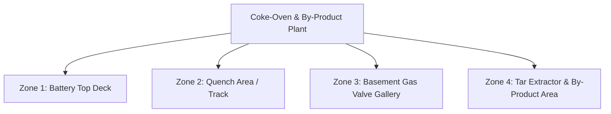
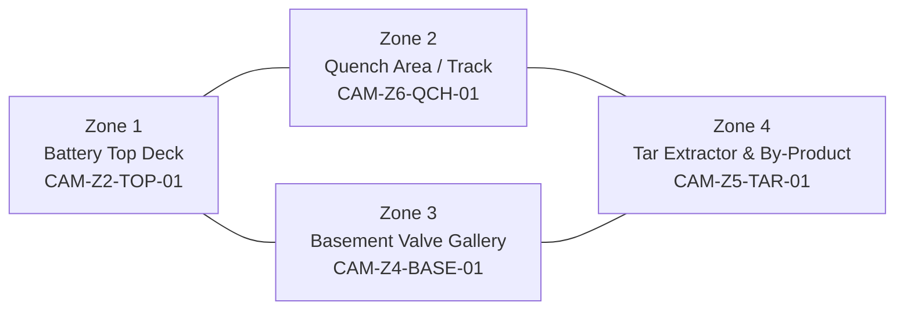

# 01 – Plant Bible

## Overview

This repository models a **coke‑oven battery and by‑product plant** as the reference facility:

- Industry: Integrated steel / coking operations.
- Purpose: Convert metallurgical coal to coke for blast furnaces, recover by‑products (tar, ammonia, light oils), and manage coke‑oven gas (COG) safely.[web:114]
- Risk profile: Toxic and flammable gases (CO, H₂S, NH₃, VOCs), high temperatures, confined spaces, line‑of‑fire hazards, and complex permit‑to‑work operations.[web:114][web:143]

The plant model is expressed through configuration CSVs and a digital twin layout.

## Zones

Zones are defined in `config/zones.csv`:

- **Zone 1 – Battery Top Deck**

  - Parent: Coke Oven Battery.
  - Hazards: CO/COG emissions, fugitive leaks, high temperature, heat stress.[web:254]
  - Typical activities: Charging, leveling, pushing, monitoring stack opacity, fugitive emissions checks.
  - Camera: `CAM-Z2-TOP-01` monitoring charging/pushing operations.

- **Zone 2 – Quench Area / Track**

  - Parent: Coke Handling.
  - Hazards: Steam, particulate emissions, line‑of‑fire from moving quench car, smoke/fire risk.[web:254]
  - Activities: Coke quenching, car movement, steam plumes, potential smoke or fire events in beds.
  - Camera: `CAM-Z6-QCH-01` monitoring quench car and tower entry.

- **Zone 3 – Basement Gas Valve Gallery**

  - Parent: Gas Distribution.
  - Hazards: Confined space, toxic gas (CO, H₂S), flammable gas (LEL), oxygen deficiency, explosion risk.[web:321][web:114]
  - Activities: Isolation operations, valve inspection, gas changeover, maintenance.
  - Camera: `CAM-Z4-BASE-01` for gallery entry and worker movement.

- **Zone 4 – Tar Extractor & By‑Product Area**

  - Parent: By‑Product Recovery.
  - Hazards: Toxic vapours (H₂S, NH₃), flammable vapours, hot surfaces, pressure changes.
  - Activities: Tar extraction, decanter operation, flushing liquor circulation, gas off‑take.
  - Camera: `CAM-Z5-TAR-01` for tar decanters, seal pots, and gas off‑take.

### Zone Diagram (Mermaid)

## Equipment

Equipment is defined in `config/equipment.csv`:

- `EQ_Z1_BAT_TOP`: Battery top gas and emission monitors (CO, LEL, O₂, temperature, wind, VOC).
- `EQ_Z1_COAL_TWR`: Coal tower moisture analysis.
- `EQ_Z2_PUSHER`: Pusher machine and hood (force, vibration, hood seal, green‑push compound).
- `EQ_Z2_STACK`: Battery stack opacity COMS.
- `EQ_Z2_QUENCH_TWR`: Quench tower and water system (TDS, baffle blockage, coke hotspots).
- `EQ_Z2_QUENCH_TRACK`: Quench car, track, smoke detector, area LEL.
- `EQ_Z3_VALVE_GALLERY`: Basement gas valve gallery (H₂S, LEL, O₂, CO).
- `EQ_Z4_TAR_EXTRACTOR`: Tar extractor & decanter (H₂S, NH₃, temperature, LEL, pressure, level, flow, gas‑side O₂).[output/equipment.csv][web:114]

Each equipment entry:

- Belongs to a zone (`zone_id`).
- Has a `criticality` rating and `maintenance_interval_days`.
- Lists associated sensors.

## Sensors

Sensors are configured in `config/sensors.csv`:

- Gas detectors: CO, H₂S, NH₃, LEL, O₂ in relevant zones.[file:290][web:214][web:119]
- Thermal sensors: Battery top temperature, coke bed hotspots, tar decanter temperature.
- Process sensors: Pressure (draft), level (seal pot/decanter), flow (flushing liquor), water quality (TDS).
- Mechanical/position sensors: Pusher force/vibration, quench car position, hood seal state.
- Environmental sensors: Wind speed, stack opacity, VOC PID.

Each sensor has:

- Physical ranges and thresholds (normal/warning/critical).
- Sampling interval and noise expectations.
- Behaviour and noise profiles for simulation.
- Failure modes linked to event profiles.

## SCADA and Tags

SCADA tags are represented by:

- `SCADA_tag` field in `sensors.csv`.
- Equipment state implied by sensor groups.

In production, these tags would map to real PLC/historian tags. In the simulator, they are used to label telemetry and align with expected control system semantics.

## Permits, Workers, Maintenance

Additional CSVs define operational context:

- `permits.csv`: Confined space, hot work, maintenance permits with:

  - `permit_id`, `zone_id`, `equipment_id`, type, status.
  - Worker assignments, start/end times.
  - Isolation, gas test status, LOTO flags.

- `workers.csv`: Worker identities, roles, PPE level, RFID tags, current zone, shift mapping.
- `maintenance.csv`: Maintenance tasks linked to equipment, permits, and technicians.
- `shifts.csv`: Shift definitions and handover notes.

These datasets reflect real refinery/coke‑oven PTW and confined space practices where gas tests (O₂, %LEL, toxics) and isolation are mandatory before entry.[web:321][web:323][web:114]

## Hazards and Emergency Routes

Hazards per zone:

- Zone 1: CO/COG exposure, fugitive emissions, heat stress, fall hazards.[web:114][web:254]
- Zone 2: Steam burns, smoke/fire, line‑of‑fire from moving coke/quench car.[web:254]
- Zone 3: Confined space gas hazards (CO, H₂S, LEL), oxygen deficiency, explosion risk.[web:143][web:321]
- Zone 4: Toxic vapours (H₂S, NH₃), flammable vapours, pressure surges.

Evacuation routes and muster points are encoded in `zones.csv` and used by the digital twin:

- Each zone has an `evacuation_route` description and implied muster point (A/B/C/D).
- The dashboard overlays evacuation routes on the plant map in emergency scenarios.[web:322]

## Digital Twin and Camera Locations

The digital twin uses:

- Zone layout coordinates (`layout_x`, `layout_y`, `layout_width`, `layout_height`) to render a 2D plant map.
- Camera IDs per zone to link CV streams:

  - `CAM-Z2-TOP-01` → Zone 1.
  - `CAM-Z6-QCH-01` → Zone 2.
  - `CAM-Z4-BASE-01` → Zone 3.
  - `CAM-Z5-TAR-01` → Zone 4.

Mermaid layout sketch (logical, not spatially accurate):

## How Incidents and Scenarios Work

Scenarios in `config/scenario.csv` define:

- Timeline: start/end times and event ranges (e.g. `EV_GAS_LEAK_MINOR@18-28`).
- Zones involved (e.g. `3;4` for basement + tar area).
- Permits involved (e.g. confined space permit P001).
- Expected AI actions (narrative).

Events in `event_profiles.csv`:

- Describe gas leaks, hot work, confined space entry, pump/valve failures, smoke/fire detection, power failure, emergency shutdown, maintenance phases, worker collapse.[code_file:317]
- Do not include sensor logic; they are metadata.

Mappings in `event_sensor_mapping.csv`:

- Specify how each event affects sensor types (which behaviour, target values, durations).[code_file:318]

Together:

- Scenarios orchestrate events over time.
- Events describe what is happening operationally.
- Mappings define how sensors respond.

This allows the plant twin to express realistic incident evolutions for simulation and risk detection.
