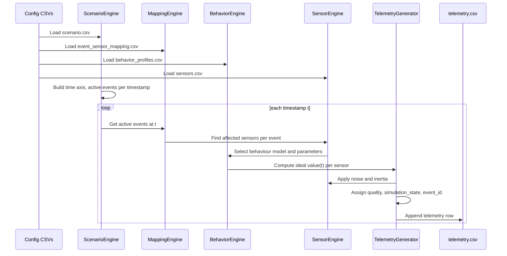

# 04 – Simulation Engine

## Purpose

The simulation engine creates **realistic telemetry** for the reference plant using only configuration files. It emulates a digital twin historian without hardcoding sensor values, enabling:

- Scenario testing (e.g., gas leaks, hot work, worker collapse).
- Risk Engine evaluation under controlled conditions.
- Demonstrations without access to live plant data.

## Architecture

Core components:

- **Scenario engine** – interprets `scenario.csv` and builds a timeline of events.
- **Event engine** – loads event metadata from `event_profiles.csv`.
- **Behavior engine** – loads behaviour models from `behavior_profiles.csv`.
- **Mapping engine** – uses `event_sensor_mapping.csv` to assign behaviours to sensor types per event.
- **Sensor engine** – uses `sensors.csv` for physical ranges, inertia, noise, and failure modes.
- **Telemetry generator** – steps through time, applies behaviours, noise, inertia, and quality logic, and writes `telemetry.csv`.

## Inputs

- `config/zones.csv` – spatial context.
- `config/equipment.csv` – equipment–sensor mapping.
- `config/sensors.csv` – sensor definitions and baseline behaviours.[file:290]
- `config/behavior_profiles.csv` – behaviour models.[code_file:316]
- `config/event_profiles.csv` – event metadata.[code_file:317]
- `config/event_sensor_mapping.csv` – event→sensor behaviour mappings.[code_file:318]
- `config/scenario.csv` – scenario timelines.[code_file:319]

## Scenario Engine

**Responsibilities:**

- Load a scenario (`scenario_id`) from `scenario.csv`.
- Parse:

  - `start_time`, `end_time` → simulation window.
  - `events_timeline` → list of event segments like `EV_GAS_LEAK_MINOR@18-28`.

- Build a **time axis** (e.g., 0.5 s steps for 60 s window).
- For each timestamp, determine active events.

## Event Engine

**Responsibilities:**

- Load event metadata from `event_profiles.csv` (severity, priority, duration, compound‑risk capability).
- Provide event objects to scenario engine and risk engine.

## Behavior Engine

**Responsibilities:**

- Load behaviour profiles from `behavior_profiles.csv`.
- For a given sensor and event mapping:

  - Select behaviour model (`mathematical_model`).
  - Determine parameters (`start_value`, `target_value`, `time_constant`, etc.) based on `start_value_rule`, `target_value_rule`, and sensor config.

## Mapping Engine

**Responsibilities:**

- Load `event_sensor_mapping.csv`.
- For each active event:

  - Find mapping rows for `event_profile_id` and the sensor’s `sensor_type`.
  - If multiple mappings apply, respect `priority` and event severity.

- Provide the behaviour model and parameter rules for each sensor under each active event.

## Sensor Engine

**Responsibilities:**

- Load sensor definitions from `sensors.csv`:

  - Physical limits (`absolute_physical_min/max`, rate of change).
  - Behaviour hints (`behavior_profile_id`, `physical_response_type`, `inertia_class`).
  - Noise settings (`noise_profile_id`, `expected_noise_percent`).
  - Failure modes.

- Provide:

  - Baseline behaviour when no event applies.
  - Physical validation (clamping, rate checks).
  - Noise and inertia application.

## Telemetry Generator – Execution Pipeline

### Step‑by‑step Flow

### Algorithm Outline

1. **Load configuration and scenario**.
2. **Build time axis** for the scenario window.
3. For each time step `t`:

   - Determine active events via `events_timeline`.
   - For each sensor:

     - If mappings exist:

       - Choose mapping and behaviour.
       - Use rules to compute `start_value` and `target_value` (e.g., `use_current`, `normal_max+10`).

     - If no mappings:

       - Use sensor’s baseline behaviour (`behavior_profile_id`) and normal ranges.

     - Compute ideal `value(t)` using the behaviour’s `mathematical_model` and parameters.
     - Apply noise according to `noise_profile_id` and `supports_noise`.
     - Apply inertia according to `physical_response_type` and `inertia_class`.
     - Clamp to physical limits and enforce rate bounds.

   - Assign `quality` based on thresholds and mapping profile.

   - Determine `simulation_state` and `event_id` from active events and scenario phase.

   - Write row to `telemetry.csv`.

## Adding New Scenarios

To add a new scenario (e.g., Hydrogen Leak):

1. Add an event profile to `event_profiles.csv` (e.g., `EV_H2_LEAK_MAJOR`).
2. Add sensor mappings to `event_sensor_mapping.csv` for relevant gas sensor types (`Flammable Gas (%LEL)`, possibly H₂).
3. Add a scenario row to `scenario.csv`:

   - `scenario_id`, `name`, `description`.
   - Timeline with `EV_H2_LEAK_MAJOR@start-end`.
   - `zones_involved`, `permits_involved`.
   - `expected_ai_actions`.

No Python changes are needed; the generator remains generic.

## Adding New Sensors and Behaviours

- **New sensor**:

  - Add row to `sensors.csv` with proper `sensor_type`, physical limits, behaviour profile, noise profile.
  - Link it to an equipment in `equipment.csv`.

- **New behaviour**:

  - Add row to `behavior_profiles.csv` with `mathematical_model` and parameter schema.
  - Reference it from `sensors.behavior_profile_id` and `event_sensor_mapping.behavior_profile_id`.

The simulation engine stays configuration‑driven.

## Validation

Before generation:

- Verify all FKs (zones, equipment, sensors, behaviours, events, mappings, scenarios) are consistent.
- Check that:

  - Every event used in `events_timeline` has mappings.
  - Every mapping references existing behaviours and event IDs.
  - Every sensor belongs to a zone and an equipment.

After generation:

- Telemetry series should:

  - Respect physical limits and realistic rates of change.
  - Reflect events (gas leak → rising gas and falling O₂).
  - Align with scenario time windows (e.g., major leak phase vs emergency shutdown).

This engine is the core of the digital twin: it makes the plant “come alive” in data form.
