# 07 – Dashboard Architecture

---

# 1. Purpose

## Overview

The Dashboard subsystem is the operational interface of the Industrial Safety Intelligence Platform. While the simulator, telemetry pipeline, Risk Engine, and knowledge layers generate and process information, the dashboard exists to transform that information into operational decisions.

The dashboard is therefore **not a visualization layer**, but an **Operational Decision Support Layer**.

Its primary responsibility is to enable operators, supervisors, and safety engineers to understand:

* what is happening,
* why it is happening,
* who is affected,
* what should happen next,
* and how confident the platform is in its recommendation.

The dashboard is intentionally designed around **decision support**, rather than telemetry presentation.

---

## Problem Statement

Modern industrial facilities already possess numerous independent monitoring systems.

Typical examples include:

* SCADA HMIs
* Distributed Control Systems (DCS)
* Gas Detection Panels
* CCTV Systems
* Permit-to-Work Software
* Historian Databases
* Maintenance Management Systems
* Alarm Management Systems

Each system performs its own specialized function, but they rarely communicate at the operational level.

Operators therefore spend significant cognitive effort correlating information manually.

Examples include:

* checking gas trends while reviewing permits,
* verifying worker presence using CCTV,
* correlating pressure deviations with maintenance activity,
* determining whether multiple low-severity events collectively represent a significant hazard.

This manual correlation process becomes increasingly difficult during abnormal situations where multiple alarms, changing process conditions, and human activities occur simultaneously.

The Dashboard subsystem exists to reduce this cognitive burden by presenting correlated operational intelligence rather than isolated telemetry.

---

## Objectives

The dashboard has five primary objectives.

### 1. Provide Immediate Situational Awareness

Within five seconds of opening the dashboard, an operator should be able to determine:

* overall plant condition,
* active incidents,
* affected zones,
* affected workers,
* recommended actions.

---

### 2. Reduce Cognitive Load

Operators should not be required to mentally correlate:

* telemetry,
* permits,
* maintenance,
* worker locations,
* historical incidents,
* computer vision events.

The dashboard performs this integration before presenting information.

---

### 3. Support Operational Decisions

The dashboard does not make autonomous safety decisions.

Instead, it provides structured operational recommendations supported by transparent evidence.

Human operators remain responsible for executing plant procedures.

---

### 4. Explain AI Reasoning

Every significant recommendation must be accompanied by an explanation.

Operators should always understand:

* which evidence contributed,
* which systems were involved,
* why risk increased,
* what assumptions were made.

This improves trust and supports post-incident review.

---

### 5. Scale Beyond Demonstration

Although the initial implementation models four plant zones, the architectural design supports hierarchical expansion to significantly larger industrial facilities without fundamental redesign.

---

## What the Dashboard Is Not

The Dashboard intentionally avoids becoming another monitoring interface.

It is **not**:

* a SCADA replacement,
* a historian viewer,
* a charting application,
* a KPI dashboard,
* a CCTV monitoring wall,
* a Business Intelligence portal.

Those capabilities already exist within industrial environments.

Instead, the Dashboard operates above them by synthesizing operational context.

---

## System Relationships

The Dashboard is positioned between backend intelligence services and human decision makers.

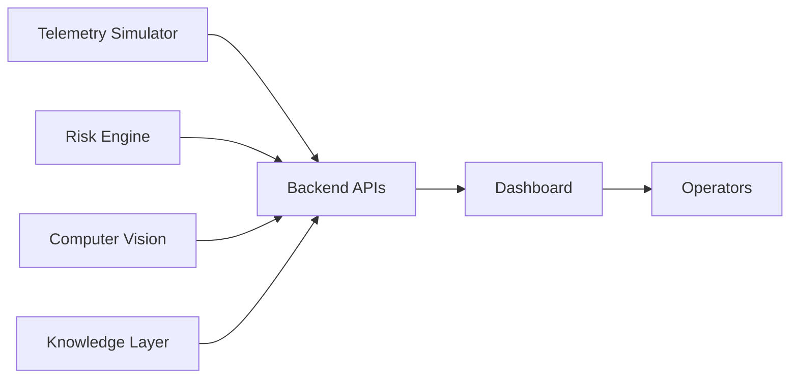

---

### Relationship with the Simulator

The Simulator produces realistic plant telemetry representing:

* sensors,
* workers,
* permits,
* maintenance,
* operational scenarios.

The Dashboard consumes this information without knowledge of simulation logic.

Its responsibility begins only after telemetry has been generated.

---

### Relationship with the Risk Engine

The Risk Engine produces:

* compound risk assessments,
* incident classifications,
* evidence chains,
* recommended responses.

The Dashboard visualizes these outputs while preserving explainability.

Risk computation never occurs inside the Dashboard.

---

### Relationship with the Digital Twin

The Digital Twin provides the spatial representation of the facility.

The Dashboard enriches the Digital Twin with:

* live telemetry,
* worker locations,
* permits,
* incidents,
* equipment states,
* recommendations.

The Dashboard therefore acts as the operational interface of the Digital Twin.

---

### Relationship with Computer Vision

Computer Vision produces events such as:

* PPE violations,
* smoke detection,
* flame detection,
* unauthorized entry,
* occupancy estimates.

These events are treated as additional evidence rather than independent alerts.

The Dashboard presents CV observations alongside telemetry and risk evidence.

---

### Relationship with the Knowledge Layer

The Retrieval-Augmented Generation (RAG) subsystem provides:

* regulatory references,
* historical incidents,
* operating procedures,
* explanation support.

The Dashboard consumes these outputs to enrich recommendations but never performs retrieval itself.

---

## Architectural Position

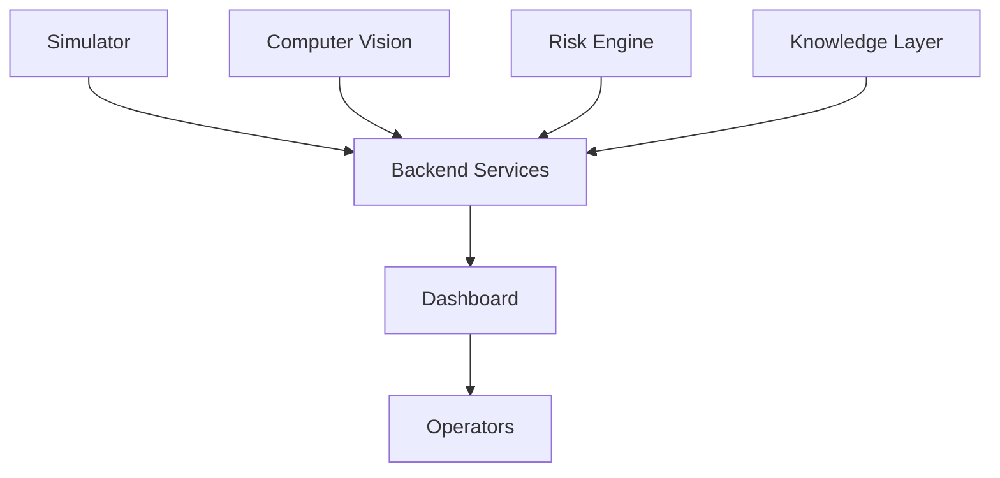

---

# 2. Design Philosophy

The Dashboard is designed according to industrial Human-Machine Interface principles rather than consumer application conventions.

Each principle directly addresses limitations commonly observed in traditional monitoring systems.

---

## Decision-First Interface

The primary objective of the Dashboard is to support operational decision making.

Information is organized according to urgency rather than data type.

Instead of presenting:

* charts,
* gauges,
* sensor lists,

the Dashboard presents:

* incidents,
* affected assets,
* supporting evidence,
* recommended actions.

This minimizes interpretation time during abnormal situations.

---

## Explainability

Every recommendation must be traceable.

Operators should never receive unexplained AI outputs.

Each recommendation therefore exposes:

* contributing sensors,
* worker context,
* permits,
* maintenance activities,
* CV observations,
* historical precedents.

Explainability improves operator trust and supports incident investigation.

---

## Industrial Realism

The Dashboard reflects established industrial operating practices.

Examples include:

* incident prioritization,
* alarm rationalization,
* operator acknowledgement,
* permit awareness,
* equipment-centric views,
* spatial awareness.

Visual design serves operational clarity rather than aesthetic novelty.

---

## Operator Workflow

The Dashboard is designed around the sequence:

Observe

↓

Understand

↓

Investigate

↓

Decide

↓

Act

↓

Review

rather than around available data sources.

This aligns the interface with real operational responsibilities.

---

## Information Hierarchy

Critical information receives the highest visual priority.

Lower-priority operational details remain available without competing for attention.

The Dashboard therefore emphasizes:

* abnormal conditions,
* changing situations,
* unresolved incidents,

while minimizing visual noise during normal operations.

---

## Human Factors

Industrial incidents frequently occur under time pressure.

The Dashboard therefore minimizes:

* unnecessary navigation,
* hidden information,
* competing visual elements,
* duplicated information.

Consistency reduces cognitive effort during emergencies.

---

## Cognitive Load Reduction

Multiple backend systems may generate dozens of independent events.

The Dashboard consolidates related observations into operational incidents.

Example:

Rather than displaying:

* High CO
* Low Oxygen
* Active Permit
* Worker Present

the Dashboard presents:

> Gas Leak During Confined Space Entry

supported by the underlying evidence.

---

## Progressive Disclosure

Different operational decisions require different levels of detail.

The Dashboard initially presents:

* incident summary,
* affected zone,
* severity,
* recommended response.

Operators may then progressively explore:

* telemetry,
* evidence,
* historical trends,
* worker details,
* permits,
* camera feeds.

This prevents overload while preserving access to detail.

---

## AI as Decision Support

Artificial Intelligence augments operator judgement.

It does not replace established industrial procedures.

Recommendations therefore remain advisory.

Final authority remains with plant personnel.

---

## Safety-Critical Philosophy

Safety-critical interfaces prioritize:

* predictability,
* clarity,
* transparency,
* redundancy,
* operational confidence.

The Dashboard avoids:

* decorative animation,
* unnecessary visual effects,
* hidden interactions.

Information must remain understandable during abnormal operating conditions.

---

## Philosophy Summary

```mermaid
mindmap
root((Dashboard Philosophy))

Decision First

Explainability

Industrial Realism

Operator Workflow

Progressive Disclosure

Human Factors

Decision Support

Safety Critical

Information Hierarchy

Low Cognitive Load
```

---

# 3. Operator Personas

The Dashboard serves multiple operational roles with overlapping but distinct responsibilities.

Each persona interacts with the same system while prioritizing different information.

---

## Safety Officer

### Responsibilities

* Monitor plant safety
* Supervise permits
* Assess hazards
* Coordinate emergency response

### Goals

* Prevent incidents
* Identify compound risks
* Ensure procedural compliance

### Primary Dashboard Usage

* Incident monitoring
* Evidence review
* Permit conflicts
* Worker safety

### Information Needs

* Risk assessments
* Evidence chains
* Permit status
* Worker exposure
* Emergency recommendations

### Pain Points

* Alarm overload
* Manual correlation
* Limited situational awareness

### Decision Workflow

Observe Incident

↓

Review Evidence

↓

Confirm Hazard

↓

Coordinate Response

↓

Document Outcome

---

## Shift Supervisor

### Responsibilities

* Manage plant operations
* Coordinate operators
* Approve interventions

### Goals

* Maintain production safely
* Allocate resources
* Escalate when necessary

### Primary Dashboard Usage

* Operational overview
* Workforce status
* Incident escalation

### Information Needs

* Active incidents
* Zone health
* Worker assignments
* Operational recommendations

### Pain Points

* Fragmented operational data
* Delayed awareness

### Decision Workflow

Review Overview

↓

Identify Priority

↓

Assign Resources

↓

Monitor Progress

---

## Control Room Operator

### Responsibilities

* Monitor live operations
* Respond to alarms
* Coordinate control actions

### Goals

* Maintain stable plant operation
* Detect abnormalities early

### Primary Dashboard Usage

* Digital Twin
* Telemetry
* Alerts
* Incident workflow

### Information Needs

* Live sensor data
* Equipment status
* Incident state
* Recommended actions

### Pain Points

* Alarm flooding
* Manual system correlation

### Decision Workflow

Observe

↓

Acknowledge

↓

Investigate

↓

Execute Procedure

↓

Monitor Recovery

---

## Maintenance Engineer

### Responsibilities

* Equipment maintenance
* Fault investigation
* Shutdown planning

### Goals

* Restore equipment
* Reduce downtime

### Primary Dashboard Usage

* Equipment health
* Maintenance status
* Incident history

### Information Needs

* Equipment conditions
* Historical trends
* Maintenance schedule
* Recommendations

### Pain Points

* Poor equipment visibility
* Missing operational context

### Decision Workflow

Identify Equipment

↓

Review History

↓

Plan Intervention

↓

Execute Maintenance

---

## Plant Manager

### Responsibilities

* Overall operational oversight
* Resource allocation
* Strategic decision making

### Goals

* Safe production
* Regulatory compliance
* Operational efficiency

### Primary Dashboard Usage

* Executive overview
* Incident summaries
* Operational KPIs
* Escalations

### Information Needs

* Overall plant health
* Major incidents
* Workforce status
* Operational trends

### Pain Points

* Delayed situational awareness
* Lack of consolidated information

### Decision Workflow

Review Overview

↓

Assess Operational Impact

↓

Approve Strategic Actions

↓

Monitor Recovery

---

## Persona Relationships

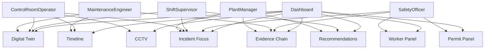

---

# 4. User Journeys

The Dashboard supports multiple operational modes corresponding to the lifecycle of an industrial process. Rather than treating every event equally, the interface progressively adapts to changing operational conditions.

Each journey represents both a human workflow and a corresponding application state.

---

## 4.1 Normal Operations

### Objective

Provide continuous plant awareness while minimizing operator fatigue.

The interface should remain information-rich without encouraging unnecessary interaction.

---

### Operator Observations

The operator immediately sees:

- Overall plant status: Healthy
- No active incidents
- Normal telemetry
- Worker locations
- Active permits
- Equipment availability
- AI System Health

The interface intentionally appears calm.

No unnecessary animations occur.

---

### System Updates

Every 0.5 seconds:

- Telemetry updates
- Worker positions refresh
- Equipment state refreshes
- Risk Engine recalculates
- Operations Narrative records operational events

No alerts are generated.

---

### Operator Actions

Typical activities include:

- Monitor Digital Twin
- Review trends
- Inspect permit status
- Verify worker locations
- Open historical telemetry
- Prepare for shift handover

---

### Dashboard State

```
Healthy

↓

Monitoring

↓

Healthy
```

---

## 4.2 Minor Incident

Example:

Minor Gas Leak

Small Pressure Drift

Permit Conflict

---

### Operator Observations

The operator notices:

- One zone changes to Warning
- Incident Queue receives one entry
- Compound Risk increases
- Evidence Chain becomes available
- Operations Narrative begins describing the event

No emergency actions are yet required.

---

### System Updates

The system automatically:

- Correlates sensor changes
- Generates incident
- Calculates evidence strength
- Highlights affected workers
- Updates Digital Twin
- Records event timeline

---

### Operator Actions

Operator should:

- Acknowledge Incident
- Review Evidence
- Verify CCTV
- Contact local operator if required

---

### Dashboard State

```
Healthy

↓

Warning

↓

Minor Incident
```

---

## 4.3 Major Incident

Example:

Gas Leak During Confined Space Entry

Hot Work Near Tar Extractor

Fire Detection

---

### Operator Observations

The operator immediately notices:

- Incident promoted to Incident Focus
- Zone highlighted
- Alert queue promoted
- Recommendation panel activated
- Camera auto-focus
- Worker cards highlighted
- Permit conflicts displayed

---

### System Updates

Backend continuously provides:

- Updated compound risk
- Evidence evolution
- Telemetry
- Worker movements
- Permit status
- Camera events

The Operations Narrative continuously expands.

---

### Operator Actions

Expected workflow:

Observe

↓

Acknowledge

↓

Review Evidence

↓

Inspect CCTV

↓

Dispatch Response

↓

Escalate

↓

Monitor

---

### Dashboard State

```
Monitoring

↓

Incident

↓

Operator Response
```

---

## 4.4 Emergency Shutdown

Emergency Shutdown represents the highest operational severity.

---

### Operator Observations

Immediately visible:

- Emergency banner
- Critical incident
- Recommendation list
- Expanded Digital Twin
- Camera enlarged
- Worker evacuation status
- Emergency timeline

Non-essential widgets become visually secondary while remaining accessible.

---

### System Updates

The Dashboard continuously receives:

- Emergency state
- Shutdown progress
- Worker evacuation
- Equipment isolation
- Sensor stabilization

---

### Operator Actions

Typical sequence:

Acknowledge

↓

Notify Supervisor

↓

Dispatch Teams

↓

Monitor Shutdown

↓

Verify Evacuation

↓

Prepare Recovery

---

### Dashboard State

```
Incident

↓

Emergency

↓

Shutdown
```

---

## 4.5 Recovery

Recovery begins after hazards have stabilized.

---

### Operator Observations

Operator sees:

- Risk decreasing
- Incident status changing
- Workers accounted for
- Equipment returning to service
- Timeline completed

---

### System Updates

The Dashboard:

- Archives incident
- Finalizes Operations Narrative
- Stores Evidence Chain
- Generates recovery summary

---

### Operator Actions

Operator:

Reviews timeline

↓

Verifies plant state

↓

Closes incident

↓

Returns to monitoring

---

### Dashboard State

```
Emergency

↓

Recovery

↓

Healthy
```

---

## User Journey Summary

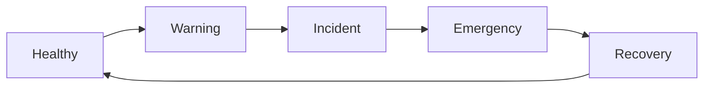

---

# 5. Information Hierarchy

## Overview

Industrial operators do not consume information uniformly.

The Dashboard therefore prioritizes information according to operational urgency rather than data category.

The hierarchy determines:

- visual prominence
- update frequency
- screen position
- interaction priority

---

## Level 1 — Highest Priority

Always visible.

Never collapsible.

Appears at the center of operator attention.

Includes:

- Active Incident
- Emergency Status
- Compound Risk
- Recommended Actions
- Digital Twin Highlight
- Emergency Banner

Reason:

These determine immediate operational decisions.

---

## Level 2 — High Priority

Visible during normal operation.

Expanded automatically during incidents.

Includes:

- Alert Queue
- Evidence Chain
- Operations Narrative
- Worker Status
- Permit Status
- CCTV Focus

Reason:

Provides operational context supporting decisions.

---

## Level 3 — Medium Priority

Collapsed by default.

Accessible within one interaction.

Includes:

- Sensor Details
- Historical Trends
- Equipment Information
- Zone Statistics
- Historical Incidents

Reason:

Supports investigation rather than immediate action.

---

## Level 4 — Low Priority

Never competes for operator attention.

Examples:

- Settings
- User Preferences
- Theme
- Help
- Documentation
- Export
- Logs

Reason:

Administrative functionality should never interrupt operational awareness.

---

## Information Priority Pyramid

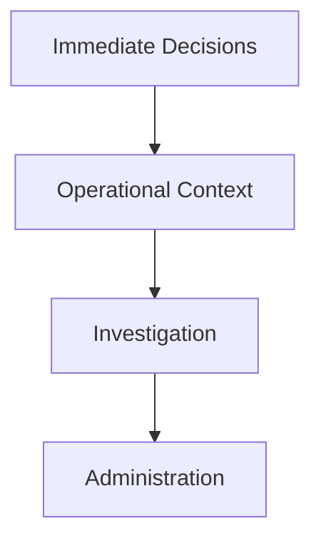

---

## Visual Attention Flow

The Dashboard is intentionally designed to guide the operator's eyes.

Eye movement follows:

```
Global Status

↓

Incident Focus

↓

Digital Twin

↓

Recommendations

↓

Evidence

↓

Alert Queue

↓

Workers

↓

Permits

↓

Timeline

↓

Historical Data
```

---

## Why This Flow?

The sequence answers:

1. Is something wrong?

2. Where?

3. What happened?

4. What should I do?

5. Why?

6. Who is affected?

This minimizes unnecessary cognitive switching.

---

## Attention Zones

```
┌────────────────────────────┐
│ Global Status              │
├────────────────────────────┤
│ Incident Focus             │
├────────────┬───────────────┤
│ Twin       │ Recommendation│
├────────────┴───────────────┤
│ Evidence                 │
├────────────────────────────┤
│ Workers  Permits  Cameras │
├────────────────────────────┤
│ Timeline                 │
└────────────────────────────┘
```

---

## Hierarchy Principles

The hierarchy follows five rules:

1.

Abnormal beats normal.

2.

Changing beats static.

3.

Decision beats visualization.

4.

Context follows incident.

5.

History never competes with live state.

---

# 6. Screen Layout

The Dashboard supports multiple deployment environments while preserving consistent information hierarchy.

---

## 6.1 Desktop Layout

Target:

16:9

24–27 inch monitor

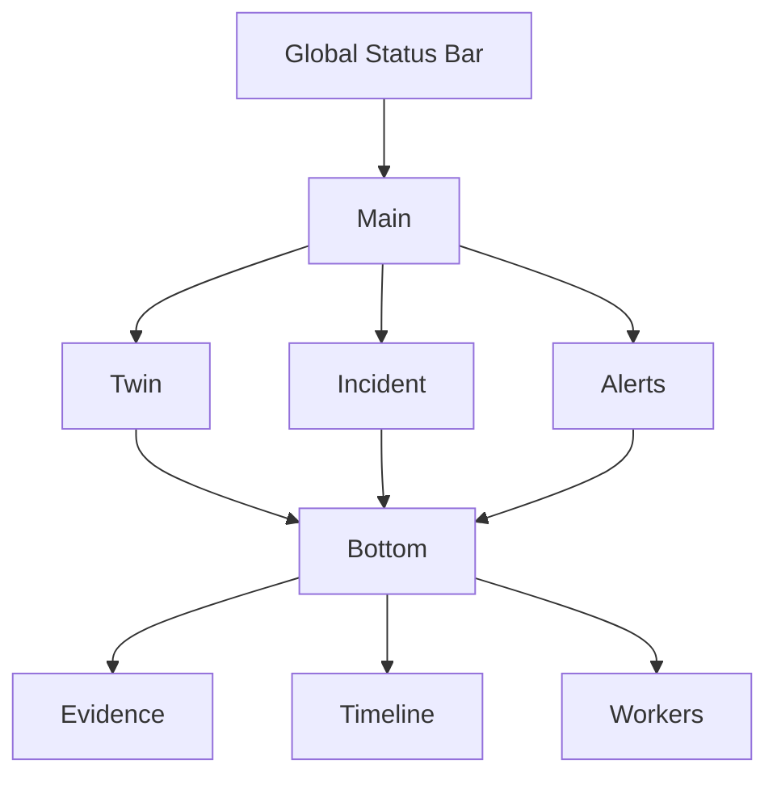

---

### Primary Panels

- Incident Focus
- Digital Twin
- Global Status

---

### Secondary Panels

- Evidence Chain
- Alert Queue
- Operations Narrative

---

### Expandable Panels

- CCTV
- Timeline
- Worker Panel
- Permit Panel
- Sensor Details

---

### Persistent Panels

- Status Bar
- Navigation
- Incident Queue

---

## 6.2 Ultra-wide Layout

Target:

34–49 inch displays.

Additional space is allocated to simultaneous operational awareness.

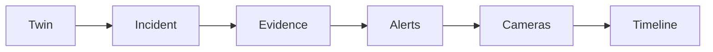

Benefits:

- Larger Digital Twin
- Simultaneous CCTV
- Wider timeline
- Larger narrative

---

## 6.3 Control Room Layout

Designed for operator workstations.

```
┌──────────────────────────────────────────────┐
│ Global Status                                │
├──────────────────────────────────────────────┤
│ Digital Twin │ Incident │ Alert Queue        │
├──────────────┼──────────┼────────────────────┤
│ Evidence     │ CCTV     │ Recommendations    │
├──────────────┼──────────┼────────────────────┤
│ Timeline     │ Workers  │ Permits            │
└──────────────────────────────────────────────┘
```

Characteristics:

- Fast scanning
- Minimal overlap
- Clear prioritization
- Large interaction targets

---

## 6.4 Future Video Wall

Designed for multi-screen control rooms.

Screen 1

Plant Overview

Screen 2

Digital Twin

Screen 3

Incident Command

Screen 4

CCTV

Screen 5

Historical Analytics

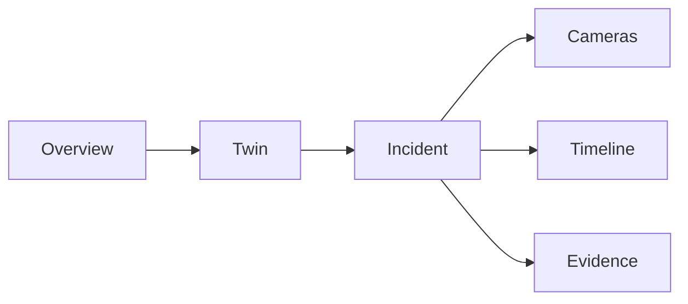

---

## Panel Categories

### Primary Panels

Always visible.

- Global Status
- Incident Focus
- Digital Twin

---

### Secondary Panels

Visible by default.

- Alert Queue
- Evidence Chain
- Operations Narrative

---

### Expandable Panels

Open on demand.

- Timeline
- CCTV
- Workers
- Permits
- Equipment
- Sensors

---

### Context-Sensitive Panels

Appear automatically.

Examples:

Emergency

↓

Emergency Actions

Permit Conflict

↓

Permit Intelligence

Worker Collapse

↓

Worker Medical Information

Camera Detection

↓

CV Evidence Panel

---

## Layout Principles

The Dashboard follows seven layout principles:

1.

Digital Twin remains spatial anchor.

2.

Incident Focus remains decision anchor.

3.

Recommendations remain adjacent to incidents.

4.

Evidence follows recommendations.

5.

Historical information stays below live information.

6.

Context expands automatically but never obscures primary operational information.

7.

Every layout preserves the same information hierarchy regardless of display size.

---

# 7. Navigation Model

## Overview

The Dashboard follows an **incident-centric navigation model** rather than a page-centric model.

Unlike conventional enterprise applications where users navigate between independent pages, industrial operators should remain continuously aware of plant state while progressively exploring additional information.

The Digital Twin remains the persistent spatial anchor, while navigation changes the **level of detail**, not the operator's context.

Navigation therefore follows the principle:

> **Overview → Focus → Investigate → Act → Review**

rather than

> Home → Page → Page → Page.

---

## Navigation Philosophy

The navigation architecture is guided by six principles.

### 1. Minimize Context Switching

Operators should never lose awareness of:

- active incidents
- plant state
- emergency conditions

when navigating deeper into the application.

Critical operational context remains persistent.

---

### 2. Incident-Centric Navigation

Incidents become the primary navigation driver during abnormal conditions.

Instead of navigating to:

Sensors

↓

Workers

↓

Permits

↓

Cameras

the operator navigates through the incident itself.

Example:

```
Gas Leak

↓

Evidence

↓

Workers

↓

Permit

↓

Camera

↓

Timeline
```

---

### 3. Spatial Navigation

The Digital Twin is always available.

Every interaction eventually maps back to:

Plant

↓

Zone

↓

Equipment

↓

Sensor

Spatial awareness remains the foundation of every workflow.

---

### 4. Progressive Investigation

Every navigation action increases information density.

Example:

```
Plant

↓

Zone

↓

Incident

↓

Evidence

↓

Sensor

↓

Historical Trend
```

---

### 5. Persistent Awareness

Regardless of navigation depth, the operator always sees:

- Global Status
- Active Incident Count
- Emergency Banner
- Navigation Rail
- System Health

---

### 6. Fast Return

Every screen remains one click away from:

- Plant Overview
- Active Incident
- Digital Twin

No navigation path exceeds three interactions.

---

# Primary Navigation

The primary navigation is permanently visible.

```
Plant Overview

Incidents

Digital Twin

Workers

Permits

Timeline

Analytics

Settings
```

Purpose:

Provides access to major operational domains.

---

## Primary Navigation Diagram

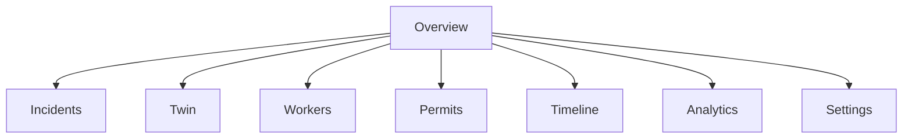

---

# Secondary Navigation

Secondary navigation changes depending on the selected module.

Example:

Incident selected

↓

Evidence

Recommendations

Workers

Permits

Telemetry

Timeline

Camera

---

Zone selected

↓

Equipment

Sensors

Workers

Permits

History

---

Worker selected

↓

Current Zone

Permit

Exposure

Timeline

Assignments

---

# Zone Navigation

The Digital Twin forms the basis of geographical navigation.

Hierarchy:

```
Plant

↓

Area

↓

Zone

↓

Equipment

↓

Sensor
```

Only one level expands at a time.

Future plants may contain:

```
Plant

↓

Area

↓

Sub-area

↓

Zone

↓

Equipment

↓

Sensor
```

without architectural changes.

---

## Zone Navigation Diagram

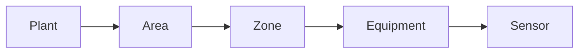

---

# Incident Navigation

Every incident owns its own investigation workspace.

Selecting an incident automatically synchronizes:

- Digital Twin
- CCTV
- Timeline
- Evidence Chain
- Workers
- Permits
- Recommendations

The operator never manually correlates these panels.

---

## Incident Workspace

```
Incident

↓

Evidence

↓

Recommendations

↓

Workers

↓

Permits

↓

Timeline

↓

Raw Telemetry
```

---

# Historical Mode

Historical Mode reconstructs previous plant states.

Purpose:

- incident investigation
- replay
- training
- demonstrations
- post-incident analysis

Historical Mode freezes:

- telemetry
- worker positions
- permits
- recommendations
- evidence

The Dashboard enters read-only mode.

No live updates are displayed.

---

# Settings

Settings are intentionally isolated from operational workflows.

Configuration includes:

- User preferences
- Display preferences
- Notification preferences
- Accessibility
- User profile
- Theme
- Time format

Settings never interrupt operational awareness.

---

# Future Modules

The navigation architecture reserves expansion points for future capabilities.

Potential modules include:

- Computer Vision
- RAG Knowledge
- AI Agents
- Compliance
- Reports
- Multi-Plant
- Shift Handover
- Asset Health
- Mobile Control

The navigation hierarchy remains unchanged.

---

## Navigation Architecture

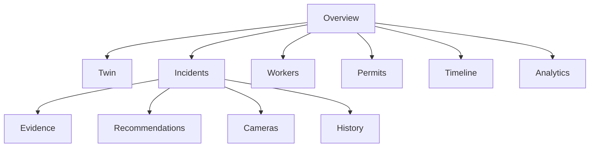

---

# 8. Dashboard Component Hierarchy

## Overview

The Dashboard is organized as a hierarchy of independent feature modules.

Each module owns:

- presentation
- interaction
- orchestration

Business logic remains outside the Dashboard.

The Dashboard consumes backend intelligence rather than computing it.

---

# Architectural Principles

Every component follows:

Single Responsibility

↓

Independent Updates

↓

Clear Ownership

↓

Minimal Coupling

↓

Shared Global State

---

# Complete Component Hierarchy

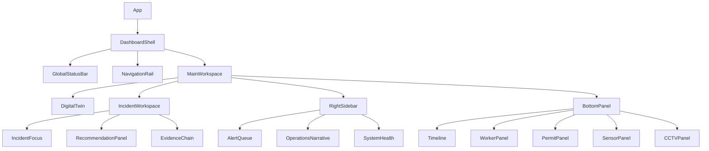

---

# Component Responsibilities

## Dashboard Shell

Owns:

- application layout
- navigation
- global synchronization

Does NOT own business data.

---

## Global Status Bar

Owns:

- plant health summary
- incident count
- emergency state
- connection status
- current time

Always visible.

---

## Navigation Rail

Owns:

- primary navigation
- quick actions
- future modules

Persistent.

---

## Main Workspace

Coordinates:

- Digital Twin
- Incident Workspace
- Side Panels
- Bottom Panels

Acts as layout orchestrator.

---

## Incident Workspace

Owns:

- active incident
- recommendations
- evidence

The Incident Workspace is the operational center of the application.

---

## Right Sidebar

Owns:

- alerts
- narrative
- AI health

Updates independently.

---

## Bottom Panel

Contains:

- Timeline
- Workers
- Permits
- Sensors
- CCTV

These modules remain collapsible.

---

# Ownership Model

```
Dashboard

↓

Layout

↓

Feature Modules

↓

Panels

↓

Widgets
```

No feature directly owns another feature.

Communication occurs through shared application state.

---

# Dependency Rules

Allowed:

```
Global State

↓

Panel

↓

Widgets
```

Not Allowed:

```
Panel

↓

Panel

↓

Panel
```

Direct feature coupling is prohibited.

---

# 9. Panel Responsibilities

Each panel has a single operational responsibility.

Panels communicate through shared state rather than direct dependencies.

---

# Global Status Bar

## Purpose

Provide continuous awareness of overall plant condition.

## Inputs

- Incident summary
- System health
- Plant health
- Connection state

## Outputs

- Global status
- Active alarms
- Emergency indicator

## Dependencies

Application State

## Interaction

Always visible.

No scrolling.

---

# Digital Twin

## Purpose

Provide spatial awareness.

## Inputs

- Zone states
- Worker locations
- Equipment
- Incidents

## Outputs

- Zone selection
- Equipment selection

## Dependencies

Telemetry

Risk Engine

Workers

Permits

## Interaction

Primary navigation surface.

---

# Incident Focus

## Purpose

Present the highest-priority incident.

## Inputs

- Compound risk
- Evidence
- Recommendations
- Incident state

## Outputs

- Operator acknowledgement
- Escalation
- Investigation context

## Dependencies

Risk Engine

Evidence

Workers

Permits

---

# Alert Queue

## Purpose

Display prioritized operational incidents.

## Inputs

- Alert Engine

## Outputs

- Selected Incident

## Dependencies

Incident State

---

# Evidence Chain

## Purpose

Explain AI reasoning.

## Inputs

- Evidence fragments
- Correlation score
- Historical references

## Outputs

- Explainability view

## Dependencies

Risk Engine

RAG

---

# Operations Narrative

## Purpose

Maintain human-readable operational timeline.

## Inputs

- Events
- Incidents
- Recommendations

## Outputs

- Chronological operational log

## Dependencies

All operational services

---

# Timeline

## Purpose

Visualize temporal evolution.

## Inputs

- Telemetry
- Events
- Incidents

## Outputs

- Historical selection

## Dependencies

Historical State

---

# Worker Panel

## Purpose

Display workforce context.

## Inputs

- Worker locations
- Exposure
- Assignments
- PPE

## Outputs

- Worker inspection

## Dependencies

Worker Service

Permits

---

# Permit Panel

## Purpose

Display operational permits.

## Inputs

- Permit records
- Status
- Roles
- Expiration

## Outputs

- Permit inspection

## Dependencies

Permit Service

Workers

---

# Recommendation Panel

## Purpose

Present AI-assisted operational recommendations.

## Inputs

- Risk Engine
- Evidence
- Incident

## Outputs

- Suggested actions

## Dependencies

Risk Engine

Evidence Chain

---

# Sensor Panel

## Purpose

Provide detailed telemetry.

## Inputs

- Live telemetry
- Historical telemetry
- Sensor health

## Outputs

- Sensor inspection

## Dependencies

Telemetry Service

---

# CCTV Panel

## Purpose

Provide visual confirmation.

## Inputs

- Camera streams
- CV events

## Outputs

- Camera selection

## Dependencies

Camera Service

Computer Vision

---

# System Health

## Purpose

Monitor platform health.

## Inputs

- Backend services
- AI modules
- Connectivity
- Update latency

## Outputs

- Health indicators

## Dependencies

Backend Health API

---

# Panel Communication Model

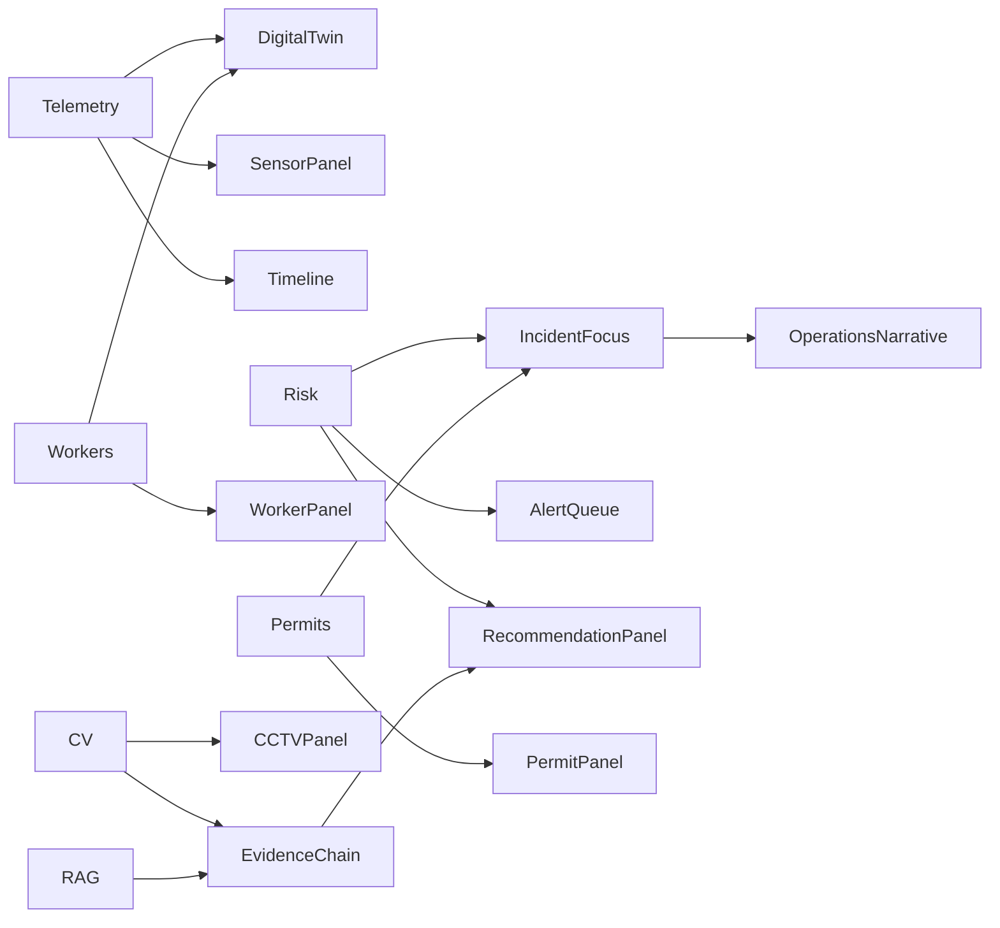

---

## Panel Design Principles

Every panel adheres to the following architectural principles:

1. One primary responsibility.
2. Independent rendering lifecycle.
3. Shared application state as the only communication mechanism.
4. Expandable without affecting neighboring panels.
5. Replaceable without modifying the surrounding architecture.
6. Optimized for real-time operational awareness rather than data exploration.

---

# 10. Global State Architecture

## 10.1 Overview

The Dashboard is a real-time operational application.

Unlike traditional CRUD applications, nearly every UI element is driven by continuously changing operational state.

The architectural objective is therefore **predictable state ownership**, **unidirectional data flow**, and **feature isolation**.

The Dashboard itself performs **no business computation**. It consumes backend intelligence and exposes a synchronized operational view.

---

## Architectural Principles

The state architecture follows the following principles:

1. Single Source of Truth
2. Immutable State Updates
3. Unidirectional Data Flow
4. Feature-based State Ownership
5. Derived State over Duplicate State
6. Event-driven Synchronization
7. UI State separated from Domain State

---

# State Categories

The application state is divided into three categories.

```
Application State

├── Domain State
├── UI State
└── Derived State
```

---

## Domain State

Represents live plant information received from backend services.

Examples:

- telemetry
- incidents
- workers
- permits
- equipment
- cameras
- recommendations

The Dashboard never computes these values.

---

## UI State

Represents the current interface.

Examples:

- selected zone
- selected worker
- expanded panel
- fullscreen camera
- active tab
- sidebar state
- timeline cursor

UI state never modifies domain state.

---

## Derived State

Derived state is computed locally from domain state.

Examples include:

- highest-risk zone
- active worker count
- active permit count
- visible incidents
- selected timeline snapshot
- visible recommendations

Derived state prevents duplication while improving rendering performance.

---

# Global Application State

```
ApplicationState

├── TelemetryState
├── IncidentState
├── WorkerState
├── PermitState
├── CameraState
├── TimelineState
├── SelectionState
├── SystemHealthState
├── NavigationState
├── UIState
├── FutureCVState
└── FutureRAGState
```

---

# Telemetry State

## Purpose

Maintain the latest operational telemetry.

Contains:

- latest sensor values
- historical buffer
- quality flags
- update timestamp
- stale detection

Owned by:

Telemetry Service

Consumed by:

- Digital Twin
- Sensor Panel
- Timeline
- Incident Panel

---

# Incident State

## Purpose

Represents operational incidents.

Contains:

- incident list
- active incident
- severity
- evidence references
- recommendations
- acknowledgement status
- escalation status

Owned by:

Incident Service

Consumed by:

Nearly every operational panel.

---

# Worker State

Contains:

- worker locations
- assigned permits
- exposure time
- current zone
- evacuation status
- standby assignment

---

# Permit State

Contains:

- active permits
- permit roles
- expiry
- conflicts
- linked workers
- linked equipment

---

# Camera State

Contains:

- camera availability
- active stream
- focused stream
- CV overlays
- fullscreen state

---

# Timeline State

Contains:

- current timestamp
- playback state
- historical cursor
- replay mode
- playback speed

Timeline state is independent of telemetry state.

Historical playback never mutates live telemetry.

---

# Selection State

Contains UI selections.

Examples:

```
Selected Zone

Selected Equipment

Selected Worker

Selected Camera

Selected Incident

Selected Permit
```

Selection state controls context.

---

# Navigation State

Contains:

- active page
- navigation history
- expanded modules
- open drawers

---

# System Health State

Contains health of platform services.

Examples:

```
Backend

Telemetry

Risk Engine

Camera

CV

RAG

API

Connection

Latency
```

Purpose:

Operators should always know whether the monitoring system itself is healthy.

---

# Future Computer Vision State

Reserved for:

- PPE detections
- smoke
- fire
- occupancy
- intrusion
- object tracking

CV remains independent of telemetry.

---

# Future RAG State

Reserved for:

- procedure retrieval
- regulation lookup
- historical incidents
- explanation references

RAG augments recommendations without modifying operational state.

---

# Global State Ownership

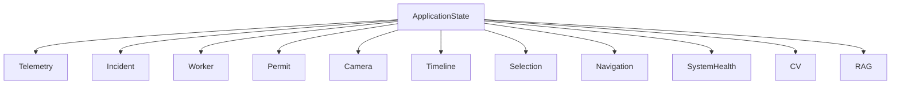

---

# State Ownership Rules

Every state object has exactly one owner.

Many components may read it.

Only the owner may modify it.

This guarantees predictable updates and eliminates conflicting state mutations.

---

# 11. Data Flow Architecture

## Overview

The Dashboard follows a strictly unidirectional data flow.

Data originates exclusively from backend services.

The Dashboard never writes operational state.

Its responsibility begins once validated backend data becomes available.

---

## High-Level Flow

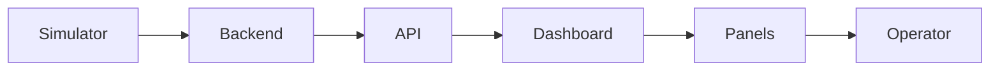

---

# Detailed Operational Flow

```
Telemetry Simulator

↓

Backend Services

↓

Risk Engine

↓

Evidence Builder

↓

Recommendation Engine

↓

API Gateway

↓

Dashboard

↓

Application State

↓

Feature Modules

↓

Panels

↓

Operator
```

---

# Backend Producers

The Dashboard receives information from independent backend modules.

Examples:

Telemetry Simulator

Risk Engine

Permit Engine

Worker Tracking

Recommendation Engine

Computer Vision

RAG

System Health

Each service owns its own data.

---

# API Layer

The API layer normalizes backend outputs.

Responsibilities:

- validation
- versioning
- serialization
- authentication
- transport

The Dashboard never communicates directly with backend modules.

---

# Dashboard Data Pipeline

```
Incoming Message

↓

Validation

↓

Normalization

↓

Application State

↓

Derived State

↓

Feature Updates

↓

Rendering
```

---

# Update Propagation

Whenever new telemetry arrives:

```
Telemetry Updated

↓

Application State

↓

Derived State

↓

Affected Features

↓

Affected Panels

↓

Rendering
```

Only affected panels update.

Example:

Pressure sensor changes.

Updates:

Digital Twin

Incident Panel

Sensor Panel

Timeline

No other panel re-renders.

---

# Data Ownership

```
Backend

↓

API

↓

Global State

↓

Panels

↓

Operator
```

Panels never exchange business data directly.

---

# Live Data Flow

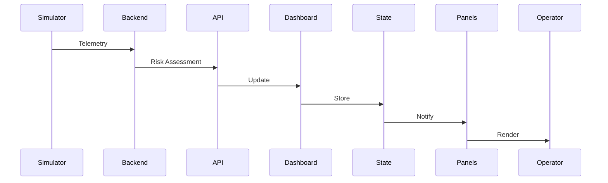

---

# Historical Playback Flow

```
Historical Snapshot

↓

Timeline

↓

Application State

↓

Panels

↓

Operator
```

Historical mode freezes live updates.

Playback becomes deterministic.

---

# Event Propagation Example

```
Pressure Increase

↓

Risk Engine

↓

Compound Risk

↓

Incident Update

↓

Recommendation

↓

Dashboard

↓

Operator
```

The Dashboard never calculates compound risk.

---

# Data Synchronization Rules

1.

Backend owns operational truth.

2.

Dashboard owns presentation state.

3.

Derived state is transient.

4.

Historical playback is isolated.

5.

No circular data flow.

---

# 12. Component Communication

## Overview

The Dashboard follows a **publish–subscribe architecture** centered around shared application state.

Components communicate **indirectly**.

Direct component-to-component dependencies are intentionally prohibited.

This minimizes coupling and enables independent feature evolution.

---

# Communication Principles

Every interaction follows five principles.

1.

Shared State

2.

Feature Isolation

3.

One-way Updates

4.

Independent Rendering

5.

Predictable Event Flow

---

# Publisher–Subscriber Model

Every feature publishes changes to shared application state.

Interested features subscribe only to relevant slices.

Example:

```
Telemetry

↓

Application State

↓

Digital Twin

↓

Incident Panel

↓

Sensor Panel
```

No panel directly notifies another panel.

---

# Communication Diagram

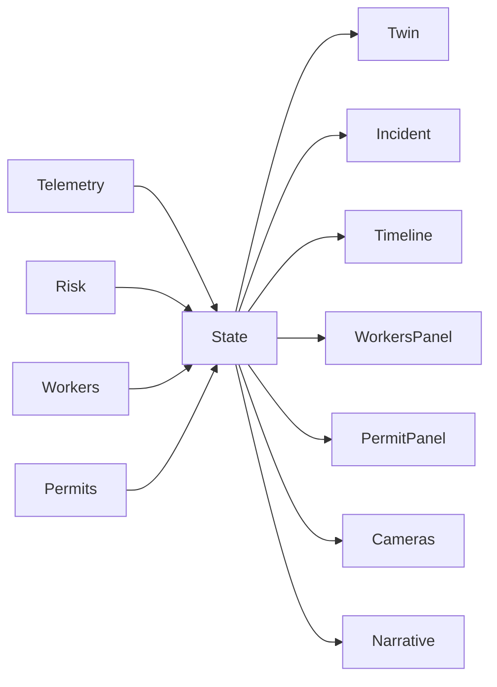

---

# Parent–Child Communication

Parent components provide:

- layout
- composition
- lifecycle

Children provide:

- visualization
- interaction
- local UI state

Parents never own feature logic.

---

# Shared State

Shared state contains:

- domain state
- UI state
- derived state

Every feature reads from shared state.

Only state owners modify it.

---

# Local Component State

Local state remains inside individual panels.

Examples:

- expanded accordion
- selected chart
- scroll position
- local filters
- fullscreen toggle

Local state never belongs in global state.

---

# Context Boundaries

Each feature is isolated.

Examples:

```
Digital Twin

Evidence

Timeline

Workers

Permits

CCTV
```

Each feature has:

- public interface
- internal state
- rendering logic

No feature accesses another feature's internal implementation.

---

# Feature Isolation

Every feature module should satisfy:

- independently testable
- independently replaceable
- independently maintainable
- independently rendered

Feature boundaries reduce long-term architectural complexity.

---

# Communication Lifecycle

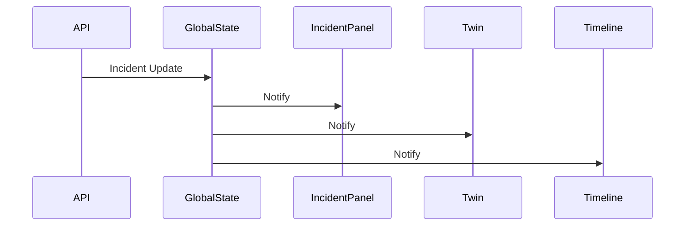

---

# Avoiding Prop Drilling

Operational state should never be passed through long component chains.

Instead:

```
Global State

↓

Interested Feature

↓

Local Rendering
```

This reduces coupling and simplifies future expansion.

---

# Event Flow

```
Backend Event

↓

Application State

↓

Feature Subscription

↓

Rendering

↓

Operator Interaction

↓

Local UI State
```

Business state always flows downward.

User interactions only affect UI state unless explicitly sent to backend through defined APIs.

---

# Communication Rules

1. Components never communicate directly.
2. Shared state is the only source of truth.
3. Parent components manage composition, not business logic.
4. Feature modules remain independent.
5. Local UI state stays local.
6. Domain state is immutable from the UI.
7. Communication is always unidirectional.

---

## Architectural Summary

The Dashboard communication architecture intentionally mirrors the backend's modular architecture.

Just as backend services communicate through well-defined contracts rather than direct coupling, frontend feature modules communicate exclusively through shared application state. This symmetry improves maintainability, simplifies testing, and ensures that the frontend remains a presentation and orchestration layer rather than an alternative source of business logic.

---

# 13. API Contracts

## 13.1 Purpose

The Dashboard communicates exclusively with backend service interfaces.

It never communicates directly with:

- Simulator
- Risk Engine
- Computer Vision
- RAG
- Database
- Historian

The backend acts as the single integration layer.

This provides:

- loose coupling
- versioned interfaces
- backend replaceability
- transport abstraction
- simplified frontend architecture

---

# Architectural Principles

Every API contract follows these principles.

1. Backend owns business logic.

2. Dashboard owns presentation.

3. APIs return complete domain objects.

4. Dashboard never assembles fragmented responses.

5. APIs are versionable.

6. APIs remain independent.

7. Streaming interfaces are preferred for continuously changing data.

---

# Communication Overview

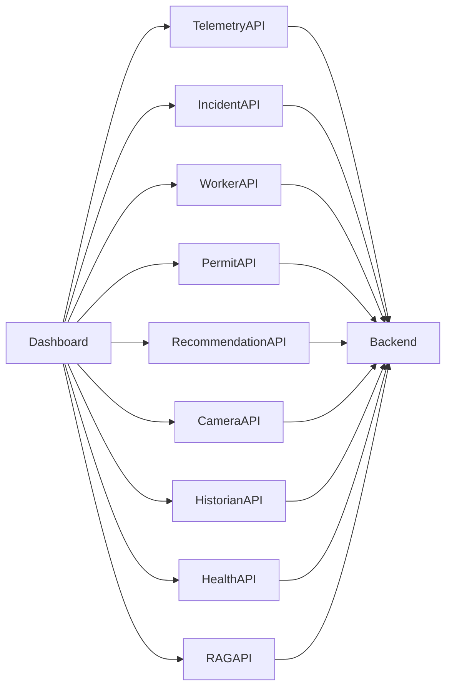

---

# Telemetry Contract

## Purpose

Provide continuously updated plant telemetry.

---

### Data Responsibilities

Provides:

- Sensor readings
- Equipment states
- Zone summaries
- Telemetry quality
- Update timestamp

Consumes:

Nothing.

---

### Update Frequency

Live

Historical

Replay

---

### Consumers

Digital Twin

Sensor Panel

Timeline

Incident Workspace

Recommendations

---

# Incident Contract

## Purpose

Provide normalized operational incidents.

---

Provides

- Active incidents
- Severity
- Priority
- Status
- Assigned operators
- Escalation level
- Acknowledgement state

---

Consumers

Incident Focus

Alert Queue

Operations Narrative

Recommendations

Digital Twin

---

# Worker Contract

Provides

- Worker identities
- Current zone
- Assigned permit
- Exposure duration
- PPE status
- Evacuation state

---

Consumers

Worker Panel

Digital Twin

Incident Panel

Permit Panel

---

# Permit Contract

Provides

- Active permits
- Permit type
- Roles
- Validity
- Linked equipment
- Linked workers
- Conflict indicators

---

Consumers

Permit Panel

Incident Workspace

Digital Twin

---

# Recommendation Contract

Provides

- Recommended actions
- Recommendation priority
- Recommendation status
- Supporting evidence
- Estimated operational impact

Recommendations remain advisory.

The backend never issues autonomous control commands.

---

# System Health Contract

Provides

Status of:

- Backend
- Risk Engine
- CV
- RAG
- Simulator
- Cameras
- API Gateway
- Streaming
- Database

Purpose:

Operators should immediately detect failures in the monitoring platform itself.

---

# Digital Twin Contract

Provides

- Zone geometry
- Equipment positions
- Worker positions
- Equipment state
- Zone state
- Incident overlays

The Dashboard renders this information without modifying topology.

---

# Historical Playback Contract

Purpose

Support deterministic replay.

Provides

- Historical telemetry
- Historical incidents
- Historical workers
- Historical permits
- Historical recommendations

Playback always represents a consistent plant snapshot.

---

# Computer Vision Contract

Provides

- PPE detections
- Smoke
- Fire
- Intrusion
- Occupancy
- Bounding boxes
- Confidence metadata
- Camera metadata

The Dashboard displays observations without performing inference.

---

# Knowledge (RAG) Contract

Provides

- Standard Operating Procedures
- Historical incidents
- Regulations
- Operating guidance
- Explanation references
- Supporting documentation

RAG augments explanation rather than generating operational state.

---

# API Dependency Diagram

```mermaid
graph TD

TelemetryAPI --> Twin
TelemetryAPI --> Sensors

IncidentAPI --> Incident

WorkerAPI --> Workers

PermitAPI --> Permits

RecommendationAPI --> Recommendations

CameraAPI --> CCTV

HistorianAPI --> Timeline

HealthAPI --> SystemHealth

RAGAPI --> Evidence
```

---

# API Versioning

Each interface should evolve independently.

Versioning strategy:

```
Telemetry v1

Incident v2

Workers v1

Recommendations v1
```

Backward compatibility should be maintained whenever practical.

---

# API Design Rules

1.

One service owns one resource.

2.

Responses are immutable snapshots.

3.

Streaming preferred for live data.

4.

Historical queries remain deterministic.

5.

Dashboard never performs business joins.

---

# 14. Event Flow

## Overview

The Dashboard is fundamentally event-driven.

Every significant UI update originates from an operational event generated by backend systems.

The Dashboard reacts to events rather than polling internal state continuously.

---

# Event Lifecycle

Every operational event follows the same lifecycle.

```
Detection

↓

Correlation

↓

Assessment

↓

Evidence

↓

Recommendation

↓

Operator Awareness

↓

Operator Action

↓

Resolution

↓

Archival
```

---

# Complete Event Pipeline

```mermaid
flowchart TD

Telemetry

Telemetry --> Risk

Risk --> Evidence

Evidence --> Incident

Incident --> Recommendation

Recommendation --> Dashboard

Dashboard --> Operator

Operator --> Action

Action --> Backend

Backend --> Dashboard
```

---

# Stage 1 — Telemetry Update

Origin:

Simulator

Future SCADA

Telemetry Stream

Examples

Pressure changes

Gas concentration

Worker movement

Permit activation

Equipment status

---

# Stage 2 — Risk Assessment

Backend evaluates:

- Thresholds
- Correlations
- Compound risk
- Temporal trends

Dashboard receives completed assessment.

---

# Stage 3 — Evidence Generation

Backend builds evidence.

Example:

Pressure ↑

+

Gas ↑

+

Worker Present

↓

Evidence Chain

The Dashboard visualizes evidence.

It never constructs it.

---

# Stage 4 — Narrative Update

Operations Narrative receives:

New operational event.

The event becomes:

Human-readable explanation.

Example

```
14:02:17

Pressure exceeded expected operating range.
```

---

# Stage 5 — Alert Generation

Alert Engine evaluates:

Priority

Severity

Deduplication

Escalation

Suppression

Dashboard receives normalized alerts.

---

# Stage 6 — Incident Lifecycle

Alert

↓

Incident Created

↓

Acknowledged

↓

Escalated

↓

Resolved

↓

Archived

The Incident Focus panel always displays the highest-priority active incident.

---

# Stage 7 — Recommendation Generation

Risk Engine produces:

- Recommended actions
- Supporting evidence
- Operational justification

Recommendations remain advisory.

---

# Stage 8 — Operator Interaction

Operator actions include:

- Acknowledge
- Escalate
- Dispatch
- Silence
- Review
- Close

These interactions are transmitted back to backend services.

---

# Event Sequence Diagram

```mermaid
sequenceDiagram

participant Simulator

participant Backend

participant Risk

participant Dashboard

participant Operator

Simulator->>Backend: Telemetry

Backend->>Risk: Update

Risk->>Backend: Risk Assessment

Backend->>Dashboard: Incident

Dashboard->>Operator: Render

Operator->>Dashboard: Acknowledge

Dashboard->>Backend: Operator Action
```

---

# Event Synchronization

Whenever an incident changes,

the Dashboard updates:

Digital Twin

↓

Alert Queue

↓

Incident Focus

↓

Recommendations

↓

Workers

↓

Timeline

↓

Narrative

↓

Evidence

All updates represent the same logical plant state.

---

# Event Ordering

Events must preserve temporal consistency.

Rules:

1.

Earlier telemetry never overwrites newer telemetry.

2.

Recommendations always reference current evidence.

3.

Historical replay preserves original timestamps.

4.

UI never mixes snapshots from different moments.

---

# Event Categories

Operational

Safety

Maintenance

Permit

Worker

CV

System

Historical

Each category follows the same architectural pipeline.

---

# 15. Real-Time Update Strategy

## Overview

The Dashboard is designed for continuous operation.

Different data sources require different synchronization strategies.

A single transport mechanism is insufficient.

Therefore, the Dashboard adopts a hybrid update architecture.

---

# Architectural Principles

1.

Latency where required.

2.

Bandwidth efficiency.

3.

Predictable rendering.

4.

Deterministic playback.

5.

Graceful degradation.

---

# Hybrid Communication Model

```mermaid
graph LR

Polling --> Dashboard

Streaming --> Dashboard

Historical --> Dashboard

User --> Dashboard
```

---

# Polling

Suitable for slowly changing information.

Examples:

Settings

Plant metadata

Users

Reports

Configuration

Health summaries

Polling interval:

30–60 seconds

---

# WebSockets / Streaming

Suitable for continuously changing operational data.

Examples:

Telemetry

Incidents

Workers

Recommendations

Digital Twin

Narrative

Timeline

Alert Queue

Streaming minimizes latency and unnecessary network overhead.

---

# Hybrid Strategy

```
Metadata

↓

Polling

Operational Data

↓

Streaming

Historical

↓

On Demand
```

This minimizes backend load while maintaining responsiveness.

---

# Refresh Rates

| Feature | Target Update Rate | Rationale |
|---------|-------------------:|-----------|
| Telemetry | 500 ms | Matches simulator cadence |
| Risk Assessments | 500 ms | Synchronized with telemetry |
| Digital Twin | 500 ms | Spatial awareness |
| Worker Positions | 500 ms | Live tracking |
| Incident Panel | Event-driven | Updates only when state changes |
| Alert Queue | Event-driven | Avoid unnecessary renders |
| Evidence Chain | Event-driven | Stable unless evidence changes |
| Recommendations | Event-driven | Coupled to incident changes |
| Operations Narrative | Event-driven | Append-only |
| System Health | 5–10 s | Infrastructure changes slowly |

---

# Batch Updates

Multiple backend events received within the same update window are processed as a single logical snapshot.

Example

```
Telemetry

Workers

Permits

↓

Single UI Update
```

Benefits:

- consistent rendering
- reduced layout recalculation
- synchronized panels

---

# Animation Timing

Animations communicate state transitions.

Rules:

Normal updates

Minimal or no animation.

Incident appearance

Short highlight animation.

Critical escalation

Immediate emphasis.

Historical playback

Smooth timeline progression.

Animations must never delay operational information.

---

# Historical Playback

Historical mode suspends live subscriptions.

The Dashboard switches to immutable historical snapshots.

Benefits:

- deterministic replay
- reproducible investigations
- operator training
- demonstrations

Live mode can be restored at any time.

---

# Performance Considerations

The update strategy minimizes unnecessary rendering through:

- selective subscriptions
- immutable snapshots
- derived state
- event-driven rendering
- independent panel updates

Only components affected by a state change should update.

---

# Update Strategy Diagram

```mermaid
flowchart TD

Backend

Backend --> Stream

Backend --> Poll

Stream --> State

Poll --> State

State --> DerivedState

DerivedState --> Panels

Panels --> Operator
```

---

# Latency Targets

| Operation | Target |
|-----------|--------|
| Telemetry → UI | < 500 ms |
| Incident creation → UI | < 500 ms |
| Recommendation update | < 500 ms |
| Worker movement | < 500 ms |
| Camera overlay update | < 1 s |
| Historical snapshot change | < 200 ms |
| System health refresh | < 10 s |

These targets ensure the Dashboard remains responsive while maintaining consistency across all operational panels.

---

## Architectural Summary

The real-time strategy balances responsiveness, consistency, and scalability by assigning each category of information the most appropriate synchronization mechanism. Streaming is reserved for operational data, polling for slow-changing metadata, and on-demand retrieval for historical information. This hybrid approach minimizes network overhead, prevents unnecessary UI updates, and preserves deterministic behavior during both live monitoring and historical replay.

---

# 16. Error Handling Strategy

## 16.1 Overview

Industrial control software must assume that failures are inevitable.

The Dashboard shall never assume:

- backend availability,
- network reliability,
- sensor correctness,
- AI availability,
- camera connectivity,
- continuous telemetry.

Instead of hiding failures, the Dashboard explicitly communicates them to operators while preserving as much operational awareness as possible.

The primary design goal is:

> **Fail gracefully while preserving operator confidence.**

---

# Error Handling Principles

The Dashboard follows eight architectural principles.

1. Never hide failures.
2. Fail independently.
3. Preserve operator awareness.
4. Maintain partial functionality.
5. Clearly distinguish unavailable data from safe conditions.
6. Preserve historical context.
7. Surface monitoring-system failures.
8. Never silently degrade.

---

# Failure Classification

Failures are categorized into:

```text
Infrastructure Failures

Backend
API
Network

↓

Operational Data Failures

Telemetry
CV
RAG
Risk Engine

↓

Presentation Failures

Rendering
UI
Panels
```

Each category has different recovery behavior.

---

# Backend Unavailable

## Description

The Dashboard cannot communicate with backend services.

Examples:

- API unavailable
- Backend process crashed
- Gateway failure

---

## Operator Experience

Immediately display:

```
BACKEND CONNECTION LOST

Last successful update:

14:02:17

Current view frozen.

Recommendations unavailable.
```

---

## Dashboard Behavior

- Freeze latest valid state.
- Disable operator actions requiring backend.
- Continue historical navigation.
- Preserve evidence already received.
- Display connection indicator.

---

## Recovery

Automatic reconnect attempts continue.

Operator may manually retry.

---

# Telemetry Stale

## Description

Telemetry stream has stopped.

Latest values may no longer represent the real plant.

---

## Operator Experience

Affected telemetry is clearly marked:

```
STALE

Last Update:

12 seconds ago
```

Sensor values remain visible but lose "live" status.

---

## Dashboard Behavior

- Preserve last values.
- Disable trend extrapolation.
- Freeze Digital Twin updates.
- Suspend compound-risk updates.
- Keep historical data accessible.

---

# Camera Disconnected

## Description

Camera stream unavailable.

Possible causes:

- Network failure
- Camera hardware failure
- Maintenance
- Permission issue

---

## Operator Experience

Affected camera panel shows:

```
CAMERA OFFLINE

Feed unavailable

Last Frame

14:03:10
```

Other cameras remain unaffected.

---

## Dashboard Behavior

- Maintain layout.
- Preserve last known frame if available.
- Continue displaying CV history.
- Continue displaying telemetry.

---

# Risk Engine Offline

## Description

Compound risk calculations unavailable.

---

## Operator Experience

Incident panel displays:

```
Risk Assessment

Unavailable

Telemetry continues.
```

Recommendations become unavailable.

Existing recommendations remain marked as historical.

---

## Dashboard Behavior

- Continue telemetry updates.
- Continue Digital Twin.
- Disable new incidents.
- Preserve historical incidents.

---

# Computer Vision Unavailable

## Description

CV inference unavailable.

---

## Operator Experience

Camera remains visible.

CV overlays disappear.

Indicator:

```
Computer Vision

Offline
```

---

## Dashboard Behavior

- Continue camera streaming.
- Continue telemetry.
- Continue worker tracking.
- Suspend CV-generated evidence.

---

# RAG Unavailable

## Description

Knowledge services unavailable.

---

## Operator Experience

Evidence remains available.

Knowledge references display:

```
Knowledge unavailable.
```

Recommendations continue.

Only contextual documentation disappears.

---

# Network Loss

## Description

Client loses network connectivity.

---

## Operator Experience

Top banner:

```
OFFLINE MODE

Displaying last synchronized state.
```

Timestamp displayed continuously.

---

## Dashboard Behavior

- Freeze operational state.
- Disable acknowledgements.
- Preserve navigation.
- Enable historical inspection.

---

# Partial Failure Strategy

The Dashboard intentionally avoids global failure.

Example:

```
Telemetry

✓

CV

×

Risk

✓

RAG

×

Camera

✓
```

Operators continue working with remaining services.

---

# Failure Propagation

```mermaid
flowchart TD

Failure

Failure --> Detection

Detection --> HealthState

HealthState --> StatusBar

HealthState --> AffectedPanel

AffectedPanel --> Operator

Operator --> Recovery
```

---

# Error Severity Levels

| Severity | Description | Operator Impact |
|-----------|-------------|-----------------|
| Info | Minor degradation | Continue normally |
| Warning | Reduced capability | Increased awareness |
| Critical | Decision support affected | Immediate attention |
| Emergency | Core monitoring unavailable | Operational escalation |

---

# Error Design Rules

1. Never remove a panel because of failure.
2. Always explain why data is unavailable.
3. Show last known valid timestamp.
4. Never display stale data as live.
5. Preserve operator trust through transparency.

---

# 17. Offline & Recovery

## 17.1 Overview

Industrial environments experience intermittent connectivity.

The Dashboard therefore supports controlled degradation and deterministic recovery.

Recovery must restore operational awareness without introducing inconsistent state.

---

# Recovery Principles

1. Automatic recovery.
2. Preserve operator context.
3. Restore complete snapshots.
4. Prevent duplicate events.
5. Rebuild derived state.
6. Synchronize before rendering.

---

# Connection Lifecycle

```mermaid
stateDiagram-v2

[*] --> Connected

Connected --> Degraded

Degraded --> Offline

Offline --> Reconnecting

Reconnecting --> Synchronizing

Synchronizing --> Connected
```

---

# Reconnection

When connectivity returns:

The Dashboard performs:

```
Reconnect

↓

Authenticate

↓

Synchronize Snapshot

↓

Rebuild State

↓

Resume Streaming

↓

Resume Rendering
```

Streaming resumes only after synchronization completes.

---

# State Restoration

Application state restoration occurs in phases.

Phase 1

Infrastructure

↓

Phase 2

Domain State

↓

Phase 3

Derived State

↓

Phase 4

Rendering

↓

Phase 5

Subscriptions

This prevents inconsistent rendering.

---

# Historical Recovery

Historical playback remains available during outages.

Historical snapshots are immutable.

Operator capabilities:

- replay incidents
- review evidence
- inspect permits
- inspect workers
- export history

Historical mode never depends on live telemetry.

---

# Graceful Degradation

Capability matrix:

| Feature | Online | Offline |
|---------|--------|----------|
| Navigation | ✓ | ✓ |
| Historical Timeline | ✓ | ✓ |
| Live Telemetry | ✓ | ✗ |
| Recommendations | ✓ | Frozen |
| Digital Twin | ✓ | Frozen |
| Evidence | ✓ | Historical Only |
| Acknowledge | ✓ | Disabled |
| Camera Streams | ✓ | Last Frame |

---

# Health Monitoring

Health monitoring is itself an architectural subsystem.

Continuously monitors:

- Backend
- API
- Database
- Simulator
- Risk Engine
- CV
- RAG
- Cameras
- Streaming
- Network latency

---

# Health Dashboard

System Health should expose:

```
Backend

Healthy

Telemetry

Healthy

Risk Engine

Healthy

Camera

Offline

RAG

Healthy

Latency

214 ms
```

Operators must always understand whether failures originate in the plant or the monitoring platform.

---

# Recovery Flow

```mermaid
flowchart TD

Offline

Offline --> Reconnect

Reconnect --> Snapshot

Snapshot --> RestoreState

RestoreState --> ResumeSubscriptions

ResumeSubscriptions --> LiveOperation
```

---

# Recovery Rules

1. Never merge partial snapshots.
2. Resume only after synchronization.
3. Preserve historical context.
4. Restore UI state where possible.
5. Recompute derived state after restoration.

---

# 18. Performance Strategy

## 18.1 Overview

The Dashboard is expected to operate continuously while processing:

- live telemetry,
- worker movements,
- permits,
- incidents,
- recommendations,
- evidence,
- camera metadata.

Performance optimization therefore becomes an architectural concern rather than a post-implementation enhancement.

---

# Performance Objectives

The architecture optimizes for:

- responsiveness,
- predictable rendering,
- low latency,
- scalability,
- deterministic updates.

---

# Caching Strategy

Caching reduces redundant computation while preserving correctness.

Suitable candidates include:

- plant topology
- equipment metadata
- zone geometry
- historical incident metadata
- SOP references
- regulatory documents

Operational telemetry is **never** cached beyond the required historical buffer.

---

# Memoization Strategy

Memoization is applied only to expensive derived computations.

Examples:

- visible worker lists
- zone summaries
- incident grouping
- recommendation sorting
- filtered historical timelines

Memoization is invalidated only when source state changes.

---

# Virtualization

Large collections should render only visible elements.

Examples:

- historical event lists
- worker tables
- alarm history
- incident archives
- telemetry tables

Virtualization is unnecessary for high-priority operational panels containing only a few items.

---

# Incremental Rendering

Rendering follows selective updates.

```
Telemetry Changes

↓

Affected State

↓

Affected Features

↓

Affected Panels

↓

Repaint
```

Panels unrelated to the update remain untouched.

---

# Update Scheduling

Updates are categorized:

| Priority | Examples |
|-----------|----------|
| Critical | Incident, Recommendations, Emergency |
| High | Telemetry, Workers |
| Medium | Narrative, Timeline |
| Low | Health, Metadata |

Critical updates always take precedence.

---

# Large Dataset Strategy

Future deployments may include:

- 1000+ sensors
- 100+ zones
- 500+ workers
- years of historical telemetry

The Dashboard scales through:

- hierarchical navigation,
- filtering,
- aggregation,
- virtualization,
- lazy loading,
- incremental retrieval.

Overview screens display summaries rather than complete datasets.

---

# Historical Playback Performance

Historical playback uses immutable snapshots.

Advantages:

- deterministic replay,
- efficient seeking,
- reproducible investigations,
- simplified synchronization.

Playback should never compete with live streaming.

---

# Scalability Strategy

Current implementation:

```
1 Plant

↓

4 Zones
```

Target architecture:

```
Enterprise

↓

Plants

↓

Areas

↓

Units

↓

Zones

↓

Equipment

↓

Sensors
```

The Dashboard architecture remains unchanged.

Only the data hierarchy expands.

---

# Rendering Pipeline

```mermaid
flowchart LR

Backend

Backend --> State

State --> DerivedState

DerivedState --> VisiblePanels

VisiblePanels --> Render

Render --> Operator
```

---

# Performance Budget

| Operation | Target |
|-----------|--------|
| Initial dashboard load | < 2 s |
| Telemetry update | < 500 ms |
| Incident render | < 300 ms |
| Zone selection | < 100 ms |
| Timeline seek | < 200 ms |
| Historical replay step | < 200 ms |
| Camera panel switch | < 250 ms |

---

# Performance Design Rules

1. Compute once, render many.
2. Update only affected features.
3. Prefer derived state over duplicated state.
4. Keep expensive computations outside rendering.
5. Separate live streaming from historical playback.
6. Preserve deterministic rendering under load.
7. Design for hierarchical growth rather than flat expansion.

---

## Architectural Summary

The Dashboard's performance architecture is built around selective updates, immutable state, and hierarchical scalability. Rather than optimizing individual widgets in isolation, the system minimizes unnecessary work through clear state ownership, event-driven rendering, and progressive disclosure. This ensures that responsiveness is maintained from the four-zone hackathon prototype to future multi-plant industrial deployments.

---

# 19. Folder Structure

## 19.1 Overview

The Dashboard frontend follows a **feature-oriented architecture** rather than a page-oriented architecture.

Industrial applications evolve continuously over many years, with new capabilities such as Computer Vision, Digital Twin enhancements, RAG, predictive maintenance, and additional operational modules added incrementally.

To support long-term maintainability, the project is organized around **business capabilities**, not UI screens.

Each feature is:

- independently maintainable,
- independently testable,
- independently replaceable,
- independently deployable within the application.

---

## Architectural Principles

The project structure follows these principles:

1. Feature-first organization
2. Shared code only when genuinely reusable
3. Clear ownership boundaries
4. No circular dependencies
5. Separation of presentation, orchestration, and infrastructure
6. Scalability beyond the hackathon implementation

---

# High-Level Project Structure

```text
src/

├── app/
├── layouts/
├── pages/
├── features/
├── shared/
├── services/
├── state/
├── hooks/
├── config/
├── assets/
├── types/
├── utils/
├── constants/
├── styles/
└── tests/
```

---

# app/

## Responsibility

Application bootstrap.

Contains:

- application initialization
- routing bootstrap
- providers
- application shell
- lifecycle coordination

This folder owns **application startup**, not business functionality.

---

# layouts/

## Responsibility

Defines high-level dashboard layouts.

Examples:

```
Dashboard Layout

Control Room Layout

Video Wall Layout

Historical Replay Layout
```

Layouts own:

- positioning
- responsiveness
- panel arrangement

They do **not** own operational logic.

---

# pages/

## Responsibility

Represents top-level navigation destinations.

Examples:

```
Plant Overview

Incidents

Workers

Analytics

Settings

Reports
```

Pages compose features but never implement them.

---

# features/

The most important directory.

Each operational capability becomes its own feature.

```
features/

DigitalTwin

Incident

Alerts

Evidence

Timeline

Workers

Permits

Recommendations

Sensors

CCTV

OperationsNarrative

SystemHealth

Navigation

Authentication
```

Each feature owns:

- UI composition
- interactions
- feature-specific state
- public interface
- internal components

---

# shared/

Contains reusable modules shared across multiple features.

Examples:

- buttons
- dialogs
- tables
- icons
- typography
- cards
- loading indicators
- error displays

No business knowledge exists here.

---

# services/

Responsible for communication with backend systems.

Examples:

```
Telemetry Service

Incident Service

Worker Service

Permit Service

Recommendation Service

Health Service

Historical Service
```

Services perform:

- API communication
- streaming
- serialization
- transport abstraction

Business rules remain in the backend.

---

# state/

Contains global application state architecture.

Examples:

```
Application State

Telemetry State

Incident State

Worker State

Timeline State

Selection State

Navigation State
```

This directory defines:

- ownership
- synchronization
- subscriptions

---

# hooks/

Contains reusable application behaviors.

Examples:

- subscriptions
- keyboard shortcuts
- resize detection
- synchronization helpers
- replay helpers

Hooks encapsulate reusable interaction patterns.

---

# config/

Contains configuration independent of runtime data.

Examples:

- environment configuration
- dashboard settings
- refresh intervals
- feature flags

---

# assets/

Contains static resources.

Examples:

- icons
- logos
- plant drawings
- equipment symbols
- illustrations

Operational data never belongs here.

---

# types/

Defines shared domain contracts.

Examples:

```
Incident

Worker

Permit

Recommendation

Telemetry Snapshot

Evidence

Timeline Event

System Health
```

Types mirror backend contracts.

---

# utils/

Contains generic helper functionality.

Examples:

- formatting
- date utilities
- unit conversion
- mathematical helpers

Utilities never contain business rules.

---

# constants/

Contains immutable application constants.

Examples:

- severity labels
- panel identifiers
- navigation identifiers
- default layouts

---

# styles/

Contains global design tokens.

Examples:

- typography
- spacing
- colors
- elevation
- responsive breakpoints

Visual styling remains centralized.

---

# tests/

Project testing hierarchy.

Examples:

```
Feature Tests

Integration Tests

Layout Tests

State Tests

Performance Tests
```

Testing mirrors production architecture.

---

# Folder Dependency Rules

```mermaid
graph TD

Pages --> Features

Features --> Shared

Features --> Services

Features --> State

State --> Types

Services --> Types

Shared --> Assets

Utils --> Shared
```

No feature may depend directly on another feature's internal implementation.

---

# Architectural Benefits

This structure provides:

- independent feature evolution
- simplified onboarding
- scalable development
- isolated testing
- reduced coupling

---

# 20. Feature Boundaries

## Overview

Every feature owns exactly one operational capability.

Feature ownership eliminates ambiguity and prevents duplicated business knowledge.

Features communicate exclusively through shared application state and well-defined public interfaces.

---

# Boundary Principles

Every feature satisfies the following rules:

1. Single responsibility
2. Independent lifecycle
3. Explicit public interface
4. Internal implementation hidden
5. Replaceable without affecting other features

---

# Digital Twin

## Owns

- plant visualization
- spatial navigation
- zone highlighting
- equipment highlighting
- worker positioning
- incident overlays

Does **not** own:

- telemetry processing
- risk calculation
- recommendations

Consumes operational state only.

---

# Alerts

## Owns

- prioritized alert queue
- alert grouping
- operator acknowledgement UI
- alert filtering

Does not own incident generation.

Incident generation belongs to backend services.

---

# Evidence

## Owns

- evidence visualization
- correlation display
- supporting observations
- explanation hierarchy

Evidence generation remains outside the Dashboard.

---

# Workers

## Owns

- worker presentation
- worker navigation
- exposure visualization
- assignment display

Worker tracking logic belongs to backend services.

---

# Permits

## Owns

- permit visualization
- permit conflicts
- permit relationships
- operational context

Permit validation is not performed inside the Dashboard.

---

# Timeline

## Owns

- temporal visualization
- playback controls
- historical navigation
- replay synchronization

Historical data retrieval remains a backend responsibility.

---

# Recommendations

## Owns

- recommendation presentation
- operational prioritization
- operator acknowledgement
- recommendation lifecycle

Recommendation generation belongs to the Risk Engine.

---

# Future Computer Vision

Future ownership includes:

- video overlays
- detection visualization
- camera annotation
- occupancy display
- PPE visualization

Inference remains external.

---

# Future RAG

Future ownership includes:

- regulatory references
- SOP presentation
- historical case presentation
- explanation enrichment

Knowledge retrieval remains external.

---

# System Health

Owns:

- infrastructure health
- service availability
- synchronization status
- latency visualization

Health monitoring logic belongs to backend services.

---

# Ownership Matrix

| Feature | Owns | Never Owns |
|----------|------|------------|
| Digital Twin | Spatial visualization | Risk logic |
| Incident | Active incident presentation | Incident generation |
| Alerts | Alert UI | Alarm correlation |
| Evidence | Evidence visualization | Evidence computation |
| Workers | Worker presentation | Worker tracking |
| Permits | Permit visualization | Permit validation |
| Timeline | Replay UI | Historical storage |
| Recommendations | Recommendation display | Decision generation |
| CCTV | Video presentation | Video inference |
| System Health | Status visualization | Infrastructure monitoring |

---

# Feature Dependency Diagram

```mermaid
graph LR

Telemetry --> DigitalTwin

Telemetry --> Timeline

Incident --> Alerts

Incident --> Recommendations

Workers --> DigitalTwin

Workers --> WorkerPanel

Permits --> PermitPanel

Evidence --> Recommendations

CV --> CCTV

RAG --> Evidence
```

---

# Boundary Rules

1. Features expose only public interfaces.
2. Internal feature implementation remains private.
3. Cross-feature communication occurs through shared state.
4. Business rules remain outside the Dashboard.
5. No feature owns another feature.

---

# 21. UI State Machine

## 21.1 Overview

The Dashboard is a **state-driven application**.

Every interface configuration corresponds to a well-defined operational state.

State transitions are triggered by backend events, operator interactions, or infrastructure changes.

The UI state machine guarantees predictable behavior under all operational conditions.

---

# State Machine Principles

The UI follows these principles:

1. One active operational state.
2. Explicit transitions.
3. Deterministic rendering.
4. Predictable operator experience.
5. Reversible recovery where appropriate.

---

# Startup

## Purpose

Initialize the application.

Activities:

- load configuration
- authenticate user
- establish backend connections
- restore previous session
- initialize global state

Visible UI:

```
Loading

System Checks

Connecting
```

Transition:

```
Startup

↓

Healthy
```

---

# Healthy

Normal operational monitoring.

Characteristics:

- live telemetry
- no active incidents
- low risk
- normal navigation
- full dashboard availability

This is the default operating state.

---

# Warning

Triggered by:

- abnormal telemetry
- low-priority incident
- infrastructure degradation

Behavior:

- warning indicators
- expanded alert queue
- recommendations become visible

Operator awareness increases without entering emergency mode.

---

# Incident

Triggered when an operational incident is declared.

Behavior:

- Incident Focus expands
- recommendations prioritized
- Digital Twin highlights affected zones
- evidence chain becomes primary
- Operations Narrative begins active logging

Operator workflow shifts from monitoring to investigation.

---

# Emergency

Highest operational severity.

Behavior:

- emergency banner
- highest-priority incident locked in focus
- recommendations emphasized
- evacuation context displayed
- operator acknowledgement required

Non-essential information is visually de-emphasized but remains accessible.

---

# Recovery

Entered after incident stabilization.

Behavior:

- decreasing risk visualization
- restoration progress
- historical review
- incident closure workflow

Operators verify plant recovery before returning to Healthy.

---

# Maintenance

Special operational mode.

Purpose:

Planned maintenance activities.

Characteristics:

- maintenance indicators
- scheduled work
- permit emphasis
- reduced operational alerts
- maintenance-specific recommendations

Live monitoring continues.

---

# Offline

Triggered by infrastructure failure.

Behavior:

- connection banner
- frozen operational state
- historical playback available
- acknowledgements disabled
- live recommendations unavailable

Recovery begins automatically once connectivity returns.

---

# State Transition Diagram

```mermaid
stateDiagram-v2

[*] --> Startup

Startup --> Healthy

Healthy --> Warning

Warning --> Healthy

Warning --> Incident

Incident --> Emergency

Incident --> Recovery

Emergency --> Recovery

Recovery --> Healthy

Healthy --> Maintenance

Maintenance --> Healthy

Healthy --> Offline

Warning --> Offline

Incident --> Offline

Emergency --> Offline

Offline --> Startup
```

---

# Operational Transition Flow

```mermaid
flowchart LR

Startup

--> Healthy

Healthy

--> Warning

Warning

--> Incident

Incident

--> Emergency

Emergency

--> Recovery

Recovery

--> Healthy
```

---

# State Responsibilities

| State | Primary Goal | Operator Focus |
|--------|--------------|----------------|
| Startup | Initialize system | Wait for readiness |
| Healthy | Monitor plant | Situational awareness |
| Warning | Assess abnormality | Investigation |
| Incident | Coordinate response | Decision support |
| Emergency | Execute emergency workflow | Immediate action |
| Recovery | Verify stabilization | Return to service |
| Maintenance | Support planned work | Operational coordination |
| Offline | Preserve awareness | Infrastructure recovery |

---

# UI Adaptation Rules

Across all states:

1. The Global Status Bar remains visible.
2. Navigation remains available.
3. Digital Twin remains the spatial anchor.
4. Incident Focus adapts according to severity.
5. Historical navigation remains accessible.
6. System Health continuously reports platform status.

No state removes critical operational context from the operator.

---

## Architectural Summary

The UI state machine provides a deterministic model for every operational condition the Dashboard may encounter. By explicitly defining states, transitions, responsibilities, and operator expectations, the architecture ensures consistent behavior across normal operations, incidents, emergencies, maintenance windows, and infrastructure failures. This state-driven approach simplifies implementation, testing, and future extension while preserving predictable operator workflows.

---

# 22. Dashboard Lifecycle

## 22.1 Overview

The Dashboard is designed as a continuously operating operational system rather than a traditional web application.

Unlike business applications where users repeatedly open and close pages, the Dashboard is expected to remain active for entire operator shifts, continuously synchronizing with plant operations while maintaining deterministic state.

Its lifecycle therefore prioritizes:

- reliability
- synchronization
- recoverability
- continuous operation
- graceful degradation

---

# Lifecycle Objectives

The Dashboard lifecycle is designed to ensure:

- deterministic startup
- complete state synchronization
- predictable rendering
- continuous monitoring
- seamless recovery
- graceful shutdown

---

# Complete Lifecycle

```mermaid
stateDiagram-v2

[*] --> Startup

Startup --> Loading

Loading --> Synchronization

Synchronization --> LiveOperation

LiveOperation --> IncidentMode

IncidentMode --> Recovery

Recovery --> LiveOperation

LiveOperation --> Shutdown

Shutdown --> [*]
```

---

## Phase 1 — Startup

### Objective

Initialize the application environment.

### Responsibilities

- Load application configuration
- Initialize logging
- Load feature flags
- Restore user preferences
- Initialize application shell
- Initialize state containers

### Operator Experience

The operator sees a startup screen displaying:

- Application version
- Environment
- Loading progress
- System initialization

No operational data is yet visible.

---

## Phase 2 — Loading

### Objective

Load static application resources.

Includes:

- Plant topology
- Zone metadata
- Equipment metadata
- Sensor definitions
- Dashboard configuration
- User permissions

This information changes infrequently and is cached locally.

---

## Phase 3 — Synchronization

### Objective

Synchronize with backend services before rendering live operational data.

### Activities

- Authenticate session
- Retrieve latest plant snapshot
- Restore application state
- Validate backend versions
- Establish streaming connections
- Build derived state

The Dashboard remains read-only until synchronization completes.

---

## Phase 4 — Live Operation

### Objective

Provide continuous operational awareness.

Characteristics:

- Live telemetry
- Active streaming
- Dynamic recommendations
- Incident monitoring
- Worker tracking
- Permit monitoring

This represents the normal operational lifecycle.

---

## Phase 5 — Incident Mode

Triggered whenever an operational incident becomes active.

Additional responsibilities:

- Promote Incident Focus
- Expand Recommendations
- Synchronize CCTV
- Highlight Digital Twin
- Append Operations Narrative
- Prioritize Alert Queue

The Dashboard remains fully interactive.

---

## Phase 6 — Recovery

Recovery begins once backend services indicate incident stabilization.

Responsibilities:

- Track decreasing risk
- Display recovery recommendations
- Monitor worker accountability
- Restore normal dashboard layout
- Archive incident context

Recovery ends only after the incident lifecycle is complete.

---

## Phase 7 — Shutdown

Shutdown may occur because of:

- user logout
- planned maintenance
- workstation restart
- application upgrade

Responsibilities:

- Save UI preferences
- Persist navigation state
- Close streaming connections
- Flush local logs
- Dispose temporary state

Operational data is never modified during shutdown.

---

# Lifecycle Responsibilities

| Phase | Primary Responsibility |
|--------|------------------------|
| Startup | Initialize environment |
| Loading | Load static resources |
| Synchronization | Synchronize operational state |
| Live Operation | Continuous monitoring |
| Incident | Decision support |
| Recovery | Controlled return to normal |
| Shutdown | Graceful termination |

---

# Lifecycle Data Flow

```mermaid
flowchart TD

Startup

--> Configuration

Configuration

--> Metadata

Metadata

--> Synchronization

Synchronization

--> Streaming

Streaming

--> LiveMonitoring

LiveMonitoring

--> IncidentHandling

IncidentHandling

--> Recovery

Recovery

--> Shutdown
```

---

# Lifecycle Design Principles

1. No rendering before synchronization.
2. Operational state always originates from backend.
3. Historical playback remains independent of live state.
4. Shutdown never mutates operational data.
5. Recovery restores complete application consistency.

---

# 23. Demo Execution Flow

## 23.1 Purpose

The hackathon demonstration is intentionally designed as a narrative rather than a sequence of unrelated dashboard interactions.

Every second should answer one of four questions:

1. What happened?
2. Why did it happen?
3. Who is affected?
4. What should be done next?

The demonstration showcases the Dashboard's ability to transform telemetry into operational intelligence.

---

# Demo Timeline Overview

Duration:

60 seconds

Scenario:

Hot Work Near Tar Extractor with Pressure Rise

Primary Zone:

Tar Extraction Area

---

## 0–10 Seconds — Normal Operations

### Backend

- Normal telemetry
- Stable process
- Active workers
- Approved permits

### Dashboard

Visible panels:

- Global Status
- Digital Twin
- Operations Narrative
- Worker Panel
- Permit Panel

Incident Focus displays:

```
No Active Incidents
```

### Operator Attention

Global Status

↓

Digital Twin

↓

Workers

### Judge Perception

"This looks like a professional operations center."

---

## 10–20 Seconds — Hot Work Begins

Backend updates:

- Hot Work Permit activated
- Worker enters zone
- Permit linked

Dashboard changes:

Permit Panel updates.

Worker icon appears near equipment.

Operations Narrative records:

```
Hot Work Permit Activated
```

### Expanded Panels

Permit Panel

Worker Panel

### Judge Perception

"The platform understands operational context."

---

## 20–30 Seconds — Early Abnormality

Backend:

- Pressure increasing
- Level increasing
- Initial anomaly detected

Dashboard:

Digital Twin

↓

Zone changes to Warning

Evidence Chain appears.

Compound Risk begins increasing.

### Expanded Panels

Evidence

Incident Workspace

### Operator Attention

Incident Focus

↓

Evidence

↓

Digital Twin

---

## 30–40 Seconds — Compound Risk

Backend:

- Gas concentration increasing
- Pressure continues rising
- Multiple evidence fragments correlated

Dashboard:

Incident created.

Alert Queue updates.

Recommendation Panel becomes visible.

Operations Narrative expands.

### Expanded Panels

Incident Focus

Recommendations

Evidence Chain

### Judge Experience

"This is not displaying alarms—it is correlating them."

---

## 40–50 Seconds — Critical Escalation

Backend:

- Flame detected
- High gas concentration
- Compound Risk critical

Dashboard:

Emergency Banner appears.

Digital Twin highlights incident zone.

Camera auto-focuses.

Worker cards highlighted.

Recommendation list expands.

### Operator Attention

Incident

↓

Recommendation

↓

Camera

↓

Evidence

### Judge Experience

"The dashboard is driving operator decisions."

---

## 50–60 Seconds — Stabilization

Backend:

- Emergency actions effective
- Pressure stabilizing
- Workers evacuating
- Risk decreasing

Dashboard:

Recovery state begins.

Operations Narrative records recovery.

Timeline complete.

Incident changes to Recovering.

### Expanded Panels

Timeline

Operations Narrative

Recovery Summary

### Judge Experience

"The platform closes the operational loop."

---

# Operator Attention Timeline

```text
0–10s

Status

↓

Twin

↓

Workers

10–20s

Permit

↓

Worker

20–30s

Twin

↓

Evidence

30–40s

Incident

↓

Recommendation

40–50s

Emergency

↓

Camera

↓

Evidence

50–60s

Recovery

↓

Timeline

↓

Narrative
```

---

# Judge Attention Timeline

```mermaid
timeline

title 60 Second Demonstration

0s : Healthy Plant

10s : Permit Activated

20s : Warning Appears

30s : Incident Created

40s : Compound Risk

50s : Emergency Response

60s : Recovery Summary
```

---

# Demo Narrative Flow

```mermaid
flowchart LR

Normal

--> Permit

Permit

--> Warning

Warning

--> Incident

Incident

--> Emergency

Emergency

--> Recovery
```

---

# Demo Design Principles

1. Every update advances the story.
2. No unnecessary animations.
3. Operators remain central.
4. AI explains every recommendation.
5. Recovery is demonstrated, not omitted.

---

# 24. Scalability Strategy

## 24.1 Overview

The initial implementation models four operational zones.

However, the architecture is designed to support substantially larger industrial environments without requiring structural redesign.

Scalability is achieved through hierarchical organization rather than increasing interface density.

---

# Architectural Principle

The Dashboard follows the information visualization principle:

> Overview first → Zoom and Filter → Details on Demand

This minimizes cognitive overload while supporting very large facilities.

---

# Scalability Levels

## Stage 1 — Demonstration

```
1 Plant

↓

4 Zones
```

Every zone remains visible simultaneously.

Suitable for:

- hackathon
- demonstrations
- operator training

---

## Stage 2 — Small Facility

```
1 Plant

↓

20 Zones
```

Dashboard introduces:

- grouped areas
- quick filters
- search
- incident grouping

Not every zone is permanently expanded.

---

## Stage 3 — Medium Facility

```
Plant

↓

Areas

↓

Units

↓

Zones
```

Examples:

```
Coke Oven

↓

Battery 1

↓

Charging

↓

Zone 4
```

Digital Twin becomes hierarchical.

---

## Stage 4 — Enterprise

```
Enterprise

↓

Plants

↓

Areas

↓

Units

↓

Zones

↓

Equipment

↓

Sensors
```

Every level aggregates information from lower levels.

---

# Navigation Hierarchy

```mermaid
graph TD

Enterprise

--> Plant

Plant

--> Area

Area

--> Unit

Unit

--> Zone

Zone

--> Equipment

Equipment

--> Sensor
```

---

# Aggregation Strategy

Each hierarchy level summarizes lower-level operational status.

Example:

```
Area

↓

3 Critical

↓

12 Warning

↓

45 Healthy
```

Operators investigate only abnormal branches.

---

# Filtering Strategy

Operators may filter by:

- severity
- zone
- worker
- permit
- equipment
- maintenance
- incident type
- recommendation status

Filtering never modifies underlying state.

---

# Search Strategy

Search becomes increasingly important as scale grows.

Supported entities include:

- workers
- permits
- sensors
- equipment
- incidents
- cameras
- zones

Search acts as a navigation shortcut.

---

# Progressive Drill-Down

Navigation follows:

```
Enterprise

↓

Plant

↓

Area

↓

Unit

↓

Zone

↓

Equipment

↓

Sensor
```

Each level provides:

- summary
- health
- incidents
- recommendations

before allowing further exploration.

---

# Incident Scalability

Instead of displaying hundreds of alerts,

the Dashboard displays:

```
Plant

↓

Area Incident

↓

Zone Incident

↓

Equipment Incident
```

Incident aggregation reduces cognitive load.

---

# Digital Twin Evolution

Current implementation:

Simple zone visualization.

Future implementation:

- plant topology
- equipment layout
- process flow
- piping
- utility systems

The Dashboard architecture remains unchanged.

Only visualization fidelity increases.

---

# Scalability Architecture

```mermaid
flowchart TD

Overview

--> Plant

Plant

--> Area

Area

--> Unit

Unit

--> Zone

Zone

--> Equipment

Equipment

--> Sensor
```

---

# Scalability Principles

1. Aggregate before expanding.
2. Never display unnecessary detail.
3. Preserve spatial awareness.
4. Keep navigation depth predictable.
5. Maintain identical interaction patterns at every level.

---

# Future Growth

The same architecture supports:

- multiple plants
- regional control centers
- enterprise operations centers
- cloud-hosted monitoring
- mobile operator views
- executive dashboards

No architectural redesign is required.

---

## Architectural Summary

The Dashboard scales through hierarchy rather than density. As facilities grow from a four-zone demonstration to enterprise-scale industrial operations, the operator experience remains consistent: begin with an overview, identify abnormal regions through aggregation, filter by operational context, and progressively drill into the exact equipment or incident requiring attention. This strategy preserves situational awareness while avoiding the cognitive overload associated with flat, information-dense interfaces.

---
# 25. Future Roadmap

## 25.1 Overview

The Dashboard architecture is intentionally designed as an extensible operational platform rather than a fixed monitoring application.

The current implementation supports a four-zone demonstration, but every architectural decision has been made to accommodate future industrial deployments without requiring fundamental redesign.

Future capabilities are introduced as independent feature modules that integrate through existing architectural contracts.

The Dashboard evolves through **extension**, not modification.

---

# Architectural Evolution Strategy

The roadmap follows five principles.

1. Preserve existing architecture.
2. Add capabilities through feature modules.
3. Keep backend ownership unchanged.
4. Maintain operator workflow consistency.
5. Preserve explainability.

---

# Computer Vision

## Current Scope

The Dashboard currently assumes Computer Vision as an external evidence source.

Future integration expands visualization without altering application architecture.

---

## Future Capabilities

Supported detections include:

- PPE Compliance
- Helmet Detection
- Vest Detection
- Face Shield Detection
- Unauthorized Entry
- Worker Counting
- Smoke Detection
- Flame Detection
- Vehicle Detection
- Restricted Area Violations
- Equipment Occupancy
- Unsafe Behaviour Detection

---

## Dashboard Integration

Computer Vision contributes to:

- Digital Twin overlays
- Incident evidence
- Worker cards
- Camera overlays
- Compound Risk
- Operations Narrative

CV never replaces telemetry.

It becomes another evidence source.

---

## Architectural Boundary

```
CV

↓

Evidence

↓

Incident

↓

Dashboard
```

The Dashboard remains inference-agnostic.

---

# Digital Twin Evolution

The current Digital Twin intentionally represents a simplified operational model.

Future maturity levels include:

Level 1

Zone visualization

↓

Level 2

Equipment-aware visualization

↓

Level 3

Piping layout

↓

Level 4

Plant topology

↓

Level 5

Live process flow

↓

Level 6

3D operational twin

Each level preserves identical navigation patterns.

---

# Retrieval-Augmented Generation (RAG)

The Dashboard currently consumes knowledge references.

Future RAG capabilities include:

- SOP retrieval
- Historical incident retrieval
- Equipment manuals
- Maintenance procedures
- Emergency procedures
- Regulatory guidance
- Operator assistance
- Explanation expansion

RAG remains advisory.

It never generates operational state.

---

# AI Agents

Future intelligent agents may include:

Operational Agent

Maintenance Agent

Permit Intelligence Agent

Safety Advisor

Emergency Coordinator

Incident Investigator

Compliance Assistant

Knowledge Assistant

Each agent contributes recommendations through existing Recommendation contracts.

No agent communicates directly with Dashboard panels.

---

# Multi-Plant Operations

Current architecture:

```
Plant

↓

Zones
```

Future architecture:

```
Enterprise

↓

Sites

↓

Plants

↓

Areas

↓

Units

↓

Zones
```

Operators maintain identical workflows regardless of deployment scale.

---

# Mobile Dashboard

Future mobile clients support:

- Incident notifications
- Worker tracking
- Permit approval
- Supervisor overview
- Emergency response
- Historical review

Mobile applications intentionally expose reduced functionality.

Control-room workflows remain desktop-first.

---

# Role-Based Access Control

Future deployments introduce role-specific experiences.

Examples:

Operator

Supervisor

Safety Officer

Maintenance

Management

Administrator

Each role receives:

- customized dashboards
- feature permissions
- action permissions
- navigation permissions
- visibility rules

Authorization remains backend-controlled.

---

# Cloud Deployment

Cloud architecture supports:

- centralized monitoring
- enterprise analytics
- fleet-wide visibility
- cross-site reporting
- AI model hosting
- disaster recovery

Cloud deployment must preserve:

- latency targets
- security boundaries
- data isolation

---

# Edge Deployment

Industrial environments frequently require local processing.

Future edge deployments support:

- local telemetry
- local AI inference
- local Digital Twin
- offline operation
- intermittent synchronization

Edge deployments synchronize with cloud when connectivity becomes available.

---

# Analytics

Future analytical capabilities include:

- incident trends
- near-miss analysis
- permit statistics
- worker exposure analytics
- equipment reliability
- operational KPIs
- predictive maintenance indicators

Analytics remain separate from operational monitoring.

---

# Audit

Future audit capabilities include:

- operator actions
- acknowledgements
- escalations
- recommendations
- state transitions
- configuration changes
- timeline exports

Every operational decision becomes traceable.

---

# Compliance

Future compliance modules support:

- OSHA guidance
- OISD recommendations
- IEC standards
- ISA standards
- internal SOP verification
- audit preparation

Compliance augments operator decisions rather than enforcing them.

---

# Long-Term Vision

The Dashboard evolves from:

```
Operational Dashboard

↓

Decision Support Platform

↓

Enterprise Safety Operations Center

↓

Industrial Intelligence Platform
```

while preserving architectural compatibility.

---

# Architecture Decision Records (ADR)

The following Architecture Decision Records summarize the foundational decisions made throughout this document.

---

## ADR-001 — Incident-First Information Hierarchy

**Decision**

Center the interface around active incidents rather than telemetry.

**Reason**

Operators make decisions around incidents, not individual sensor values.

**Alternatives Considered**

- KPI dashboard
- Sensor-first dashboard
- Alarm-list dashboard

**Trade-offs**

Pros:

- Faster decision making
- Reduced cognitive load

Cons:

- Less suitable for engineering diagnostics

---

## ADR-002 — Digital Twin as Spatial Anchor

**Decision**

Use the Digital Twin as the primary navigation surface.

**Reason**

Industrial operators think spatially.

**Alternative**

Equipment tree navigation.

**Trade-offs**

Pros:

- Better situational awareness

Cons:

- Requires accurate topology

---

## ADR-003 — Explainability Before Automation

**Decision**

Every recommendation requires supporting evidence.

**Reason**

Safety-critical systems require operator trust.

**Alternative**

Opaque AI scoring.

**Trade-offs**

Pros:

- Higher credibility

Cons:

- Additional UI complexity

---

## ADR-004 — AI as Decision Support

**Decision**

Recommendations remain advisory.

**Reason**

Human operators retain authority.

**Alternative**

Autonomous decision making.

**Trade-offs**

Pros:

- Regulatory alignment

Cons:

- Slower automation

---

## ADR-005 — Feature-Oriented Frontend Architecture

**Decision**

Organize frontend by business capability.

**Reason**

Improves scalability and maintainability.

**Alternative**

Page-based architecture.

**Trade-offs**

Pros:

- Independent evolution

Cons:

- Slightly higher initial structure

---

## ADR-006 — Shared Global State

**Decision**

Features communicate only through shared application state.

**Reason**

Avoid tight coupling.

**Alternative**

Direct feature communication.

**Trade-offs**

Pros:

- Predictable behavior

Cons:

- More state planning

---

## ADR-007 — Event-Driven Rendering

**Decision**

Render only affected features.

**Reason**

Maintain performance.

**Alternative**

Full dashboard refresh.

**Trade-offs**

Pros:

- Better scalability

Cons:

- Requires clear subscriptions

---

## ADR-008 — Hybrid Update Strategy

**Decision**

Streaming for operational data, polling for metadata.

**Reason**

Balance responsiveness and network efficiency.

**Alternative**

Polling-only or streaming-only.

**Trade-offs**

Pros:

- Efficient bandwidth usage

Cons:

- Multiple synchronization mechanisms

---

## ADR-009 — Hierarchical Scalability

**Decision**

Scale through navigation hierarchy rather than denser interfaces.

**Reason**

Preserve situational awareness.

**Alternative**

Flat dashboards with hundreds of widgets.

**Trade-offs**

Pros:

- Sustainable growth

Cons:

- Additional navigation depth

---

## ADR-010 — Independent Feature Modules

**Decision**

Every feature owns one operational capability.

**Reason**

Reduce coupling.

**Alternative**

Large monolithic dashboard.

**Trade-offs**

Pros:

- Easier testing
- Easier maintenance

Cons:

- More architectural planning

---

## ADR-011 — Historical Playback as First-Class Capability

**Decision**

Treat historical replay as a core operational workflow.

**Reason**

Supports investigation, training, and demonstrations.

**Alternative**

Simple telemetry history charts.

**Trade-offs**

Pros:

- Richer operational context

Cons:

- Snapshot management complexity

---

## ADR-012 — Operations Narrative

**Decision**

Represent plant activity as a continuously generated operational narrative.

**Reason**

Humans understand stories faster than correlated event lists.

**Alternative**

Traditional alarm log.

**Trade-offs**

Pros:

- Excellent situational awareness
- Strong explainability

Cons:

- Requires high-quality event summarization

---

# Design Principles Summary

The Dashboard architecture is founded on the following principles:

- Decision-first rather than chart-first.
- Incident-centric rather than telemetry-centric.
- Explainable AI rather than opaque AI.
- Human-in-the-loop rather than autonomous control.
- Progressive disclosure rather than information overload.
- Spatial awareness through the Digital Twin.
- Feature isolation with shared application state.
- Event-driven rendering.
- Hierarchical scalability.
- Deterministic UI state transitions.
- Graceful degradation under failure.
- Industrial HMI realism over visual novelty.
- Accessibility through redundant encoding.
- Extensibility without architectural redesign.

These principles should guide every future architectural and implementation decision.

---

# Open Questions

The following decisions remain intentionally open and should be finalized before production deployment.

## Infrastructure

- Authentication provider
- Authorization model
- Deployment topology
- Streaming protocol selection

---

## Frontend Technology

- State management library
- Routing strategy
- Charting library
- Mapping/rendering engine
- Camera streaming framework

---

## Backend Integration

- Final API schemas
- Snapshot versioning
- Historical storage format
- Event persistence strategy

---

## Operational Features

- Shift handover workflow
- Multi-user collaboration
- Operator annotations
- Incident assignment workflow
- Notification escalation policies

---

## Enterprise Features

- Multi-tenant deployment
- Federated search
- Cross-plant analytics
- AI model lifecycle management

These questions do not affect the architectural validity of this document but should be resolved before production implementation.

---

# Implementation Readiness Checklist

Before implementation begins, verify the following.

## Architecture

- Dashboard Architecture approved.
- Backend Architecture approved.
- Data Model finalized.
- Simulator interfaces frozen.
- API contracts reviewed.

---

## Product Design

- Information hierarchy approved.
- Screen layouts approved.
- Navigation approved.
- Operator workflows validated.
- Accessibility reviewed.

---

## Technical Design

- Component hierarchy finalized.
- State ownership finalized.
- Feature boundaries finalized.
- Folder structure approved.
- Event lifecycle approved.
- UI state machine approved.

---

## Backend Readiness

- Telemetry API available.
- Incident API available.
- Worker API available.
- Permit API available.
- Recommendation API available.
- Historical API available.
- Health API available.

---

## Operational Readiness

- Demo scenario finalized.
- Digital Twin assets available.
- Camera placeholders available.
- Plant topology verified.
- Historical playback data prepared.

---

## Quality

- Architecture review completed.
- Industrial HMI review completed.
- Accessibility review completed.
- Performance targets approved.
- Scalability strategy reviewed.

---

## Implementation Gate

Implementation should begin only when:

- No unresolved architectural decisions remain.
- All public interfaces are documented.
- State ownership is unambiguous.
- Feature boundaries are frozen.
- API contracts are agreed upon.
- Demo scenario has been validated against the architecture.

At this point, implementation may proceed incrementally, feature by feature, while remaining fully compliant with the architectural principles established in this document.

---

# Final Statement

**This document becomes the authoritative architectural specification for the Dashboard subsystem. Any implementation should conform to the principles, structures, and responsibilities defined herein.**